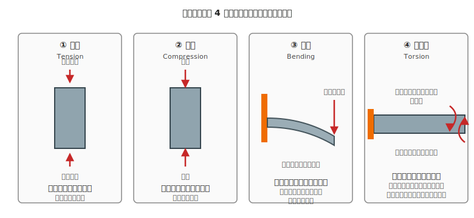

# 第 18 章　壊さないための機械基礎

ここから本書の後半、**機械系** に入ります。前半の電気系と同じく「何が、どう壊れるのか」を直感で押さえるのがこの章の目的です。電気側の第 2 章「壊さないための電気基礎」と **対応する位置づけ** の章で、**定性的な直感レベル** — 「このぐらいの太さなら耐える」「この力のかけ方だとヤバい」と感じ取れる程度 — を目指します。

厳密な応力計算・モーメント計算・材料力学の体系は本書のスコープ外です（[CONCEPT §9](../CONCEPT.md) 参照）。必要になれば、機械設計ハンドブックや大学教科書に進んでください。

!!! warning "この章で壊しやすいもの"
    - アクリル板（薄板にモータ荷重をかけて割る、ねじ穴周りが欠ける）
    - 3D プリント部品（積層方向を無視した荷重で剥離する）
    - ねじ山（オーバートルクでなめる、特に 3D プリント部品で起きやすい）
    - ベアリング（圧入時の斜め打ちで玉が砕ける）

---

## 1. 機械の「絶対最大定格」は何か

電気側には **絶対最大定格** という概念がありました（第 2 章・第 3 章）。40 mA を超えたら壊れる、というような明確な限界です。

機械側にも似たような概念があります。ただし数字の形は違って、次の 4 つが「超えたら壊れる」系の上限です。

- **強度（strength）** — どれだけの力をかけたら割れるか・折れるか
- **剛性（stiffness）** — どれだけ曲がるか・ねじれるか
- **疲労限度（fatigue limit）** — 繰り返し力をかけると、何回目で壊れるか
- **摩擦係数（friction）** — 滑る／滑らないの境界

電気と違って、機械側の限界は **時間と回数** に強く依存します。「1 回だけなら耐える力」が「1000 回繰り返すと壊れる」ことがある、という直感を最初に持っておきます。

---

## 2. 荷重モードの 4 分類

材料にかかる力は、**どの向きにかかるか** で 4 種類に分けられます。同じ材料でも、どのモードの力を受けるかで壊れやすさが大きく変わります。

### 2.1 4 つのモードと、本書で出会う例

| モード | 力のかかり方 | 本書で出会う典型例 |
|---|---|---|
| **引張** | 両端から引っ張る | ワイヤが切れる、ねじの頭が飛ぶ |
| **圧縮** | 両端から押す | スペーサが潰れる、細い柱が座屈する |
| **曲げ** | 片端固定、もう一端に横からの力 | 薄板のたわみ、モータアームが下がる |
| **ねじり** | 軸周りに回転させる | モータ軸のねじれ、シャフトカップリングの破損 |

### 2.2 材料との相性

同じ材料でも、どのモードに強いかが違います。ざっくりした感覚:

- **アクリル板**：引張・圧縮は強い、**曲げに弱い**（たわんで割れる）、ねじりは普通
- **アルミ板**：どのモードでもバランス良く強い
- **3D プリント部品（PLA）**：積層と直交する引張に **弱い**（層が剥がれる）、積層に平行な圧縮は強い
- **ねじ（鉄）**：引張・ねじりに強い、極端な横力（曲げ）には耐えない

設計時は「**この部品に一番かかるモードは何か**」を考えて材料を選びます。

---

## 3. 剛性：「どれだけ曲がるか」の直感

剛性は「力をかけたときにどれだけ変形するか」の指標です。

- **剛性が高い** = 曲がりにくい／ねじれにくい（強い）
- **剛性が低い** = 曲がりやすい／ねじれやすい（弱い）

### 3.1 剛性を決める 3 つの要素

1. **材料**：アルミ > アクリル > 木材 > PLA（おおざっぱな順）
2. **厚さ／太さ**：2 倍厚くすると、曲げ剛性は **約 8 倍** になる（直感より効く）
3. **形状**：同じ量の材料でも、**中空パイプ > 棒** のほうが曲げに強い。T 字や L 字断面も剛性を稼ぎやすい

!!! tip "厚みは「2 倍で 8 倍効く」を覚える"
    曲げ剛性は、**厚さの 3 乗** に比例します。3 mm のアクリル板より 6 mm 板のほうが、強度は 8 倍の感覚です。
    薄板がたわむときは「1.5 倍厚くすれば 3 倍以上の剛性になる」と考えるのが実用的な目安です。

### 3.2 どれくらい曲がったら「ダメ」か

設計上の目安（本書の作例範囲）:

- **静止状態で目に見えてたわむ** → ダメ（重量バランスが狂い、運用中にさらに曲がる）
- **指で押してみて、わずかに戻るぐらい** → OK（静的荷重なら）
- **モータ駆動中に視認できる振動** → ダメ（共振を起こしている可能性。詳しくは第 29 章）

---

## 4. 疲労：「繰り返すと壊れる」

1 回で壊れない力でも、**繰り返しかける** と壊れることがあります。これを **疲労破壊** と呼びます。

### 4.1 疲労が効く場面

- モータ駆動による振動（常時発生、数万〜数百万回／時間）
- 歩行ロボットの脚の衝撃（1 歩ごと、1 時間で数千回）
- 開閉部のヒンジ（操作ごと）

### 4.2 疲労を避ける勘所

- **振動する部位に、薄く・尖った形状を使わない**（応力が集中して割れる）
- **穴の周りは応力が集中する** — 穴ギリギリに力がかかるようにしない
- **ねじ締結部は緩み止め**（スプリングワッシャ、ネジロック剤）を使う — 振動で緩むのが典型的な疲労現象
- **3D プリント部品は特に疲労に弱い** — 層の界面が繰り返し応力で剥がれる

### 4.3 「たまに壊れる」の正体

作った直後は動いていたロボットが、1 週間後に壊れている — 多くはこの疲労破壊です。「いつの間にか緩んでいた」「気付いたらひびが入っていた」のほとんどがここ。

---

## 5. 摩擦：「滑る／滑らない」の直感

機械の動作は「滑らせたい場所は滑らせる、止めたい場所は止める」の使い分けで成立します。

| 滑らせたい場所 | 止めたい場所 |
|---|---|
| 車輪の軸とベアリング | 車輪とモータ軸の結合 |
| リニアスライドのガイド | 部品同士のねじ締結 |
| サーボの減速ギア間 | ベルトと滑車の噛み合わせ |

### 5.1 滑り止めの定石

- **ねじ + 座面の摩擦** — 標準的な締結方法
- **D カット軸 + イモねじ** — モータ軸と車輪・プーリの結合で多用（第 27 章で詳しく）
- **キー溝 + キー** — もっと大きなトルクが必要なとき
- **接着剤** — 緊急避難。振動と熱で外れることがあるので本番用途には不向き

### 5.2 滑らかにしたい場所

- **ベアリングを使う**（ボールベアリング／ブッシュ／メタル軸受）
- **潤滑油／グリースを差す**（ただし電気回路に飛ばないように）
- **PTFE（テフロン）や樹脂製のすべりブッシュ** を使う

!!! warning "接着剤で車輪を止めるのは後で後悔する"
    初心者がやりがちな失敗：モータの D カット軸に接着剤だけで車輪を付ける。
    - 接着剤の面積が小さく、トルクを受けきれず空転する
    - 振動で少しずつ剥がれる
    - 剥がれた後に再接着しても、前の接着剤が残っていて密着しない
    
    正しくは **イモねじで機械的に固定** してから、補助として接着剤。詳しくは第 27 章。

---

## 6. 「どれくらいなら大丈夫？」目安値カード

本書の作例範囲（テーブルトップサイズのロボット、総重量 1 kg 以内）で使う目安値です。厳密ではありませんが、初期設計時の判断に使えます。

| 場面 | 目安 |
|---|---|
| 3 mm アクリル板で、モータ 1 個（100 g）を支える | 片持ちは NG、両端支持なら OK |
| M3 ねじの引張強度（使える上限） | 約 500 N（50 kg 相当の力。ロボット用途では十分） |
| M3 ねじの締付トルク | 手締めで 0.5〜1 N·m 程度（工具なしで「ぐっ」とくる感覚）|
| 3 mm 厚 PLA 部品の曲げ強度 | アクリルより少し弱い、熱で軟化する点も注意 |
| 608 ベアリング（内径 8mm）のラジアル荷重 | 数百 N（ホビーロボット用途では十分）|

これら数値は **常識的な使い方での目安** です。定量計算で検証が必要な場面では、材料メーカーのデータシート／機械設計便覧 を参照してください。

---

## 7. 次章への橋渡し

機械の「何がどう壊れるか」の直感を押さえたら、次は **道具と部品の規格** を知る番です。

次の [第 19 章「機械の工具と部品規格」](19-mechanical-tools-parts.md) では、ノギス・ドライバ・六角レンチといった工具、そして M ねじ・ナット・スペーサ・ベアリングといった定番部品の **規格表の読み方** を扱います。電気側の「データシートを読む」（第 3 章）に対応する章です。

機械系の部品選定は **規格書の読解** ができれば大半が解決します。データシートと同じく、**最初は用語の地図** さえ持っていれば怖くありません。
