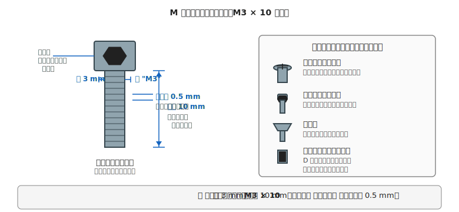

# 第 19 章　機械の工具と部品規格

電気側の「データシートの読み方」（第 3 章）と対応する章です。機械系の **工具** と、**規格化された部品**（ねじ・ナット・スペーサ・ベアリング）の読み方を扱います。

機械系は電気系と違って、部品そのものの「データシート」は個別にあまり出てきません。代わりに **規格表**（JIS や ISO）を引けば仕様が決まります。M3 ねじ、608 ベアリング、というような **「型番の略記」で数ミリ単位の寸法が決まっている** のが機械の世界の便利さです。

!!! warning "この章で躓きやすい誤解"
    - **M3 ねじの「3」は呼び径（= 外側のねじ山の頂点を通る円の直径、3 mm）**。「M」は Metric（メートル規格）の意味。M3 ナットの内径（= 有効径、ねじ山が噛み込む部分の径）は約 2.5 mm で、**呼び径とは別物**
    - **長さの基準は「首下」から先端まで**。皿ねじは頭の天面から先端までで別基準
    - **D カット軸とイモねじの組み合わせ** — 平面側にイモねじ先端を当てないとトルクが伝わらない
    - **ベアリングの型番は「内径 × 外径 × 幅」** の 3 次元。608 と 6800 は別物

---

## 1. 機械系の工具リスト

電気側と別に、機械作業専用の工具セットを揃えます。電気用のニッパやテスタを機械に転用すると、汚れ・傷・切れ味の低下を招くためです。

### 1.1 必須

| 工具 | 用途 | 価格帯 |
|---|---|---|
| **ノギス（150 mm）** | 0.05 mm 精度で長さを測る。機械では最も使う。**初心者にはデジタルノギス** がおすすめ（目盛の読み方に悩まず、ボタン 1 つでゼロリセットできる）| 1,000〜3,000 円 |
| **プラスドライバ（#0、#1、#2）** | 最もよく使うねじ頭 | 500〜1,500 円／本 |
| **六角レンチセット（1.5〜5 mm）** | キャップスクリュとイモねじ | 500〜2,000 円／セット |
| **ラジオペンチ** | 部品の保持・曲げ | 1,000〜2,000 円 |
| **ニッパ（機械用、電子用と分ける）** | タイラップや針金の切断 | 1,000〜2,000 円 |
| **カッターナイフ** | バリ取り、シール剥がし | 500 円〜 |

### 1.2 あると便利

| 工具 | 用途 |
|---|---|
| **電動ドリルドライバ** | 多数のねじ締め、木材への穴あけ |
| **金属用やすり（平・丸）** | アルミやアクリルのバリ取り |
| **デジタルノギス** | ノギスの読みが苦手なら |
| **スコヤ（小さい直角定規）** | 穴あけ時の位置出し |
| **ピンバイス（手動ドリル）** | 細径の穴あけ（φ 0.5〜3 mm）|
| **3D プリンタ（または外注アクセス）** | 筐体・マウントの製作 |

!!! tip "工具は最初は安物でも OK"
    電気側のテスタ・はんだごてと違って、機械系の工具は **安物でも工具そのものが原因で電気部品を焼損するような事故はほぼ起きない** ため、Amazon の 500〜1,500 円帯で問題なく始められます。
    ただし **ノギス** だけは、極端に安いとゼロ調整が狂ったままで精度が出ないので、1,000 円以上のものを選びます。

!!! danger "ただし「工具が安物でも怪我はする」"
    工具自体が電子部品を壊さないという意味であって、**ドリル巻き込み・やすりでの擦り傷・カッターでの切創・ピンセットの刺し傷・飛び散るバリが目に入る** といった人体への怪我のリスクは工具の価格とは関係なく発生します。第 22 章（製作フェーズ）で具体的な安全姿勢を扱いますが、**機械作業を始める前に保護メガネを用意し、作業中に軍手を回転工具で使わない** だけは最初に覚えてください。

---

## 2. ねじの規格表記

ホビーロボット用途で最もよく出会う規格が **M ねじ**（メートルねじ）。ISO 規格で世界共通なので、どこで買っても互換性があります。

### 2.1 表記の読み方

**`M3 × 10`** の意味:

- **M3** — 呼び径（山径）3 mm のメートルねじ
- **× 10** — 長さ 10 mm（**首下から先端まで**、ただし皿ねじは頭天面から先端まで）
- ピッチ（山と山の間隔）は指定なしなら **標準ピッチ**（M3 なら 0.5 mm）
- 細目ねじは `M3 × 0.35 × 10` のようにピッチを明示

### 2.2 本書でよく使うサイズ

| サイズ | 典型用途 |
|---|---|
| **M2** | センサやモータドライバ IC ボードの固定（基板の取り付け穴） |
| **M2.5** | Raspberry Pi ボードの取り付け穴 |
| **M3** | 最も汎用。筐体の組み立て、モータマウント、プーリ固定（最多使用）|
| **M4** | やや大型の構造物、ホイールハブ |
| **M5** | 大型ロボットの構造、T スロットアルミフレーム（2020 規格）|

**最初のひと揃えは M3 を中心に、M2・M2.5 を少量** が実用的です。

### 2.3 頭の形状の使い分け

- **鍋ねじ（プラス）** — 最もよく流通。プラスドライバで締められる
- **キャップスクリュ（六角穴）** — 強く締められる、六角レンチで作業が速い
- **皿ねじ** — 頭が板面と面一になる。カバー類に
- **イモねじ（止めねじ）** — 頭がなく、完全に中に入る。**モータ軸への車輪固定** に多用（詳細は第 27 章）

---

## 3. ナット・スペーサ・ワッシャ

### 3.1 ナット

ねじと対になって部品を挟んで固定します。M ねじと同じ呼び径（M3 ねじに M3 ナット）。

- **六角ナット** — 最もよく流通。スパナで締める
- **ナイロンナット（ロックナット）** — 内側にナイロンリングがあり、振動で緩みにくい。**モータ取り付けや駆動部に推奨**
- **蝶ナット** — 手で緩められる。カバーのように何度も開け閉めする場所に

### 3.2 スペーサ（スタンドオフ）

2 枚の板を決まった距離で固定する筒状の部品。マイコンボードを筐体から浮かせて固定する典型用途。

- **M3 × 10 mm スペーサ** など、呼び径と長さで指定
- **メスメス**（両端がナット穴）と **オスメス**（片方がねじ、片方がナット穴）がある
- **樹脂スペーサ** は軽くて絶縁性が良く、基板の固定に最適
- **金属スペーサ** は剛性が高く、構造部材にも使える

### 3.3 ワッシャ

ねじの頭／ナットと取り付け先の間に挟む円盤。

- **平ワッシャ** — 接触面を均等にして、ねじの頭が部品に食い込むのを防ぐ
- **スプリングワッシャ** — 緩み止め。振動する場所に必須
- **歯付きワッシャ** — さらに強力な緩み止め

!!! warning "3D プリント部品のねじ穴は要注意"
    PLA や PETG の 3D プリント部品に直接ねじを切ると、数回の着脱で **ねじ山が潰れる**（なめる）ことがよくあります。対策:
    
    - **熱圧入インサート**（ヒートセットナット）を使う — 最も推奨、耐久性が桁違い
    - **タッピングねじ**（先端が尖った自攻ねじ）を使う — 簡易対応
    - **貫通穴にして、反対側にナットで止める** — 一番確実

---

## 4. ベアリング

軸を滑らかに回転させる部品。ロボットの車輪・プーリ・関節で頻出します。

### 4.1 表記の読み方

ベアリングの型番は **4 桁の数字** で表されます。ホビー用途でよく出会うのは:

| 型番 | 内径 | 外径 | 幅 | 典型用途 |
|---|---|---|---|---|
| **608ZZ** | 8 mm | 22 mm | 7 mm | 小型ロボットの車輪、3D プリンタパーツ |
| **MR83ZZ** | 3 mm | 8 mm | 3 mm | マイクロサイズのロボット |
| **6800ZZ** | 10 mm | 19 mm | 5 mm | 軽荷重・薄型 |
| **6001ZZ** | 12 mm | 28 mm | 8 mm | 中型ロボット |

- **末尾の `ZZ`** — 両側シールド（ゴミが入りにくい）。未シールドや片側シールドもある
- **`2RS`** — ゴムシール（より防塵性が高い）

### 4.2 取り付けの勘所

- **軸にベアリングを圧入** するときは、**外輪を押す**（内輪を押すと玉が砕ける）
- **筐体の穴にベアリングを圧入** するときは、**内輪を押す**
- どちらも **斜めに押し込まない**。傾いたまま入れると玉が偏って高摩擦・短寿命の原因

### 4.3 選び方の目安

本書の作例範囲（小型ロボット、軸径 3〜8 mm）では、**608ZZ を基準に考えれば大半のケースをカバー** できます。3D プリント部品と組み合わせるときは、**ベアリング外径 + 0.1〜0.2 mm** の穴を設計して圧入します。

---

## 5. 材料の選び方（ざっくり）

筐体や構造材として使う **板材** の選び方。詳しくは第 26 章で扱いますが、規格の観点で触れておきます。

### 5.1 アクリル板

- **流通厚**：1, 2, 3, 5, 8, 10 mm
- **最も使う**：**3 mm** と **5 mm**
- レーザーカット外注が容易（DXF データで発注）
- 特徴：透明で綺麗、ただし **衝撃と曲げに弱い**

### 5.2 アルミフレーム（T スロット）

- **2020 規格**（20 mm × 20 mm 断面）：ホビーロボットの定番
- **3030 規格**（30 mm × 30 mm 断面）：大型用
- M5 ねじで T スロットナットと組み合わせて締結
- 特徴：**剛性が高い、再構成が楽、ただし重い**

### 5.3 3D プリント部品

- **素材**：PLA（標準）、PETG（耐熱・耐衝撃）、ABS（耐熱だが扱い難）
- **流通**：フィラメント 1 kg で 2,000〜4,000 円
- 特徴：**自由形状が作れる、時間はかかる、層剥離リスクあり**（第 22 章で詳述）

---

## 6. 規格表を引くとき

定番部品で迷ったら、次の情報源に当たります。

- **ミスミ FA メカニカル部品ガイド** — 機械部品の事実上のリファレンス。Web で規格表が引ける
- **モノタロウの商品ページ** — 各部品のバリエーション・寸法表が詳しい
- **ねじ規格の JIS ハンドブック** — 図書館で参照
- **ISO 4762**（キャップスクリュ規格）など、該当 ISO 規格 — 厳密な定義が欲しいとき

AI エージェントに「M3 × 10 のキャップスクリュの寸法を教えて」と聞いても、**標準寸法なら正確に返してくれる** ことが多いので、ここは AI 活用が効きやすい領域です。

---

## 7. 次章への橋渡し

工具と部品規格の「地図」ができたら、次は **設計図面・寸法・嵌合** の読み方です。

次の [第 20 章「寸法・公差・嵌合の読み方」](20-dimensions-tolerance-fit.md) では、CAD で出した図面の寸法記号、公差（許容誤差）、はめあい（軸と穴の組み合わせ）の 3 本柱を扱います。電気側で「Recommended Operating Conditions」を読めることが設計判断の土台だったように、機械側では **「公差」と「嵌合」を読める** ことが設計判断の土台になります。
