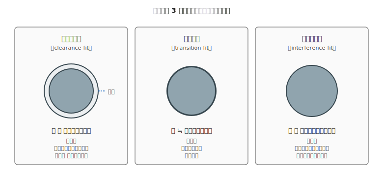

# 第 20 章　寸法・公差・嵌合の読み方

Part V「機械の基礎」の最終章。電気側の第 3 章（データシートの読み方）に対応する、**機械図面の言語** を理解する章です。CAD で描いた図面や、通販サイトの寸法表を読めるようにするのが目的です。

機械系の部品選定で初心者が詰まるポイントは、**「公称寸法は分かるが、公差と嵌合が分からず現物が合わない」** というケースです。この章では、数ミリ単位で設計判断ができるレベルの基礎を押さえます。

!!! warning "この章で失敗しやすいこと"
    - **公称寸法だけで発注** → 現物が穴に入らない／ガバガバで使えない
    - **D カット軸の寸法を誤解** → 車輪のイモねじが D カット面に当たらず空転
    - **すきま嵌め／しまり嵌めの区別がつかない** → 軸受が抜ける or 入らない
    - **ねじ穴の下穴径を間違える** → タップが切れない or 割れる
    - **3D プリントの縮み** を考慮せず設計 → 軸が入らない

---

## 1. 寸法記号の基本

図面には大量の記号が登場します。全部覚える必要はありませんが、**頻出の 5 つ** は最初に押さえます。

| 記号 | 意味 | 使用例 |
|---|---|---|
| **φ（ファイ）** | **直径** | `φ 8` = 直径 8 mm の穴 |
| **R** | 半径（角の丸め）| `R 2` = 角の曲率半径 2 mm |
| **t** | 板の厚み（thickness）| `t 3` = 板厚 3 mm |
| **C** | 面取り（chamfer）| `C 0.5` = 45° 方向に 0.5 mm の斜めカット |
| **×** | 繰り返し or 寸法の掛け合わせ | `4 × M3` = M3 穴 4 個 |

例として「**φ 8 深さ 5 R 1 の穴** を 4 × M3 で囲む」と書かれていれば、直径 8 mm・深さ 5 mm・角 R 1 mm の主穴の周囲に、M3 のねじ穴を 4 つ配置する、の意味になります。

---

## 2. 公差 — 「ぴったり」は存在しない

機械部品は **寸法通りには作れません**。加工精度や熱膨張で、必ず微妙にズレます。このズレの許容範囲を表すのが **公差**（tolerance）です。

### 2.1 公差の表記

- **±0.1** — プラスマイナス対称の許容差（例：`10±0.1` は 9.9〜10.1 mm）
- **+0.1 / 0** — 上限 +0.1、下限 0（例：`10 +0.1/0` は 10.0〜10.1 mm）
- **0 / −0.1** — 上限 0、下限 −0.1（例：`10 0/−0.1` は 9.9〜10.0 mm）
- **JIS 等級（IT）** — 精度クラスの指定（例：`10 IT7` で「IT 等級 7 相当の公差」）

本書の作例範囲では、**±0.1 mm** の精度で考えておけば大きくは外れません。具体例：M3 ねじ（直径 3.0 mm）を通すだけの穴は **φ 3.2 mm** で設計しておけば、実際の加工誤差（±0.1 mm）で「穴径 3.1〜3.3 mm」になっても、ねじは余裕を持って通ります。

### 2.2 公差が効いてくる場面

- **軸を穴に通す** — 軸径と穴径の差が公差より小さいと入らない
- **部品同士の位置合わせ** — 公差が大きいと組立時にガタつく
- **ねじ穴** — 公差が小さすぎるとタップを切るのが困難、大きすぎるとねじが緩む

### 2.3 3D プリントと公差

家庭用 FDM 3D プリンタは、**公差が ±0.2 mm 程度**。これは機械加工（金属 CNC の ±0.01〜0.05 mm）より **1 桁荒く**、射出成形（±0.05〜0.1 mm）と比べても荒い分類。一方、レーザーカットは ±0.1 mm 程度で家庭用 3D プリントより精密です。**家庭用 3D プリントは「ゆるい公差の部品」向き** と覚えておけば OK。したがって:

- **穴は + 0.2〜0.3 mm 大きめ** に設計する（PLA は冷えると 0.2〜0.5% 縮む）
- **軸は − 0.1〜0.2 mm 小さめ** に設計する
- **ベアリングの圧入部は ±0 で設計** して、必要ならリーマで後加工

---

## 3. はめあい（嵌合）— 穴と軸の相性

「穴に軸を通す」とき、両者の寸法差によって 3 つの挙動が生まれます。これを **はめあい** と呼び、規格化されています。

### 3.1 3 分類

| 分類 | 穴と軸の関係 | 挙動 | 用途 |
|---|---|---|---|
| **すきま嵌め** | 穴 ＞ 軸 | 手で回る、スライドする | 軸受、スライダー、ねじと通し穴 |
| **中間嵌め** | 穴 ≒ 軸 | 手では入らず、軽い力で入る | 位置決めピン、キー結合 |
| **しまり嵌め** | 穴 ＜ 軸 | プレス or 叩き込みで圧入 | ベアリングの筐体圧入、ローレット軸の固定 |

### 3.2 本書の作例での選び方

- **モータ軸に車輪を通す** → すきま嵌め（隙間あり）＋ イモねじで固定
- **モータ軸にプーリを圧入** → 中間〜しまり嵌め（イモねじでさらに固定）
- **筐体にベアリングを入れる** → しまり嵌め（ベアリングがガタつかないように）
- **マイコンボードを筐体に固定** → すきま嵌め（ねじの通し穴は M3 なら φ 3.2〜3.5 mm が目安）

!!! tip "ねじの通し穴は「ねじの呼び径 + 0.2〜0.5 mm」"
    M3 ねじを通すだけの穴（しめつけない側）は **φ 3.2 mm 前後** が定番です。ぴったり φ 3.0 mm にするとねじが入らない／無理に押し込んでねじ山を傷めます。
    ミスミなどの規格表では「ボルト用通し穴（並級）」の寸法が引けます。

---

## 4. D カット軸とイモねじの仕様

ホビーロボットで最頻出の軸形状。モータ軸・エンコーダ軸・シャフトに使われます。

**D カット軸** とは、**丸い軸の一部を平らに削ったフラット面を 1 箇所持つ軸** です。断面を見るとアルファベットの「D」の形になっているので D カットと呼ばれます。この平らな面にイモねじ先端を押し当てることで、軸と部品が機械的にロックされ、回転力（トルク）を確実に伝達できます（詳しい当て方は [第 27 章 §4.1](../topics-mechanical/27-drivetrain.md)）。

### 4.1 D カットの寸法

- **軸径** — 円の直径（例：**3 mm**）
- **平面までの距離**（面取り深さ）— 円の中心から平面までの長さ（例：**2.5 mm**）

N20 ギヤードモータの定番軸は **φ 3 mm、D カット面まで 2.5 mm** です。車輪やプーリを発注するときは「**φ 3 D カット対応**」と明記します。

### 4.2 イモねじの当て方

D カット軸の **平らな面に、イモねじの先端が垂直に当たる** ように車輪のねじ穴を設計します。イモねじが丸い面に当たるとトルクを受けきれず、車輪が空回りします。

詳細は [第 27 章 駆動部](../topics-mechanical/27-drivetrain.md) で扱いますが、設計時点で:

- 車輪の中心穴は **φ 3.1〜3.2 mm**（D カット軸 3 mm を通す、ややゆるめ）
- 車輪側面から中心に向かう **M3 のイモねじ穴**（M3 イモねじが入る深さ）
- 「イモねじが D 面に当たる角度」を CAD 上で確認

---

## 5. ねじ穴の下穴径

ねじを **締結する側**（ナットを使わず、部品の穴にねじを切る）は、**下穴径** が重要です。

| ねじサイズ | 下穴径（並目ピッチの場合）|
|---|---|
| M2 | φ 1.6 mm |
| M2.5 | φ 2.05 mm |
| M3 | **φ 2.5 mm** |
| M4 | φ 3.3 mm |
| M5 | φ 4.2 mm |

**下穴径を間違えると:**

- **小さすぎる** → タップが折れる、3D プリント部品が割れる
- **大きすぎる** → ねじ山が浅くてすぐなめる、トルクが掛けられない

### 5.1 3D プリント部品でのねじ穴戦略

3D プリントは **下穴精度が出にくい** ため、おすすめの順序は:

1. **熱圧入インサート（ヒートセットナット）を使う** — 最も信頼性が高い。手順は:
    - プリント側の穴を **インサート外径と同じ寸法（例：M3 用 φ 4.0 mm、深さ 5 mm）** で設計
    - プリント後、**はんだごて（350℃）を通常のこて先ではなく専用チップ or 先端を平らにしたチップに付け替え**、インサートを乗せて下向きに **ゆっくり** 押し込む（所要時間 5〜10 秒、押圧は手の自重程度）
    - **インサートが完全に面一（表面と同じ高さ）まで沈んだら離す**。傾いて埋まると後で外れるため、垂直を保つ
    - 注意：PLA は 60℃ から軟化するので、作業中にプリント部品が変形しないよう **短時間で済ませる**。火傷に注意
2. **タッピングねじを使う** — 自攻ねじなので下穴は M3 ねじ用に φ 2.5〜2.7 mm
3. **貫通穴 + 反対側ナット** — 下穴精度を気にせず済む

---

## 6. 図面の記号：穴加工の基本パターン

CAD で描く図面によく出てくる穴の表記例。

- **φ 3** — 通し穴、直径 3 mm、深さは貫通
- **φ 3 深さ 5** — φ 3 mm、深さ 5 mm の止まり穴
- **M3 深さ 8** — M3 ねじ穴、深さ 8 mm（下穴 φ 2.5 + タップ加工）
- **φ 3 ザグリ φ 6 深さ 2** — 通し穴 φ 3 の入り口に φ 6・深さ 2 mm のザグリ（キャップスクリュの頭を沈める座）
- **皿ザグリ φ 6** — 皿ねじの頭を沈める斜めのザグリ

---

## 7. AI エージェントとの協働

機械設計の定量的な寸法選定は、AI との相性が比較的良い領域です。

- **「PLA の 3D プリント部品で M3 のタッピングを切りたい。下穴径と深さの推奨は？」** → AI は JIS 規格＋プリント経験値から答えを出せる
- **「608 ベアリングを PLA 筐体に圧入する場合、穴径は？」** → AI は収縮率を加味した推奨を出せる

ただし電気側と同じく、**AI の出力は規格表で検証** します。本章の用語（公差、嵌合、下穴径、ザグリ）が頭に入っていれば、AI が間違ったときに気付けます。

---

## 8. Part V のまとめと次章への橋渡し

これで Part V「機械の基礎」の 3 章が揃いました。

- **第 18 章** — 材料と荷重モードの直感
- **第 19 章** — 工具と部品規格の読み方
- **第 20 章** — 図面・寸法・嵌合（本章）

次からは **Part VI「機械のワークフロー」** に入ります。電気側の第 5〜9 章と対応するフェーズ別章群で、設計 → 製作 → 組立前 → 組立中 → デバッグの 5 段階を扱います。

次の [第 21 章「機械の設計フェーズ」](../workflow-mechanical/21-design-phase.md) では、「作りたいロボットのイメージ」から、材料選定・寸法決定・CAD 出力を経て **実際に製作に渡す図面一式を作る** までの流れを扱います。電気側の第 5 章と同じく、**AI エージェントに相談する前の準備** に重点を置いた内容になります。
