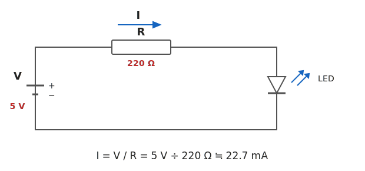
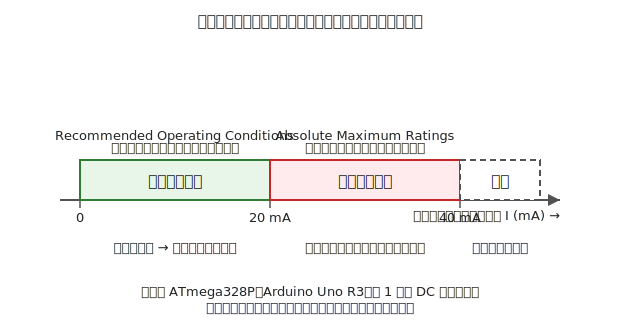
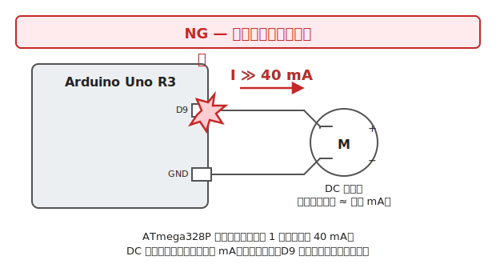
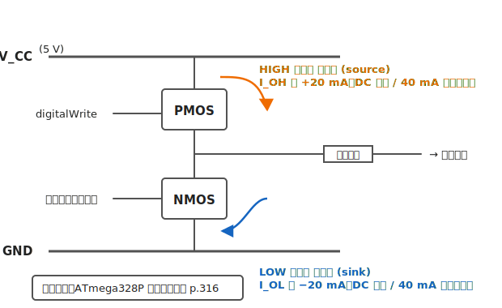
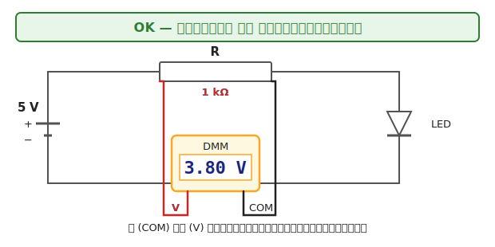
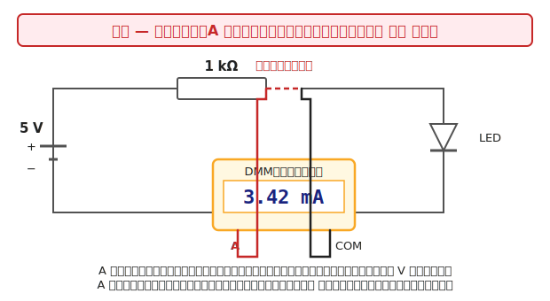

# 第 2 章　壊さないための基礎

本章は本書全体を通じて効いてくる「壊さないための基礎体力」を付ける章です。この章さえきちんと読んでおけば、以降の章で NG 回路を目にしたときに **「なぜダメか」が自分で説明できる** 状態になります。[第 1 章 §6.1](01-introduction.md) で触れた「**予測できる破壊**」の力を、具体的な電流・電圧の計算として身につけるのが本章の役割です。

!!! warning "この章で壊しやすいもの"
    - マイコンの **GPIO ピン**（過電流による破壊。復旧不能）
    - **LED**（電流制限抵抗なしでの焼損。2〜3 秒で壊れる）
    - **バッテリ**（ショートによる発熱・発火。特にリチウムイオン／リポ）

この章で手を動かす場面はテスタの使い方だけで、ハンズオンらしい組み立てはしません。読み物としてまず一度通して読んでから、あとで困ったときに戻って引くリファレンス、という使い方を想定しています。

---

## 1. オームの法則の復習

中学理科で習ったオームの法則は、本書の「なぜ壊れるか」の全説明の土台です。式で書くと:

\[
V = I \times R
\quad\Leftrightarrow\quad
I = \frac{V}{R}
\quad\Leftrightarrow\quad
R = \frac{V}{I}
\]

- \( V \)：電圧 [V]（ボルト）
- \( I \)：電流 [A]（アンペア）。本書ではほとんど mA 単位（1 mA = 0.001 A）
- \( R \)：抵抗 [Ω]（オーム）

### いちばん簡単な直列回路

5 V 電源に 220 Ω の抵抗と赤色 LED を直列につないだ回路を考えます。

LED の順方向電圧（VF）を一旦 0 V と雑に近似すると、流れる電流は
\( I = V/R = 5\,\text{V} / 220\,\Omega \approx 22.7\,\text{mA} \) です。
実際には LED で電圧が 2 V ほど落ちるので、抵抗にかかる電圧は \(5 - 2 = 3\,\text{V}\)、
したがって \( I \approx 3/220 \approx 13.6\,\text{mA} \) 付近に落ち着きます。
この「抵抗で電流を制限する」発想は第 10 章（LED）でもう一度詳しく扱います。

### 電力 \( P = V \times I \) も一緒に覚える

抵抗を選ぶときに忘れがちなのが **定格電力** です。
1/4 W（0.25 W）の抵抗に、許容を超える電力をかけると発熱で焼けます。

上の 220 Ω で 13.6 mA を流すとき、抵抗での消費電力は:

\[
P = V \times I = 3\,\text{V} \times 0.0136\,\text{A} \approx 0.041\,\text{W}
\]

なので 1/4 W 抵抗で十分余裕があります。逆に、100 Ω の抵抗に 100 mA を流そうとすると、
\( P = 0.1\,\text{V}/\Omega \times 100\,\Omega \times 0.1\,\text{A} = 1\,\text{W} \) となり、
**1/4 W 抵抗なら 4 倍オーバー**。表面が一瞬で焦げます。

!!! tip "覚え方"
    抵抗は「電圧を電流に変換するタダの部品」ではなく、**熱を発生させる部品** です。
    電流値だけでなく「その抵抗がいま何 W 熱を出しているか」も毎回考える癖をつけます。

---

## 2. 絶対最大定格と推奨動作条件

部品を「壊さないで使う」ための最大のヒントは、**データシートの最初の方にある 2 つの表** に書いてあります。
名前と意味の区別だけは必ず押さえてください。

### 推奨動作条件（Recommended Operating Conditions）

「**この範囲で使うと、データシートに書いてある性能が保証される**」範囲です。
電源電圧・動作温度・クロック周波数・入出力電圧など、製品として正常に動く条件が並びます。

### 絶対最大定格（Absolute Maximum Ratings）

「**これを 1 瞬でも超えたら、壊れる覚悟をしてください**」という物理的限界です。
超えても動くことはありますが、**寿命が著しく縮む** か、その場で壊れるか、
しばらく経ってから壊れるかのいずれかになります。メーカー保証は効きません。

!!! warning "この 2 つを混同すると、すべての事故が起きる"
    初心者が「20 mA まで OK」とだけ覚えて 30 mA を流してしまう、
    あるいは「40 mA が絶対最大だから 38 mA で常用してよい」と思ってしまう — これが最頻出の事故です。  
    **常用するのは推奨動作条件の範囲内**。絶対最大定格は「ここまでは壊れなかった、それ以上は破壊」という境界線です。

### 具体例：ATmega328P（Arduino Uno R3 の MCU）

Arduino Uno R3 の心臓部である Atmel ATmega328P のデータシート（Microchip 公開、p.316 付近）によると、
1 ピンあたりの I/O 電流について次のような値が載っています（要旨）。

| 項目 | 値 | 分類 |
|---|---|---|
| 1 ピンあたりの推奨 I/O 電流（常用） | 20 mA | 推奨動作条件 |
| 1 ピンあたりの絶対最大 I/O 電流 | 40 mA | 絶対最大定格 |
| VCC / GND ピン合計の絶対最大電流 | 200 mA | 絶対最大定格 |

> データシート出典：[Microchip ATmega328P Datasheet](https://ww1.microchip.com/downloads/aemDocuments/documents/MCU08/ProductDocuments/DataSheets/ATmega48A-PA-88A-PA-168A-PA-328-P-DS-DS40002061B.pdf)（Absolute Maximum Ratings / DC Characteristics の項）

次の節以降、「GPIO は 1 ピン 20 mA まで」と言うときは、この値を指しています。

---

## 3. 電圧と電流の直感

オームの法則は式ですが、直感として覚えておくと速いのが **水のアナロジー** です。

| 電気 | 水 |
|---|---|
| 電圧 V | 水圧（高さ） |
| 電流 I | 流量（毎秒何リットル流れているか） |
| 抵抗 R | 管の細さ（細いほど流れにくい） |
| GND | 海面（基準点） |

このアナロジーは強力ですが、**限界もあります**。2 つだけ注意点を挙げます。

!!! info "水アナロジーの限界 1：電圧源は「押し込む」のでなく「保持する」"
    水のタンクは水位が決まっていても、ホースを引き抜いて地面に放り出せば水は勢いよく出続けます。
    しかし電源（定電圧源）は電圧を「5 V に保とうとする」装置で、回路側がそれを受け入れるかは別問題です。
    ショートすれば理屈上は電流が無限大になろうとし、実際には電源自身の電流制限か配線の抵抗で上限が決まります。

!!! info "水アナロジーの限界 2：「電流を流す」の主語"
    「電源が電流を押し込む」と思いがちですが、電気では **「負荷が電流を引く」** ほうが実態に近いです。
    LED を挿すと LED 側が電流を引き、電源はそれを供給します。
    GPIO の吐出し（ソース）／吸込み（シンク）の話はすべて「負荷がピンから電流を引く／ピンに電流を押し込む」という読み替えが必要です。

---

## 4. GPIO 直結の危険性

ここが本章の核心です。**マイコンの GPIO は、単なる電線ではありません。**
内部に出力段というトランジスタ回路があり、そこに流せる電流には厳然とした上限があります。
上限を超えた瞬間、出力段が壊れます。

### 典型的な NG パターン 3 つ

1. **GPIO に直接 LED を挿す（抵抗なし）** — 第 10 章の主題ですが、端的に言って 1〜3 秒で LED と GPIO の両方を焼きます
2. **GPIO に直接 DC モータを挿す** — 今から詳しく見ます
3. **GPIO に直接リレーのコイルを挿す** — リレーコイルは誘導性負荷（インダクタ）で、電流を遮断した瞬間に **電源電圧の何倍もの高電圧パルス（逆起電力）** が発生して GPIO を即死させます。逆起電力の原理と対策は [第 12 章](../topics/12-transistor-mosfet.md)・[第 13 章](../topics/13-dc-motor.md) で詳しく扱います

### NG 例：Arduino Uno の D9 ピンで DC モータを回そうとする

!!! danger "実機で組まないこと"
    この回路を組むと、Arduino Uno R3 の D9 ピン（またはそれ以上）が壊れます。
    運が悪ければ ATmega328P ごと書き込み不能になります。

なぜダメか。例として代表的な小型 DC モータ（FA-130 相当）を考えます。

- 定常時の消費電流：約 150〜250 mA
- **起動時／ストール時の突入電流：数百 mA〜1 A 以上**

一方 §2 で見たとおり、ATmega328P の 1 ピンあたり絶対最大定格は **40 mA**。
定常電流ですら定格の 4 倍以上、突入電流はさらに大きいので、**GPIO の出力段は即座に破壊** されます。

### GPIO の内部等価回路（なぜ 40 mA が上限なのか）

GPIO の内部は、ごく簡略化すれば以下のような **2 つのトランジスタ（PMOS / NMOS）のプッシュプル構造** になっています。

- `digitalWrite(pin, HIGH)` → 上の PMOS が ON。出力ピンから外部へ電流が **吐き出される（source）**
- `digitalWrite(pin, LOW)` → 下の NMOS が ON。出力ピンへ外部から電流が **吸い込まれる（sink）**

このトランジスタ 1 個ずつに、**チップ上で許容できる電流上限** があります。
それが ATmega328P では 1 ピンあたり 20 mA（推奨）/ 40 mA（絶対最大）です。
モータの数百 mA をここに通そうとすると、物理的にトランジスタが焼損します。

!!! tip "ボード差分について"
    Raspberry Pi Pico（RP2040）・ESP32-S3・Raspberry Pi 4 の GPIO もプッシュプル構造ですが、**許容電流はそれぞれ違います**。  
    - RP2040：4 / 8 / 12 mA を設定で選択（デフォルト 4 mA）  
    - ESP32-S3：40 mA（絶対最大）  
    - Raspberry Pi 4（BCM2711）：1 ピン 16 mA・全ピン合計 50 mA 程度  
    具体値はそれぞれのボードのデータシートで確認してください（付録 B に参照先のメモあり）。本書の作例は Arduino Uno R3（ATmega328P）で動作検証されているため、他ボードを使う読者は **AI エージェントに「このコードと回路を ○○ 用に書き換えて」** と依頼するのが最短ルートです。

### ではどうすればよいか

**GPIO から直接駆動できない負荷は、トランジスタ／MOSFET か、モータドライバ IC を介して駆動する**。
これを [第 12 章（トランジスタ／MOSFET をスイッチとして使う）](../topics/12-transistor-mosfet.md) と
[第 13 章（DC モータを回す）](../topics/13-dc-motor.md) で詳しく扱います。
本章ではまず「なぜ直結はダメか」を体に染み込ませるのが目的です。

---

## 5. テスタの使い方

本書の「動作確認チェックリスト」はすべてテスタの読みで書かれています。
ここでは最低限必要な 3 つの測り方 — **電圧・電流・導通** — を押さえます。

### 電圧測定（並列接続・通電したまま）

- 赤プローブを **V 端子**、黒プローブを **COM 端子** に差す
- レンジを DCV（直流電圧）の自動または 20 V レンジにする
- 測りたい部品の両端にプローブを当てる（**部品と並列**）
- **電源は入れたまま** で良い

オームの法則から、抵抗の両端電圧を測れば電流がわかります。
電流を直接測るより安全なので、本書では「電圧測定で電流を推定する」パターンを多用します。

### 電流測定（直列接続・電源を切ってから配線を切る）

!!! danger "電流測定の「直後」が一番危ない"
    電流レンジの A 端子は、直列に挿入しても回路への影響を最小化するため
    **内部抵抗がほぼゼロ（低抵抗シャント）** になっています。
    つまり A 端子は見方を変えれば「ほぼ導線」です。
    この状態で **赤プローブを A 端子に挿したまま、誤って電圧レンジで電源に並列に当てる** と、
    回路側から見れば電源を直接短絡することになり、電源 → 配線 → A 端子の低抵抗を経由して大電流が流れます。
    結果としてテスタ内部の **ヒューズが飛ぶ**（安い機種は本体が焼損する）か、手前の電池が熱暴走します。
    **電流測定が終わったら、必ず赤プローブを V 端子に戻す** 習慣を最優先で身につけてください。

手順：

1. **電源を切る**
2. 赤プローブを **A 端子（または mA 端子）** に差し替える
3. テスタのレンジを DCA（直流電流）の最大レンジから始める
4. 測りたい経路の配線を **一度切って**、切り口にテスタを挟む（**直列**）
5. 電源を入れて値を読む。読みが小さければレンジを下げる
6. 終わったら電源を切り、プローブを V 端子に戻しておく（最重要）

### 導通測定（電源を切った状態でのみ）

導通モード（ブザー付き）は、2 点間が電気的につながっているかを確認するモードです。
本書では **電源投入前に VCC-GND 間がショートしていないかをチェック** するのに毎回使います。

!!! warning "通電中の導通測定はダメ"
    導通モードはテスタ内部から微小電流を流して抵抗を測ります。
    通電中の回路で使うと、回路電圧がテスタに流れ込んで誤動作・破損の原因になります。

---

## 6. 動作確認チェックリスト（本書の定型）

本書の各ハンズオン章は、**電源投入の前と後** に次のチェックを行う構成になっています。
このチェックリストそのものを、自分で書くノートに貼っておくのがおすすめです。
テスタの当て方は §5 の要領で、**プローブは黒が COM、赤が V 端子** に差した状態で全項目を行います
（A 端子に挿したままだとヒューズが飛びます）。

### 電源投入の **前**

電源ケーブル（USB / AC アダプタ / 電池ボックス）は **まだ繋がない** 状態で実施します。

**(A) 目視による配線確認**

- [ ] 回路図と見比べて、配線と部品を 1 周見渡した
- [ ] ジャンパの被覆が剥けて隣のラインに触れていないか確認した
- [ ] ブレッドボード上で、部品の足が 2 列以上にまたがっていないか確認した

**(B) VCC - GND 間ショートチェック**（毎回必ず実施）

テスタを **導通モード（ブザー付き）** にします。次の順で当てて、いずれも **ブザーが鳴らない** ことを確認します。

- [ ] マイコンボードの **5V ピン（または 3.3V ピン）** と **GND ピン** の間 → 鳴らない
- [ ] ボード側と反対に、**ブレッドボード上の `+` レール** と **`−` レール** の間 → 鳴らない
- [ ] 5V ボードと 3.3V 部品を混在させている場合は、**5V レール** と **3.3V レール** の間 → 鳴らない（独立していること）
- [ ] 各 IC の **VCC ピン（データシートで確認）** と **GND ピン** の間 → 鳴らない

!!! warning "ブザーが鳴ったら即座に配線を抜く"
    どれか 1 つでも鳴ったら電源を繋いではいけません。配線のどこかに必ずショート経路があります。
    ジャンパを 1 本ずつ外しながら鳴らない状態に戻し、最後に外したジャンパ付近を重点的に調べます。

**(C) ロジック電圧の一致チェック**

各部品の VCC に、正しい電圧のラインが繋がっているかを確認します。テスタは **導通モード** のままです。

!!! info "データシートの用語について"
    以下で登場する **Recommended Operating Conditions（推奨動作条件）** や **V_CC / V_DD** などのデータシート用語の詳しい読み方は、**次章（[第 3 章](03-datasheet.md)）** で扱います。今の時点では「**動作電圧の範囲が書いてある表**」くらいの理解で構いません。

- [ ] 使う IC・センサ・モジュールすべてについて、データシートの **Recommended Operating Conditions**（または **Electrical Characteristics** 冒頭）で **Supply Voltage / V_DD / V_CC の範囲** を確認した
- マイコンボードの電源ピンを起点に、導通モードで次をチェックする:
    - [ ] **5V 動作の部品**（5V センサ、ロジック IC など）の VCC が、ボードの **5V ピンと導通** している（鳴る）
    - [ ] **3.3V 動作の部品** の VCC が、ボードの **3.3V ピンと導通** している（鳴る）
    - [ ] **3.3V 部品の VCC ピン** が、5V ラインと **導通していない**（鳴らない）
- [ ] I2C / SPI / UART 等の信号線で、送り出し側と受け取り側のロジック電圧が違う箇所にはレベル変換を入れた（詳細は [第 16 章](../topics/16-sensors.md)）

!!! info "なぜ導通モードでチェックできるか"
    電源を入れていない状態では、ボードの 5V ピンやレギュレータ出力ピンは配線として「繋がっているか」しか意味を持ちません。
    したがって **導通 = 電源 ON 時に電圧が届く**、**非導通 = 届かない** と読み替えてよいです。
    電源 ON 時に 5V と 3.3V が同じラインにいたら致命的なので、**通電前の導通チェックでこれを潰しておく** のが鉄則です。

**(D) ロジック電源とモータ電源の分離チェック**（第 13 章以降のモータ・大電流章で実施）

モータや大電流負荷を使う章では、ロジック電源（マイコン用）とモータ電源を別系統にします
（[第 13 章](../topics/13-dc-motor.md) で詳しく扱います）。分離できているかを導通モードで確認します。

- [ ] マイコン用 AC アダプタ／USB とモータ用電源（電池ボックスや別アダプタ）は **別々** に用意してある
- テスタの導通モードで:
    - 赤プローブを **マイコン側の 5V（または 3.3V）ピン**、黒プローブを **モータ電源の V+ 端子** に当てる
    - [ ] 鳴らない（2 つの電源レールが分離できている）
    - 赤プローブを **マイコン側の GND ピン**、黒プローブを **モータ電源の GND 端子** に当てる
    - [ ] **鳴る**（共通 GND ができている。これは必須）

!!! danger "「電源は別、GND も別」は厳禁"
    モータドライバ IC の信号線はマイコン側の電圧を基準にしています。もし GND が共通でないと、
    同じ「0 V」のつもりで違う電位を指しており、IC が想定外の入力を受けて破壊、または誤動作します。
    **V は分離／GND は共通** がロボット配線の基本パターンです。

**(E) 極性部品の向き**

- [ ] LED：長い足（アノード）が + 側、短い足（カソード）が − 側
- [ ] 電解コンデンサ：印字帯または短い足（−）が GND 側
- [ ] ダイオード：カソード帯（黒い線）が + → 負荷方向に向いている
- [ ] トランジスタ／MOSFET：データシートのピンアサインと E/C/B（または S/G/D）が一致している
- [ ] センサ・モジュール類：シルク印刷の VCC / GND / SDA / SCL 等がボード側と合っている

### 電源投入の **後**

USB or 電源スイッチを入れた **直後から 10 秒まで** を集中観察します。

**(F) 投入直後（〜2 秒）**

- [ ] 煙・焦げ臭・パチッという音が **ない**
- [ ] 部品近くに指をかざして、熱風を感じる部品が **ない**

いずれかでアウトなら **即座に電源を切る**。配線を引き抜くのは電源断のあとです。

**(G) 電圧の実測**（テスタを DCV モードに）

- [ ] マイコンの VCC ピンの実測値が、**公称値 ±5% 以内**
    - 5V ボードなら 4.75〜5.25 V
    - 3.3V ボードなら 3.15〜3.45 V
- [ ] 各センサ・モジュールの VCC ピンの実測値が同じく公称値 ±5% 以内
- [ ] モータ電源を使う章では、**モータドライバ IC の V_M（または V_MOT）ピン** に、データシートが指定する範囲の電圧が出ている
- 実測値が **公称より 10% 以上低い** 場合、電源容量不足 or 配線の接触不良。即座に電源を切って原因を調べる

**(H) 温度確認（投入後 10〜30 秒）**

- [ ] どの部品も **指を 10 秒以上触れていられる** 温度に収まっている
- 目安：IC は 40℃ 前後なら問題ない、**60℃ 超（指で瞬間的に熱いと感じる）** は異常。即座に電源断

**(I) マイコン動作確認**

- [ ] 書き込みエラーが出ない（Arduino IDE の「書き込み完了」／`mpremote` の「OK」等）
- [ ] `Serial.println("test")` などの簡単な出力がシリアルモニタに表示される（表示されない場合、**ブラウンアウト**（電源電圧が瞬間的に下がってマイコンがリセットする現象。[第 4 章](04-power.md) で詳説）、または GND 未接続の疑い）

!!! tip "異常を感じたら即座に電源を切る"
    「もう少し待てば安定するかも」という思考が一番危険です。
    **煙・焦げ臭・異常発熱** のいずれかを感じた時点で、配線を引き抜くのではなく **電源スイッチを切る** のを最優先にしてください。
    電源が切れれば、すぐに燃え広がることはまずありません。

---

## 次章への橋渡し

次の [第 3 章「データシートの読み方」](03-datasheet.md) では、本章で何度か引用した「データシートの絶対最大定格／推奨動作条件／電気的特性」を、**読み手として最初に見るべき場所はどこか** という観点で体系的に扱います。
ここまでの「GPIO には 40 mA 以上流してはいけない」の根拠を、**自分で任意の部品データシートから引けるようになる** のがゴールです。
