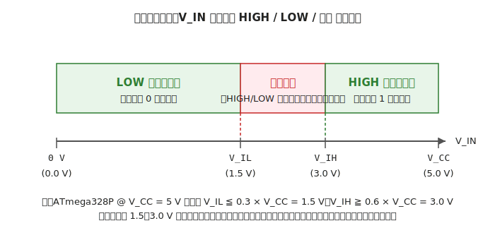
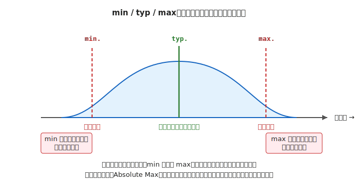

# 第 3 章　データシートの読み方

前章で「絶対最大定格」「推奨動作条件」という言葉が繰り返し出てきました。本章ではこれらが書いてある文書 — **データシート** — を、読者自身が任意の部品について引けるようになることをゴールにします。

この章さえ済ませれば、以降のどの章で知らない部品が出てきても、**「とりあえずデータシートを開いて、絶対最大定格と推奨動作条件だけは確認する」** という最低ラインの安全確認ができるようになります。

!!! info "最初はこの 3 ステップだけで OK（3 分）"
    1. `Absolute Maximum Ratings` を探す（超えると壊れる境界）
    2. `Recommended Operating Conditions` を探す（常用してよい範囲）
    3. `DC Characteristics` で I/O 電流または V_IH / V_IL を確認する

    この 3 つを見てから配線を始めるだけで、初心者の焼損事故の大半を回避できます。

---

## 1. データシートとは何か

データシートは、電子部品メーカーが部品 1 つ 1 つについて発行する **製品仕様書** です。典型的には数ページから 500 ページ超まで、部品によってボリュームが大きく違います。書いてあるのは大雑把に次の 3 種類です。

1. この部品は何者か（機能、特徴、代表的な用途）
2. この部品をどう使うと仕様通りに動くか（推奨動作条件、ピン接続、タイミング）
3. この部品を壊さないためには何を超えてはいけないか（絶対最大定格）

本書が特に強調するのは 3 番目です。焼損事故の大半は「絶対最大定格を超えた」か「推奨動作条件を外した」のどちらかが原因です。

!!! tip "入門書だけ読んでも事故は防げない"
    ブログ記事や入門書は「この LED には 220 Ω を入れてください」と書いてくれます。
    しかし **「その値がどこから来たのか」** を説明する一次情報はデータシートにしかありません。  
    「記事と違う LED を使いたくなったら抵抗値をどう変えるか」 — これを自分で決められるようになるのが本章の目的です。

---

## 2. データシートの典型構成

メーカーと部品が違ってもデータシートの章構成はほぼ共通です。この地図を頭に入れておくと、500 ページ PDF を前にしても目的の情報に最短でアクセスできます。

```
[表紙]
├─ 型番・概要・パッケージ写真
├─ Features（特徴・セールスポイント）
│
├─ Pin Configuration（ピン配置）
│   └─ どのピンが何の機能か
│
├─ Block Diagram（内部ブロック図）
│   └─ 内部モジュールの関係
│
├─ Absolute Maximum Ratings（絶対最大定格） ★焼損を避ける
│   └─ これを超えたら壊れる／保証なし
│
├─ Recommended Operating Conditions（推奨動作条件） ★常用の上限
│   └─ ここで使えば性能が保証される
│
├─ Electrical Characteristics（電気的特性） ★設計に使う
│   ├─ DC Characteristics（直流）
│   │   └─ V_IH / V_IL / V_OH / V_OL / I_OH / I_OL など
│   └─ AC Characteristics（交流・動的）
│       └─ 遅延時間、立ち上がり時間など
│
├─ Timing Diagrams（タイミングチャート）
│   └─ 信号の前後関係（I2C, SPI の波形など）
│
├─ Package Information（パッケージ情報）
│   └─ 外形寸法、推奨はんだパッド
│
└─ Ordering Information（注文情報）
    └─ 型番の枝番、温度グレードの読み方
```

!!! info "読む順番"
    初見の部品では次の順で読みます。慣れてきたら 1. と 2. だけで済むことも多いです。

    1. **Features + Pin Configuration**（1〜2 ページで部品の用途把握）
    2. **Absolute Maximum Ratings + Recommended Operating Conditions**（焼損回避）
    3. **Electrical Characteristics**（回路設計に必要な値を拾う）
    4. **Timing Diagrams**（通信 IC の場合のみ）
    5. 全部通読する必要はありません。**辞書引き** で OK です。

---

## 3. 最初に見るべき 3 つの項目

上の構成の中で、**初見の部品でとにかく先に見る** べき 3 項目だけ抜き出して暗記してください。

### (A) Absolute Maximum Ratings（絶対最大定格）

「これを超えたら破壊」という物理的限界です。超えた瞬間に必ず壊れるわけではありませんが、**保証は消え／寿命は大幅に縮み／即死もあり得る** の範囲に入ります。典型項目:

- 電源電圧（V_CC / V_DD / V_IN）の最大
- 入力ピン電圧の最大
- 1 ピンあたりの最大電流
- 動作温度・保存温度の上限
- 消費電力 P_D

### (B) Recommended Operating Conditions（推奨動作条件）

「**この範囲で使えばデータシートが保証する**」という通常動作のレンジです。本書の作例はすべてここに収める設計です。

- 電源電圧の推奨範囲（例：4.5〜5.5 V）
- 動作温度の推奨範囲
- 入力信号電圧の推奨レンジ

### (C) I/O 電流能力（DC Characteristics の中）

マイコン・ロジック IC では必ず、**出力ピンが吐き出せる（source）／吸い込める（sink）最大電流** が DC Characteristics の表に書いてあります。第 2 章で見た ATmega328P の「1 ピン 20 mA（DC max.）」はこの項目の値です。

!!! warning "この 3 項目だけで焼損事故の 9 割が避けられる"
    逆に言うと、この 3 項目 **すら確認せずに配線を進めた結果** が焼損事故の最頻出原因です。
    新しい部品を使うときは、データシートを開いて必ずこの 3 項目を読むクセを付けてください。

---

## 4. 記号の読み方

データシートは独特の記号の海です。読めないと表の意味が取れません。頻出分だけ先に覚えます。

### 電圧関係

| 記号 | 意味 | よく出る値 |
|---|---|---|
| V_CC | 電源電圧（バイポーラ系）| 5 V |
| V_DD | 電源電圧（CMOS 系）| 3.3 V, 5 V |
| V_SS | 負電源／GND（CMOS 系）| 0 V |
| V_EE | 負電源（バイポーラ系）| 0 V または負電圧 |
| V_IN | 入力電圧 | — |
| V_IH | **入力** を HIGH と判定する **最低** 電圧 | 5 V 品で 3.0 V 等 |
| V_IL | **入力** を LOW と判定する **最高** 電圧 | 5 V 品で 1.5 V 等 |
| V_OH | **出力** HIGH 時のピン電圧 | V_CC − 0.8 V 等 |
| V_OL | **出力** LOW 時のピン電圧 | 0.6 V 以下等 |
| V_F | 順方向電圧（ダイオード・LED）| 赤 LED で 約 2.0 V |

### 電流関係

| 記号 | 意味 |
|---|---|
| I_CC / I_DD | 電源電流（消費電流）|
| I_OH | 出力が HIGH のとき吐き出せる最大電流 |
| I_OL | 出力が LOW のとき吸い込める最大電流 |
| I_IH / I_IL | 入力リーク電流 |
| I_F | 順方向電流（ダイオード・LED）|

### 温度

| 記号 | 意味 |
|---|---|
| T_A | 周囲温度（Ambient）|
| T_J | 接合温度（Junction、チップ内部の半導体温度）|
| T_OP | 動作温度範囲 |
| T_STG | 保存温度範囲 |

### デジタル入力のしきい値（V_IH / V_IL）

マイコンやロジック IC の入力は、**ピンにかかっている電圧のレベルで HIGH か LOW か** を判定します。このしきい値を表すのが V_IH と V_IL です。



重要なのは V_IH と V_IL の **間に「不定領域」** があることです。入力電圧が V_IL 以下なら必ず LOW、V_IH 以上なら必ず HIGH と判定されますが、**その間（例えば 1.5〜3.0 V）は IC がどちらに読むか保証されません**。ピン電圧がこの範囲に長時間留まると、内部で HIGH/LOW の判定が揺れ、貫通電流による発熱・誤動作の原因になります。

これが「入力が浮いている（配線がどこにも繋がっていない）状態を避ける」理由です。第 12 章で扱う **プルアップ／プルダウン抵抗** は、この V_IH / V_IL の不定領域を避けるためにあります。

---

## 5. typ / min / max の意味と使い分け

データシートの値にはほぼ必ず `typ.` `min.` `max.` の区別があります。

- **typ.** (typical) — 代表値。個体バラツキの中心付近
- **min.** — その項目の下限保証値。これを下回る個体は（建前上は）出荷されない
- **max.** — 上限保証値。これを上回る個体も出荷されない



### 使い分けの指針

| 用途 | どれを使う |
|---|---|
| 「このピン、通常は何 V 出る？」という設計の出発点 | **typ.** |
| 「最悪ケースでも回路が成立するか」の検証 | **min.** または **max.** |
| 焼損判定（絶対に超えないか） | Absolute Maximum Ratings の値（min/typ/max とは別物） |

具体例：Arduino Uno の ATmega328P で、電源電圧が 5 V のとき:

- V_OH（出力 HIGH 時の電圧）の **min.** は V_CC − 0.8 V ＝ 約 4.2 V
- つまり HIGH 出力でも **電源電圧ちょうどまでは上がらない**。ピン電圧は 4.2 V しか届かないケースがある
- 負荷側の IC の V_IH（HIGH と判定される最低電圧）が 3.5 V なら、4.2 V ≥ 3.5 V でマージン OK
- もし負荷側の V_IH が 4.5 V だと、4.2 V < 4.5 V でアウト。HIGH 信号が届かない可能性がある

このように **送り手の min. V_OH ≥ 受け手の V_IH** が、ロジック IC を組み合わせる設計の基本不等式です（詳しくは [第 12 章](../topics/12-transistor-mosfet.md) と [第 16 章](../topics/16-sensors.md)）。

!!! tip "min / max はチップのバラツキだけの話ではない"
    min / max は、電源電圧の変動・温度変動・経年変化なども織り込んだ数値です。
    したがって **常温・定格電圧で測れば typ. に近い値が出る** のが普通ですが、夏の屋外・電池残量が減ってきたとき・長時間運転後など、条件が悪くなるほど min/max の境界に近づきます。
    「今は動いているのに、いつの間にか動かなくなる」現象の多くはここです。

---

## 6. 実例ウォークスルー

ここからは本書で実際に使う代表的な部品について、**最低限どこを読むか** を通しで示します。各部品の詳しい使い方は該当する章で扱います。

### (A) カーボン抵抗（1/4 W, 5%）

- **Power Rating（定格電力）**：0.25 W。\( P = I^2 R \) または \( P = V^2 / R \) で計算し、この値を超えないこと
- **Voltage Rating**：250 V 程度。本書の作例では問題になりません
- **Tolerance（誤差）**：±5%。抵抗計算で「ぴったり」と思っても ±5% ズレる前提で設計する
- **Temperature Coefficient**：±200〜500 ppm/℃ 程度。本書の範囲では影響しません

### (B) 赤色砲弾型 LED（例：OSR5JA3Z74A）

- **Forward Voltage V_F**：typ. 約 2.0 V @ I_F = 20 mA（赤色 LED の典型値）
- **Forward Current I_F**：推奨 20 mA、絶対最大 30 mA 前後（個体による）
- **Luminous Intensity**：明るさ。高輝度品ほど大きい
- **Viewing Angle**：指向性の強さ

赤 LED を 5 V 電源から光らせるときの電流制限抵抗:

\[
R = \frac{V_{CC} - V_F}{I_F} = \frac{5 - 2.0}{0.020} = 150\,\Omega
\]

実際には E24 系列で近い 150 Ω または 余裕を取って 220 Ω を選びます。詳しい設計は [第 10 章](../topics/10-led.md)。

### (C) Atmel ATmega328P（Arduino Uno R3 の MCU）

Microchip 公式データシート（DS40002061）の **DC Characteristics** の表を参照します。本書で特に重要な値:

| 項目 | 値 |
|---|---|
| V_CC 推奨動作範囲 | 1.8〜5.5 V（クロック周波数で下限が変わる）|
| 1 ピン I/O 電流 DC 最大 | 20 mA |
| 1 ピン I/O 電流 絶対最大 | 40 mA |
| VCC / GND ピン合計の絶対最大 | 200 mA |
| V_IH min. | 0.6 × V_CC（5 V 時に 3.0 V）|
| V_IL max. | 0.3 × V_CC（5 V 時に 1.5 V）|
| V_OH min. (@ I_OH = 20 mA) | V_CC − 0.8 V |
| V_OL max. (@ I_OL = 20 mA) | 0.6 V |

> 出典：[Microchip ATmega328P Datasheet DS40002061](https://ww1.microchip.com/downloads/aemDocuments/documents/MCU08/ProductDocuments/DataSheets/ATmega48A-PA-88A-PA-168A-PA-328-P-DS-DS40002061B.pdf)（Absolute Maximum Ratings / DC Characteristics の項）

### (D) 汎用 NPN トランジスタ（例：2N3904）

!!! info "トランジスタ未経験の読者へ"
    NPN トランジスタの端子名（**コレクタ / エミッタ / ベース**）と動作原理は [第 12 章](../topics/12-transistor-mosfet.md) で扱います。本節では「データシートにはこういう項目が並ぶ」という **読み方の例** として、値だけ眺めてください。

- **V_CEO max.**（コレクタ-エミッタ間の絶対最大電圧）：40 V
- **I_C max.**（コレクタに流せる絶対最大電流）：200 mA
- **h_FE typ.**（直流電流増幅率。ベース電流を何倍に増幅してコレクタに流すか）：100〜300（個体バラツキが非常に大きい）
- **P_D**（許容損失）：625 mW @ T_A = 25℃

2N3904 は汎用スイッチとして LED やリレー程度の駆動に十分ですが、DC モータ（数百 mA〜）には **I_C max. 200 mA が足りない** ため、MOSFET か専用モータドライバを使います（詳細は [第 12 章](../topics/12-transistor-mosfet.md)、[第 13 章](../topics/13-dc-motor.md)）。

### (E) 小型モータドライバ（例：DRV8835）

Texas Instruments のデュアル小型モータドライバ。データシートを見ると:

- **V_M（モータ電源）**：2.0〜11 V
- **V_CC（ロジック電源）**：2.0〜7 V
- **連続出力電流**：1.5 A / ch（ピーク 3 A）
- **ロジック入力 V_IH min.**：0.7 × V_CC

**ロジック電源 V_CC とモータ電源 V_M が別ピン** になっていることに注目してください。第 2 章で扱った「ロジック電源とモータ電源の分離」を物理的に可能にしている構造です。モータドライバ IC を選ぶときは、この 2 電源分離ピンがあるか（＝ロジックとモータを別電源で駆動できる設計か）を必ず確認します。

---

## 7. 自分でデータシートを探すコツ

必要になった時に自分で見つけられないと意味がないので、実用的な検索手順を挙げておきます。

1. **Google で「型番 datasheet」** で検索。例：`ATmega328P datasheet`
2. **メーカー公式サイトの PDF を優先** する
    - Microchip、STMicroelectronics、Texas Instruments、Nexperia、Rohm などの公式ドメイン（`*.microchip.com`、`*.ti.com` など）
    - 転載サイト（datasheetcatalog.com など）は改訂前の版が残っていることが多く避けるのが無難
3. **PDF 内検索で記号を探す**：`Ctrl + F` で `Absolute` / `Recommended` / `V_IH` / `I_OH` などを検索するのが最速
4. **和訳版は補助、数値は必ず原文で確認**：機械翻訳で文脈把握するのは良いですが、表の数値・単位は原文で再確認してください
5. **ダウンロードしてローカル保存**：メーカーは旧品種のデータシートを静かに削除することがあります。リポジトリや自分のクラウドストレージに控えを持っておくと、数年後の改造時に助かります

!!! info "「秋月の取扱説明書 PDF」との違い"
    秋月電子通商などの通販サイトは独自の「取扱説明書 PDF」を配布することがあります。
    これは初心者向けの抜粋・和訳版で、**正規のメーカーデータシートとは別物** です。
    最初の理解には便利ですが、設計上の最終根拠としてはメーカー公式データシートを参照してください。

---

## 次章への橋渡し

次の [第 4 章「電源の基礎」](04-power.md) では、本章で身につけた「データシートの推奨動作条件を読む」スキルを、**電池・AC アダプタ・DCDC コンバータの選び方** に適用します。「Arduino は 5 V で動く」だけでは選べない、USB 給電の電流上限や電圧ドロップ、モータ電源との分離など、配線を組む前に決めておくべきことを一通り扱います。
