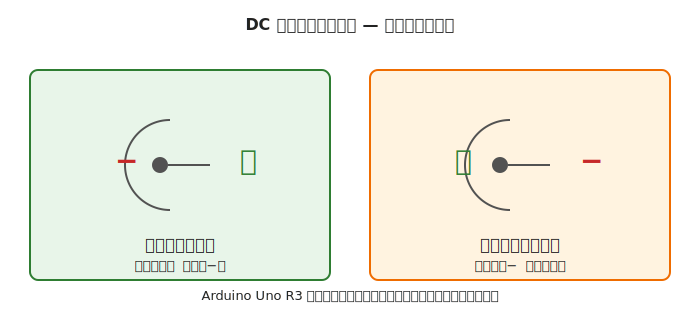
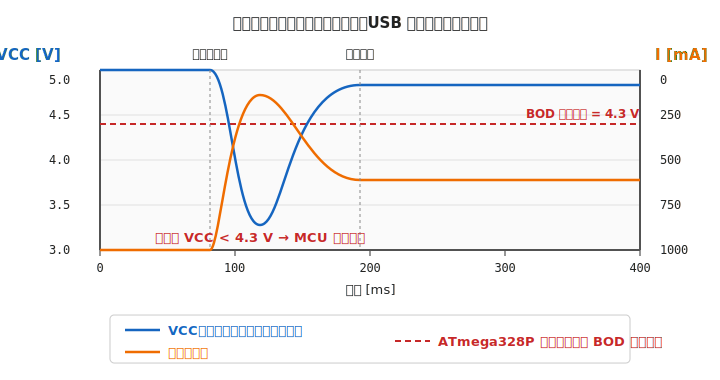
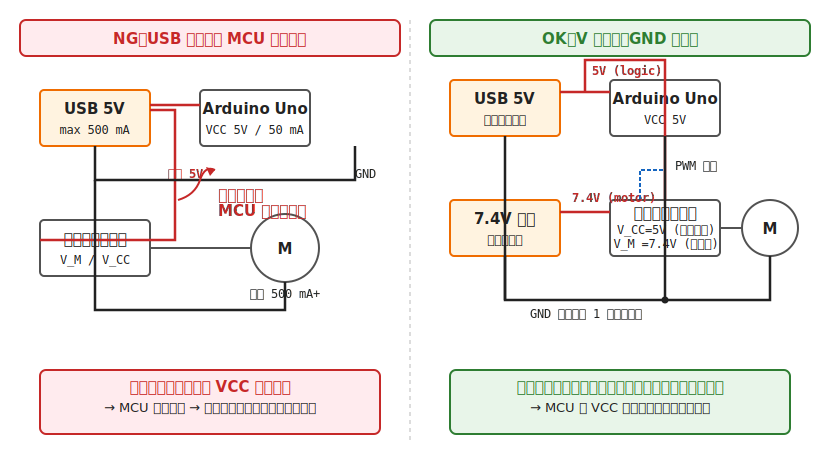

# 第 4 章　電源の基礎

マイコンでロボットを作る上で、**電源まわりは「あとから直すのが最も難しい」部分** です。完成したロボットが誤動作する原因の多くが電源設計のミスに由来します。本章では Part I の締めくくりとして、電池・AC アダプタ・DCDC・USB 給電の基本と、**ロジック電源とモータ電源を分ける** 理由を体系的に扱います。

!!! warning "この章で壊しやすいもの"
    - マイコンボード（**逆極性プラグ接続** による過電流）
    - リポ／リチウムイオンバッテリ（ショートによる発火・破裂）
    - PC の USB ポート（過電流によるポート保護回路トリップ）

!!! info "迷ったらこれを選ぶ（初心者デフォルト）"
    電源構成で迷ったときは、まず次の 3 段階で進めてください。

    - **机上の初期テスト**：マイコンは USB 給電、モータはまだ接続しない
    - **モータ単体テスト**：マイコンは USB 5V、モータは電池（**V は分離 / GND は共通**）
    - **自走テスト**：モータ電源は電池のまま、ロジック側だけ LDO か降圧 DCDC で安定化

    この構成にしておくと、最も多い「ブラウンアウトで原因不明に見える不具合」を初期段階で避けやすくなります。

---

## 1. 電源に求められる 3 つの条件

電源を選ぶときに見るべき指標は 3 つに整理できます。

1. **電圧 (V)** — マイコン・モータ・センサそれぞれの推奨動作条件に入っているか
2. **電流容量 (A)** — 回路全体のピーク電流を供給できるか。常用電流の **2〜3 倍の余裕** が必要
3. **安定性・ノイズ** — 負荷が変動しても電圧が保たれるか、ノイズが許容範囲か

第 3 章で習った「データシートの Recommended Operating Conditions」をこの 3 項目で逆引きするのが、電源設計の出発点です。

---

## 2. 電池の種類と特性

本書で出会う可能性のある電池を並べます。

| 種類 | 公称電圧 | 容量の目安 | 再充電 | 注意点 |
|---|---|---|---|---|
| アルカリ乾電池（単 3）| 1.5 V / 本 | 約 2000 mAh | 不可 | 大電流に不向き（内部抵抗が大きい）|
| Ni-MH 充電池（エネループ 等）| 1.2 V / 本 | 約 2000 mAh | 可 | 自己放電が少ない。直列本数で電圧を調整 |
| リチウム一次（CR2032 等）| 3.0 V | 約 200 mAh | 不可 | 時計・常時通電センサ用 |
| リチウムイオン 18650 | 3.7 V / セル | 約 3000 mAh | 可 | 保護回路付きを選ぶ |
| リポ（LiPo）| 3.7 V / セル × N | 製品差 | 可 | **発火・膨張リスクあり**。専用充電器必須 |

!!! danger "リポバッテリは扱いを間違えると発火する"
    - **端子をショート**（はんだ作業中の不注意も含む）→ 発火
    - **過放電**（電圧が 3.0 V / セル を下回る）→ 内部化学反応で劣化し、次回充電時に発火の可能性
    - **物理的衝撃**（落下・圧迫）→ 内部ショート → 発火
    - **充電は必ず専用充電器** で。USB モバイルバッテリの「なんでも充電モード」は絶対に使わない
    - **リポ専用の耐火袋（リポセーフバッグ）** に入れて充電する

### 電池選びの実用指針

以下で出てくる「**三端子レギュレータ**」「**昇圧／降圧 DCDC**」という言葉は §4 で詳しく扱います。ここではとりあえず **「電圧を変換する部品」** と思って読み進めてください。  
なお「**試作段階は乾電池 6 V から始める**」という方針は [第 1 章 §6.5「段階的プロトタイピング」](01-introduction.md) と対応しています（ショート事故時の被害を最小化するため、試作期は容量の小さい電源を使う）。

- **試作段階・短時間の実験**：単 3 アルカリ × 4 本（6 V） + 三端子レギュレータで 5 V を作るのが最もトラブルが少ない（ショート時の電流が小さく安全）
- **連続運用・高電流**：Ni-MH × 6 本（7.2 V）または リポ 2S（7.4 V）
- **携帯・小型**：リポ 1S（3.7 V）+ 昇圧 DCDC、もしくは リポ 2S（7.4 V）+ 降圧 DCDC

---

## 3. AC アダプタの選び方

家庭用 AC（100 V）をそのまま使うのは危険なので、AC アダプタで直流低電圧に変換します。選定時に見る項目:

### 3.1 電圧と電流の表記

AC アダプタ本体に「出力：9 V 1.5 A」のように書かれています。意味は:

- **9 V** — 定格電流を引いたときに出る電圧（**無負荷では 9〜11 V 程度出ていることが多い**）
- **1.5 A** — 連続して流せる最大電流

!!! warning "定格電圧 ≠ 無負荷電圧"
    安い **非安定化（non-regulated）** アダプタは、無負荷時に定格の 1.5 倍程度まで電圧が跳ね上がることがあります。
    「9 V 定格のアダプタをテスタで測ったら 13 V だった」というのはよくある話です。
    **安定化（regulated）** と記載された製品を選ぶか、必ず後段に **レギュレータ**（電圧を一定に保つ回路。次節 §4 で詳説）を入れてください。

### 3.2 プラグの極性

DC プラグ（DC ジャック）には **センタープラス**（内側が +）と **センターマイナス**（内側が −）の 2 種類があります。

- Arduino Uno R3 の DC ジャックは **センタープラス**
- 古い楽器用エフェクター類は **センターマイナス** が多い

**極性を間違えると、逆接続保護ダイオードが焼ける**（保護回路付きのボードの場合）か、**保護回路のないボードは一撃で破壊されます**。アダプタを挿す前に、後述のチェックリストにある手順で **テスタでプラグの極性を実測** するクセを付けてください。

### 3.3 PSE マーク

日本国内で AC100 V から電気を取る機器には、**PSE マーク（電気用品安全法）** の表示が必要です。海外通販の無印 AC アダプタは PSE マーク無し＝国内販売違反品の可能性があります。国内で安全に使うなら PSE マーク付きを選びます。

---

## 4. レギュレータ（電圧変換回路）の基礎

電池や AC アダプタの出力電圧を、マイコンや IC が要求する電圧（5 V や 3.3 V）に変換するのが **電圧レギュレータ** です。本書で扱う 3 つの言葉をまず整理します。

### 4.1 用語の整理 — レギュレータ／DCDC／LDO

- **レギュレータ (regulator)** — 入力電圧が多少ズレても、出力電圧を一定に保つための回路（または部品）の総称。電池の消耗や負荷変動を吸収して、マイコン向けに安定した電圧を作ります
- **DCDC コンバータ (DC-DC converter)** — 直流 → 直流の電圧変換回路の総称。レギュレータの一種と考えて差し支えありません。特に **スイッチング方式** のものを単に「DCDC」と呼ぶ慣用があります
- **LDO (Low Drop-Out) レギュレータ** — リニアレギュレータの改良版で、**入出力電圧差が小さくても動く** タイプ。例えば 3.3 V 品なら入力 3.5 V でも出力 3.3 V が出せる

本書で使う電圧変換回路は、大きく **2 方式** に分かれます。

| 方式 | 代表 | 効率 | ノイズ | 入出力差 |
|---|---|---|---|---|
| **リニア（三端子レギュレータ / LDO）** | 7805、AMS1117-3.3 | 低い（40〜60%）| 少ない | **LDO は小さくてよい**、通常リニアは 2 V 以上必要 |
| **スイッチング（DCDC コンバータ）** | MP1584EN、LM2596 | 高い（85〜95%）| 多い | 自由 |

### 4.2 リニアレギュレータ（三端子レギュレータ・LDO）

代表例：**7805**（5 V 出力、1 A、三端子レギュレータの代名詞）、**AMS1117-3.3**（3.3 V 出力、1 A、**Low Drop-Out タイプ**）

- **動作原理**：入力電圧と出力電圧の差を、**熱として捨てる**
- **効率**：入出力電圧差に依存。入力 9 V → 出力 5 V で効率約 55%（残りは発熱）
- **長所**：ノイズが少ない、回路が簡単、安価
- **短所**：効率が悪い、大電流で発熱が大きい

**入出力電圧差の要件**：通常の三端子レギュレータ（7805 等）は、**入力が出力 + 2 V 以上** ないと安定動作しません。これを「**ドロップアウト電圧 (dropout voltage)**」と呼び、LDO タイプはこの差を **0.1〜0.5 V** 程度まで縮めた製品群です。リポ 1S（3.7 V）から 3.3 V を作るには LDO でないと成立しません。

### 4.3 スイッチングレギュレータ（DCDC）

代表例：**MP1584EN モジュール**（降圧、3 A）、**LM2596 モジュール**、各種 **Buck / Boost モジュール**

- **動作原理**：高速でスイッチを ON/OFF し、インダクタとコンデンサで電圧を作り直す
- **効率**：85〜95%
- **長所**：高効率、大電流に強い、昇圧（Boost）・昇降圧（Buck-Boost）もできる
- **短所**：スイッチングノイズが出力に乗る（アナログ回路・無線用途では対策が要る）

### 4.4 本書でのデフォルト選定

| 用途 | 推奨 |
|---|---|
| ロジック電源（マイコン・センサ）| **リニア／LDO** で 3.3 V / 5 V を作る |
| モータ電源 | 電池から直接、または **スイッチング DCDC** |

**ノイズが入るとマイコンがリセットすることがある** ため、ロジック電源側はクリーンさを優先してリニア／LDO を採用。モータ側は効率優先でスイッチング、あるいは電池電圧をそのまま使います。

---

## 5. ロジック電源とモータ電源を分ける理由

第 2 章の動作確認チェックリストで「V は分離／GND は共通」と書きました。ここで深掘りします。

### 5.1 モータは電源を「引きずり下ろす」

モータは起動時・負荷変動時に **大きな電流を瞬間的に引きます**（突入電流）。
小型 DC モータで数百 mA、ホビーサーボで 1 A、大型モータなら数 A です。
この電流を **電源が供給できない** 場合に何が起きるかを示したのが下の図です。

起きる順番はこうです。

1. モータが起動 → 突入電流で電源レールから数百 mA が引かれる
2. 電源の供給能力を超えると、電源電圧（VCC）が一瞬ガクッと下がる
3. マイコンの **Brown-out Detector（BOD、低電圧検出）** が働いてリセット
4. リセット中なのでモータへの信号が切れ、モータが止まる
5. 止まると電流が戻って VCC が回復 → マイコンが起動
6. 再度モータに指令 → また突入電流 → VCC 低下 → リセット
7. **永久ループ** に陥る

USB バスパワーだけで Arduino + モータを動かそうとして詰まるのは、典型的にこのパターンです。

### 5.2 分離のトポロジ — NG と OK の比較

- **NG**：USB 1 本で MCU もモータドライバも給電している
    - モータの突入電流が **共通の VCC レール** を通って MCU 側にも影響する
    - 結果として §5.1 のブラウンアウトループに陥る
- **OK**：MCU は USB 5 V、モータドライバの **V_M は別電源（電池 7.4 V）**
    - モータの電流変動は **モータ側レールだけ** に出る
    - MCU 側の 5 V は負荷が小さく安定したままなのでリセットしない
    - **GND は両電源で共通** にする（これが最重要）

!!! danger "「V は分離／GND は共通」を必ず守る"
    モータドライバ IC の **ロジック入力ピン** は、マイコン側の電圧を基準にしています。
    もし両電源の GND がつながっていないと、「0 V」の基準が一致しないので、
    モータドライバから見ればロジック信号が意味不明な電位を示す状態になります。
    → **IC が想定外の入力で誤動作、または破壊**。  
    「V は別系統、GND は 1 点で統合」がロボット配線の基本パターンです。

### 5.3 分離の実装パターン

- **電池 × 2 系統**：マイコン用 9 V 電池 + モータ用 Ni-MH × 6 本（または リポ 2S）
- **電池 + DCDC**：リポ 2S（7.4 V）から、マイコン用に降圧 DCDC で 5 V を作り、モータ側は 7.4 V をそのまま使う
- **AC アダプタ + 電池**：開発中は AC アダプタでマイコン給電、モータは電池。AC アダプタを挿したまま電池も繋いで、テスタで両 GND が導通していることを確認する

---

## 6. USB 給電の落とし穴

マイコン入門期は USB 給電が圧倒的に便利ですが、**モータを含む用途には限界があります**。

### 6.1 USB ポートの電流上限

| 規格 | 1 ポートあたりの供給上限（標準）|
|---|---|
| USB 2.0 | 500 mA |
| USB 3.0 / 3.1 Gen1 | 900 mA |
| USB BC 1.2（充電対応ポート）| 1.5 A |
| USB PD（Power Delivery）| ネゴシエーション次第（最大 5 A・20 V 等）|

**Arduino Uno R3 本体の消費電流だけで 50 mA 前後** を使うので、センサやモータドライバを足していくと USB 2.0 の 500 mA はすぐ使い切ります。

### 6.2 ケーブルによる電圧降下

USB ケーブルには電線抵抗があり、電流が流れると \( V = I \times R \) で電圧が落ちます。
100 円ショップの細い USB-A → Micro-B ケーブルを使うと、ボード側の VCC が **4.3〜4.5 V まで落ちる** ことも珍しくありません（定格 5 V）。
これは §5.1 のブラウンアウトを、モータを動かしていなくても招きます。

!!! tip "USB ケーブルは「太い＋短い」を選ぶ"
    どうしても USB 給電で動かしたいときは、**AWG 22 以上の太線ケーブル** を選びます。
    価格帯でいえば **1,000 円以上のきちんとしたケーブル** がそれにあたります。
    モバイルバッテリ付属の細ケーブルでは電圧ドロップが致命的です。

### 6.3 PC の USB ポートから何が流れるか

PC 側の USB ポートは、規格超過の電流要求があると **保護回路が働いてポートを切る** 設計です。
PC によってはカーネルレベルで USB ハブごと無効化されることもあり、**再起動するまで復帰しない** ケースがあります。
モータや大電流実験は PC のポートではなく、**セルフパワー USB ハブ（別途 AC アダプタ付き）** か **USB 電源単体（アダプタ＋ USB ケーブル）** を使うのが無難です。

---

## 7. 動作確認チェックリスト（電源編）

第 2 章のチェックリストに電源まわりを追加した拡張版です。モータを含む章では毎回このチェックを行います。

### 電源投入の **前**

- [ ] **電源電圧** がマイコン・IC のデータシート Recommended Operating Conditions の範囲にある（典型：5 V ±0.25 V、3.3 V ±0.15 V）
- [ ] **電流容量** が、回路全体のピーク電流（常用の 2〜3 倍想定）以上ある
- [ ] AC アダプタ使用時、**プラグ極性をテスタで実測** した
    - テスタを **DCV モード** にし、赤プローブをプラグの **中心**、黒プローブをプラグの **外周** に当てる
    - 読みが **正** → センタープラス（Arduino Uno 等と合う）
    - 読みが **負** → センターマイナス（そのまま差し込むと破壊。別のアダプタを使う）
- [ ] 無負荷時のアダプタ出力電圧が、**ボードの絶対最大定格を超えていない**（非安定化品は要注意）
- [ ] ロジック電源とモータ電源を分離する構成なら、**第 2 章 (D)** のチェック（V 非導通 / GND 導通）を実施した

### 電源投入の **後**

- [ ] マイコン無負荷時、**VCC の実測値が公称 ±5% 以内**（5 V なら 4.75〜5.25 V、3.3 V なら 3.15〜3.45 V）
- [ ] モータを最大出力で動かしたときに、マイコンが **リセットループに入らない**
    - ATmega328P のデフォルト Brown-Out Detector しきい値は **約 4.3 V**。VCC がこれを下回るとマイコンが強制リセットされ、起動 → モータ指令 → また低下 → リセット、という永久ループに陥る（§5.1 参照）
    - **検出方法その 1：シリアルモニタで setup() の再実行を観察する（最も確実で、追加の道具不要）**
        1. スケッチの `setup()` の冒頭に起動メッセージを入れる：  
           `Serial.begin(9600); Serial.println("BOOT");`
        2. `loop()` に定期メッセージを入れる：  
           `if (millis() % 1000 < 10) Serial.println(millis());`
        3. Arduino IDE のシリアルモニタを開いたまま、モータを最大スロットルにする
        4. **モータ駆動中に `BOOT` が複数回出る** → リセットループ発生（＝ブラウンアウト）
        5. `BOOT` は最初の 1 回のみで、その後 `1000` `2000` `3000` … が途切れず出続ければ OK
    - **検出方法その 2：DMM の MIN HOLD 機能（中級 DMM があれば）**
        1. テスタの DCV モードで **MIN ホールド（最小値記録）** を有効化
        2. VCC-GND 間に当てたまま、モータを 30 秒ほど最大スロットルで回す
        3. MIN 値が **4.3 V を下回っていたらブラウンアウト確定**
        4. 安い DMM にはこの機能がないので、その場合は方法その 1 を使う
- [ ] モータ電源のレールが、負荷変動時にデータシートの最低動作電圧を割らない（モータドライバの V_M 下限も要チェック）

!!! tip "ブラウンアウトループを見つけたときの切り分け"
    **先に症状をチェック**（オシロなしで気づける兆候）：

    - シリアルモニタで `BOOT` のような起動メッセージが **繰り返し出る**
    - 内蔵 LED（D13）がモータ駆動中に **不規則に点滅** する（Arduino Uno の場合は起動時の 3 回点滅が繰り返し見える）
    - モータが **「動いては止まる」** を細かく繰り返す
    - PC 側で **USB デバイスの接続／切断が繰り返される**（Windows なら接続／切断のチャイム音、macOS なら `/dev/cu.usbmodem*` の消失）
    - Arduino IDE での書き込みが **途中で失敗する** 頻度が上がる

    **切り分け手順**（上の症状が出たら）：

    1. まず **電源を切る**（このループ中も大電流が瞬間的に流れ続けている）
    2. USB ケーブルを **太く短いもの** に替えて改善するか？ → ケーブル劣化・電圧ドロップが原因
    3. 改善しない場合、モータドライバの V_M を **別電源** に分けて改善するか？ → ロジック／モータ電源の分離（§5）で解決
    4. それでも改善しない場合、**モータ電源側の容量不足**（電池の内部抵抗が高い／AC アダプタの定格電流不足）。より大きな電源に替える

---

## 次章への橋渡し

ここまでの Part II（電気の基礎）で、**焼損を避ける基礎（第 2 章）／データシートの読み方（第 3 章）／電源の考え方（本章）** が揃いました。これで読者は「新しい部品を触るときに、データシートを開いて壊さない範囲で動かす」最低ラインの判断ができる状態です。

次の [第 5 章「電気の設計フェーズ」](../workflow-electrical/05-design-phase.md) から **Part III 電気のワークフロー** に入ります。Part III は **設計 → 組立 → テスト前 → テスト中 → デバッグ** の 5 フェーズを順に扱う章群で、これまでに登場した「動作確認チェックリスト」「ブラウンアウト検出」などの要素を、プロジェクトを進めるタイムライン上に再整理します。
