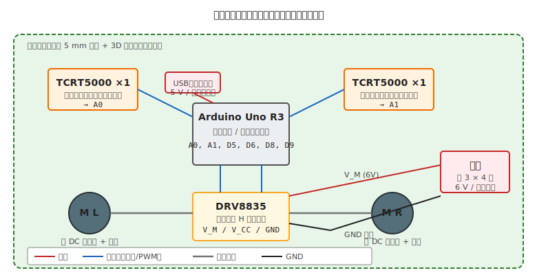
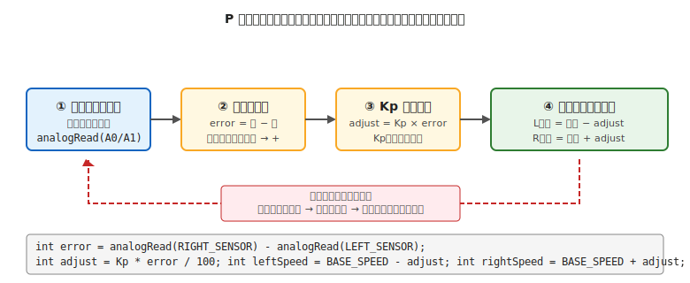

# 第 31 章　プロジェクト A：ライントレースカーを作る

本書の **卒業課題** です。これまで学んだすべての章 — 第 1 章の安全意識、Part II-IV の電気技術、Part V-VII の機械技術、Part III と Part VI のワークフロー — を **1 台のロボットに統合** します。

ここまで独立して学んできた要素が、「**床に引いた黒い線に沿って自律走行する車**」という 1 つの動くモノに結実します。完走したときに「自分で動くロボットを作れた」という成果が手元に残るのが、本書のゴールです。

!!! warning "この章で壊しやすいもの（統合ならではのリスク）"
    - **モータドライバ IC**（電源分離忘れ・突入電流 → [第 4 章 §5](../getting-started/04-power.md)、[第 13 章 §3](../topics/13-dc-motor.md)）
    - **反射型フォトセンサ**（電流制限抵抗ミス → [第 10 章 §4](../topics/10-led.md) と同じ考え方）
    - **電池**（過放電による性能劣化 → [第 4 章 §2](../getting-started/04-power.md)）
    - **車輪の空回り**（イモねじの当て方ミス → [第 27 章 §4](../topics-mechanical/27-drivetrain.md)）
    - **重心の転倒**（電池を上に載せる配置 → [第 29 章 §3](../topics-mechanical/29-weight-rigidity-balance.md)）

---

## 1. 完成イメージとブロック図

### 1.1 作るもの

- 大きさ：手のひらに乗るサイズ（約 180 × 140 × 60 mm、重量 200 g 前後）
- 走行方式：左右独立駆動の 2 輪差動駆動（後輪 2 + 前輪ボール 1 の 3 点接地）
- ライン検出：反射型フォトセンサ 2 個で床面の黒白を検知
- 制御：**比例制御（P 制御）** で、ラインからのズレ量に応じてモータ速度を補正
- 電源：単 3 × 4 本（6 V）で自走。マイコンは USB 給電（調整時）→ 単独走行時は同じ電池から 5V LDO 経由で給電

### 1.2 システム構成



---

## 2. 設計フェーズ（[第 5 章](../workflow-electrical/05-design-phase.md) と [第 21 章](../workflow-mechanical/21-design-phase.md) の統合）

### 2.1 電気要件（第 5 章 §2 の 4 分類）

| 分類 | 内容 |
|---|---|
| 入力 | 反射型フォトセンサ 2 個（アナログ出力、A0/A1）|
| 出力 | DC モータ 2 個（モータドライバ経由で PWM）|
| 通信 | なし（単独動作）|
| 電源 | 単 3 × 4 本（6V）を モータ用。ロジックは 5V LDO 経由 or USB |

### 2.2 機械要件（第 21 章 §2 の 5 分類）

| 項目 | 内容 |
|---|---|
| 可動部 | 左右車輪の独立駆動（2 輪）+ 前方ボールキャスター |
| 搭載物 | Arduino Uno、DRV8835、モータ 2、センサ 2、電池 4 本 = 合計 約 200 g |
| 外形 | 180 × 140 × 60 mm 以内 |
| 環境 | 室内フロア（硬い板、黒テープで引いた線） |
| 耐久 | デモ用途、1 日数回走らせる程度 |

### 2.3 BOM（第 5 章 §5、第 21 章 §6 の統合）

| カテゴリ | 型番 | 入手先 | 数量 | 小計 |
|---|---|---|---|---|
| マイコン | Arduino Uno R3（公式品） | Switch Science | 1 | 3,300 円 |
| モータドライバ | DRV8835 モジュール | Switch Science / Pololu | 1 | 650 円 |
| DC モータ | FA-130 相当 + ギアボックス | タミヤ ツインモーターギアボックス | 1 | 1,200 円 |
| 車輪 | タミヤ トラック&ホイールセット | タミヤ | 1 | 700 円 |
| 反射型センサ | TCRT5000 ブレークアウトモジュール | Amazon（中華、数個セット）| 2 | 600 円 |
| 電池ボックス | 単 3 × 4 本、スイッチ付き | 秋月 | 1 | 150 円 |
| 電池 | 単 3 アルカリ × 4 本 | 100 円ショップ | 1 | 200 円 |
| ブレッドボード | EIC-801 | 秋月 | 1 | 350 円 |
| ジャンパワイヤ | オス-オス・オス-メス | Amazon | 1 セット | 500 円 |
| 抵抗 | 330 Ω（センサ LED 用）、10 kΩ（プルアップ）| 秋月（セット品から）| 各数本 | — |
| 5V LDO（自立走行用） | AMS1117-5 モジュール | 秋月 or Amazon | 1 | 200 円 |
| シャシー材料 | アクリル板 3 mm、180 × 140 mm | レーザーカット外注 | 1 | 800 円 |
| モータマウント | 3D プリント（PLA）| 自家プリント or 外注 | 1 式 | 500 円 |
| ねじ・ナット類 | M3 × 8、M3 ナット、M3 スペーサ | 秋月／モノタロウ | 各数個 | 400 円 |
| **合計（目安）** | | | | **約 9,550 円** |

!!! tip "タミヤのキットで機械部品を省略できる"
    タミヤの **「カムプログラムロボット工作セット」** や **「ライントレーサー工作セット」** を買うと、シャシー・モータ・車輪・ボールキャスターが一式揃います。「機械設計からやりたい」読者は本書の設計フェーズで自作、「電気と制御に集中したい」読者はタミヤキットのシャシーを流用、と選べます。

---

## 3. 機械の製作・組立（[Part VI](../workflow-mechanical/21-design-phase.md) の流れ）

### 3.1 シャシーのレイアウト

底板（180 × 140 mm アクリル）に以下を配置:

- **前方（端から 20 mm）**：TCRT5000 センサ 2 個を左右に並べる（中心間距離 30 mm）
- **中央**：Arduino Uno と DRV8835 を重ねて配置
- **後方（端から 40 mm）**：モータ 2 個と車輪、その後ろに電池ボックス
- **前方中央下面**：ボールキャスター（車体を 3 点で支える）

**重心を低く**（[第 29 章 §4](../topics-mechanical/29-weight-rigidity-balance.md)）保つため、電池は底板直上に配置。マイコンは中層、センサは底板前方の裏面に取り付けます。

### 3.2 製作手順（[第 22 章](../workflow-mechanical/22-fabrication-phase.md)）

1. 底板をレーザーカット外注（DXF データ作成 → 業者発注 → 3〜7 日で納品）
2. モータマウントを 3D プリント（積層方向は底板と平行になる向きで PLA、壁 3 周、充填 30%）
3. ねじ穴・センサ穴のバリ取り（カッター or ヤスリ）

### 3.3 組立前チェック（[第 23 章](../workflow-mechanical/23-pre-assembly-check.md)）

- [ ] BOM 突き合わせ（ねじの長さ M3 × 8 と M3 × 10 を混同していないか）
- [ ] 底板の寸法をノギスで実測（レーザーカット品、±0.2 mm 以内）
- [ ] モータマウントと底板のねじ穴が揃う
- [ ] 車輪がモータ軸に入る（D カット軸 + イモねじで固定、[第 27 章](../topics-mechanical/27-drivetrain.md)）

### 3.4 組立（[第 24 章](../workflow-mechanical/24-assembly-check.md)）

順序：

1. **センサを底板裏面に取り付け**（配線は底板の穴を通して上面に出す）
2. **モータを 3D プリントマウントに固定**、マウントごと底板に取り付け
3. **車輪をモータ軸に装着**（D カット面にイモねじ先端が当たる向き、[第 27 章 §4](../topics-mechanical/27-drivetrain.md)）
4. **前方ボールキャスターを取り付け**（底板裏面、前方中央）
5. **Arduino とブレッドボードを底板中央に固定**（M3 スペーサー）
6. **電池ボックスを底板後方に配置**（両面テープ or ねじ）
7. **手で各車輪を回してみる**（スムーズに回る、引っかかりなし）

---

## 4. 電気の組立（[第 6 章](../workflow-electrical/06-assembly-phase.md) + [第 13 章](../topics/13-dc-motor.md) の実装）

### 4.1 配線（DRV8835 の IN/IN モード、MODE ピンを GND）

```
【ロジック系】
Arduino 5V ─┬─ DRV8835 V_CC
            ├─ TCRT5000(L) VCC
            └─ TCRT5000(R) VCC

Arduino D5 ── DRV8835 AIN1（左モータ PWM）
Arduino D6 ── DRV8835 AIN2（左モータ方向）
Arduino D9 ── DRV8835 BIN1（右モータ PWM）
Arduino D8 ── DRV8835 BIN2（右モータ方向）

Arduino A0 ── TCRT5000(L) OUT
Arduino A1 ── TCRT5000(R) OUT

DRV8835 MODE ── GND（IN/IN モード）

【モータ系・別電源】
電池ボックス V+ ── DRV8835 V_M
DRV8835 AOUT1, AOUT2 ── 左モータの 2 端子
DRV8835 BOUT1, BOUT2 ── 右モータの 2 端子

【GND 共通】
Arduino GND ─┬─ DRV8835 GND（ロジック側）
             ├─ TCRT5000(L) GND
             ├─ TCRT5000(R) GND
             └─ 電池ボックス GND
```

### 4.2 配線の色分け（[第 6 章 §4](../workflow-electrical/06-assembly-phase.md)）

- 赤：5V（ロジック）
- オレンジ or 濃い赤：6V（モータ電源）
- 黒：GND
- 黄：PWM / 方向信号
- 緑：センサ信号

---

## 5. テスト前・テスト中チェック（[第 7 章](../workflow-electrical/07-pre-test-check.md) + [第 8 章](../workflow-electrical/08-test-check.md)）

### 5.1 電源投入前（第 7 章 (A)〜(E) 全項目）

- [ ] (A) 配線シートと実機の目視照合
- [ ] (B) VCC-GND 間ショートチェック：Arduino 5V ⇔ GND、電池 V+ ⇔ GND、各 IC の VCC ⇔ GND、**すべて鳴らない**
- [ ] (C) ロジック電圧一致：全部品が 5V レール上にある（3.3V センサは未使用）
- [ ] (D) 電源分離：Arduino VCC（USB）と電池 V+ が **非導通**、GND 同士が **導通**（[第 4 章 §5](../getting-started/04-power.md) の V 分離／GND 共通）
- [ ] (E) 極性：センサの LED、電解コンデンサ（使う場合）、ダイオードの向き

### 5.2 電源投入後（第 8 章）

- [ ] 投入直後 2 秒：煙・焦げ臭・音なし
- [ ] 2〜10 秒：VCC 5V ±5%、Arduino の電源 LED 点灯
- [ ] 10〜30 秒：モータドライバ・モータ温度 OK（触って 10 秒耐えられる）
- [ ] 30 秒〜1 分：Arduino IDE でスケッチ書き込み成功、シリアルモニタ出力

---

## 6. ソフトウェア：段階的に実装

### 6.1 ステップ 1：センサ読み取りだけ

まず、走らせずに **センサが線を検知しているかを確認** します。

```cpp
const int LEFT_SENSOR = A0;
const int RIGHT_SENSOR = A1;

void setup() {
  Serial.begin(9600);
  pinMode(LEFT_SENSOR, INPUT);
  pinMode(RIGHT_SENSOR, INPUT);
}

void loop() {
  int left = analogRead(LEFT_SENSOR);
  int right = analogRead(RIGHT_SENSOR);
  Serial.print("L=");
  Serial.print(left);
  Serial.print("  R=");
  Serial.println(right);
  delay(200);
}
```

**期待される動作**：

- センサを **白い紙** の上にかざす → 値が小さい（反射が多い → トランジスタが ON → A0 電圧が低い、100〜300）
- センサを **黒い線** の上にかざす → 値が大きい（反射が少ない → トランジスタが OFF → A0 電圧が高い、700〜950）
- 値の差が 300 以上あれば検知 OK

センサのバラツキを見て、**しきい値**（例：白黒の中間値 500）を決めます。

### 6.2 ステップ 2：モータの直進テスト

センサを無視して、両モータを同じ PWM で回して **直進するか** を確認します。

```cpp
const int AIN1 = 5;   // 左 PWM
const int AIN2 = 6;   // 左 方向
const int BIN1 = 9;   // 右 PWM
const int BIN2 = 8;   // 右 方向

const int BASE_SPEED = 130;   // 0-255

void setMotor(int pwm_pin, int dir_pin, int speed) {
  if (speed >= 0) {
    analogWrite(pwm_pin, speed);
    digitalWrite(dir_pin, LOW);
  } else {
    analogWrite(pwm_pin, -speed);
    digitalWrite(dir_pin, HIGH);
  }
}

void setup() {
  pinMode(AIN1, OUTPUT); pinMode(AIN2, OUTPUT);
  pinMode(BIN1, OUTPUT); pinMode(BIN2, OUTPUT);
  delay(2000);   // 起動後 2 秒待機（いきなり動き出さない）
}

void loop() {
  setMotor(AIN1, AIN2, BASE_SPEED);    // 左 前進
  setMotor(BIN1, BIN2, BASE_SPEED);    // 右 前進
}
```

**期待される動作**：

- 両輪が同じ速度で回り、車体が直進する
- 曲がってしまう場合 → 左右のモータ特性差、車輪径の差、または左右非対称の重量バランス
    - 左右の PWM 値を微調整（例：左 130、右 125）
    - または [第 25 章 §4.2](../workflow-mechanical/25-debugging.md) の「直進させているつもりが曲がる」で切り分け

### 6.3 ステップ 3：ON/OFF 制御（単純な方式）

センサの片方が線に乗ったら、その側を減速して曲げる単純なロジック。

```cpp
const int THRESHOLD = 500;   // 白黒の中間値

void loop() {
  int left = analogRead(LEFT_SENSOR);
  int right = analogRead(RIGHT_SENSOR);
  bool leftOnLine = left > THRESHOLD;
  bool rightOnLine = right > THRESHOLD;

  if (leftOnLine && rightOnLine) {
    // 両方が線上 → 直進（交差点 or 線の上）
    setMotor(AIN1, AIN2, BASE_SPEED);
    setMotor(BIN1, BIN2, BASE_SPEED);
  } else if (leftOnLine) {
    // 左が線上 → 左に曲がる
    setMotor(AIN1, AIN2, 0);
    setMotor(BIN1, BIN2, BASE_SPEED);
  } else if (rightOnLine) {
    // 右が線上 → 右に曲がる
    setMotor(AIN1, AIN2, BASE_SPEED);
    setMotor(BIN1, BIN2, 0);
  } else {
    // どちらも白 → 直進
    setMotor(AIN1, AIN2, BASE_SPEED);
    setMotor(BIN1, BIN2, BASE_SPEED);
  }
  delay(10);
}
```

**期待される動作**：

- ゆっくりしたライン（半径 200 mm 以上のカーブ）なら追従する
- 急カーブで **線から外れて戻ってくるのを繰り返す**（ジグザグ走行）→ P 制御へ

### 6.4 ステップ 4：P 制御で滑らか走行

ON/OFF の「線から外れるまで真っ直ぐ、外れたら 90 度曲がる」をやめて、**ズレ量に比例した補正** を加えます。



```cpp
const int BASE_SPEED = 120;   // 基準速度
const int Kp = 40;            // 比例ゲイン（要調整、最初は 40 前後）

void loop() {
  int left = analogRead(LEFT_SENSOR);
  int right = analogRead(RIGHT_SENSOR);

  // 誤差：ライン上の位置ズレ
  //   両方 白（line なし）→ error = 0
  //   左が黒 右が白 → error = 負（= 車体が右にズレている）
  //   右が黒 左が白 → error = 正（= 車体が左にズレている）
  int error = right - left;

  // 比例補正（Kp を掛けて、255 を超えないように調整）
  int adjust = (Kp * error) / 100;

  int leftSpeed = BASE_SPEED + adjust;   // 左にズレたら左を速く
  int rightSpeed = BASE_SPEED - adjust;

  // 飽和させる
  leftSpeed = constrain(leftSpeed, 0, 255);
  rightSpeed = constrain(rightSpeed, 0, 255);

  setMotor(AIN1, AIN2, leftSpeed);
  setMotor(BIN1, BIN2, rightSpeed);

  delay(5);
}
```

---

## 7. 調整：ゲインとしきい値

### 7.1 Kp の調整

- **Kp が小さすぎる**（10〜20）：反応が鈍く、急カーブで線から外れる
- **Kp がちょうど良い**（30〜60）：滑らかに線を追従
- **Kp が大きすぎる**（100 以上）：ジグザグに振動しながら走る（オーバーシュート）

Kp を **小さい値から徐々に上げて**、「線を外れなくなる最小のゲイン」を探します。

### 7.2 BASE_SPEED の調整

- **速すぎる**（200 以上）：急カーブで慣性に負けて外れる → 速度を下げる or Kp を上げる
- **遅すぎる**（80 以下）：デッドバンドで回らない → BASE_SPEED を 100 以上に

### 7.3 センサしきい値の調整

走行する床面の色で値が変わります。**走行前に §6.1 のコードで毎回確認** し、その場の THRESHOLD を決めると安定します。

### 7.4 ライン幅

- **ライン幅 10〜20 mm** が扱いやすい
- センサ間距離（30 mm）と同じくらいのラインが最も追従性が良い

---

## 8. トラブルシュート（よくある失敗）

??? question "モータが全く回らない"
    - 電池残量を確認（新品でも 5V 以下に落ちていないか）
    - DRV8835 の MODE ピンが GND に繋がっているか（IN/IN モード）
    - モータ単体を電池に直接繋いで回るか確認（[第 25 章 §3](../workflow-mechanical/25-debugging.md) 駆動系分離テスト）

??? question "モータは回るが線に追従しない"
    - センサ値の確認（§6.1 のコード）で白黒の差が 300 以上出ているか
    - しきい値 THRESHOLD を白黒の中間に設定したか
    - センサを **床面から 3〜5 mm** の位置に取り付けているか（離れすぎると反射が弱まる）

??? question "線の上をジグザグに走る"
    - Kp が大きすぎる → 半分に下げる
    - BASE_SPEED が速すぎる → 20 ほど下げる
    - センサ間距離が **ライン幅より狭すぎる** → センサ間を広げる

??? question "直進させているつもりが曲がる"
    - 左右のモータ特性差、車輪径の差、重量バランス → [第 25 章 §4.2](../workflow-mechanical/25-debugging.md)
    - 左右 PWM 値のオフセット補正で暫定対処

??? question "モータ駆動中にマイコンがリセットする"
    - ブラウンアウト（[第 4 章 §7](../getting-started/04-power.md)）
    - 電池分離（ロジック用 USB、モータ用 電池）で解決
    - 自立走行させるなら 5V LDO で電池から安定した 5V を作る

??? question "センサが全部同じ値しか返さない"
    - **TCRT5000 の LED 側（VCC + 電流制限抵抗 330 Ω）** が正しく配線されているか
    - 照明条件（強い蛍光灯下だと床の反射が変わる）
    - センサモジュールの配線順（VCC / GND / OUT の順序、モジュールで違う）

??? question "走行中に電池が急に切れる"
    - モータ用電池（アルカリ）は 30 分程度で電圧が下がる → エネループ（Ni-MH）に変更
    - 長時間運用なら リポ 2S（7.4V）+ 降圧 DCDC で 6V を作る（[第 4 章 §4](../getting-started/04-power.md)）

??? question "ラインが床に見えない／反応しない"
    - **黒マスキングテープの色が薄い**（暗い灰色だとセンサが見分けない）→ **純黒の「電工用ビニルテープ」** が最も確実
    - **床が模様入り** → 無地の紙 or 白ボードの上にラインを引く
    - **光沢のあるフローリング** → センサ前面の LED が鏡面反射で飽和 → 走行面に紙を敷く

??? question "自分の影がラインセンサに写って誤検知"
    直上の蛍光灯と自分の立ち位置の関係で、**ロボットの上に影が落ちてセンサが黒と誤認** → 急に曲がる・止まる。デモ時は **照明条件を一定に**、または **センサに遮光フード** を 3D プリントで被せる。

??? question "モータを左右逆に配線していて、進みたいのに後退する"
    「前進のつもり」でスケッチ書いたが、実機は **逆に回って後退**。配線を入れ替えるか、`setMotor(BIN1, BIN2, -speed)` のように符号を反転。**最初のテストで確認すべき最初の項目**。

??? question "センサの左右を入れ違えて配線した"
    `LEFT_SENSOR = A0` だけど、A0 には物理的に右のセンサが繋がっている → ラインのズレ方向と補正方向が一致せず、**ロボットがラインから遠ざかる**（発散）。走行前に「左のセンサを手で隠して値の変化」を確認。

??? question "走行テスト中に机から落下"
    テーブルの端を認識しないので普通に落ちます。**床でテスト** するか、**テーブルの端にブロック** を置いて堤防にする。落下破損の修理は手間がかかるので、最初から床で走らせる。

??? question "Kp を調整している間に記憶が飛んで最適値を忘れる"
    「動いてる動いてる、次は Kp=50 か…、あれ、Kp=30 のときのほうが良かった気がする、値どこだっけ」あるある。**試行ごとに Kp と感想を紙 or スマホメモに記録** する。5 回試したら最良の 2 つを絞ってさらに試す。

??? question "Arduino IDE を閉じたらスケッチが消えた"
    スケッチは **ファイルとして保存されている** はずだが、**名前なしスケッチ（untitled）は IDE を閉じると消える**。作業開始前に一度 `Ctrl+S` で名前を付けて保存。作業ごとにプロジェクトフォルダを分けると後日追跡できる。

??? question "充電式電池の電圧が公称より低くてドライバが動かない"
    Ni-MH（エネループ）は **1.2 V × 4 本 = 4.8 V**（アルカリの 1.5 × 4 = 6.0 V より低い）。DRV8835 の V_M 最低 2 V は満たすが、**モータのトルクは弱くなる**。床のグリップが悪いと進まないこともある。Ni-MH × 6 本（7.2 V）に増やす選択肢。

??? question "ライン幅が広すぎて両センサが常に黒を読む"
    幅 40 mm 以上のラインだと、センサ間距離 30 mm では **両方が同時に黒に乗る** → 誤差ゼロで直進するだけ。カーブに気付かず直進して外れる。**ライン幅は 10〜20 mm** が基本。

??? question "モータドライバ DRV8835 の MODE ピンを GND に繋ぎ忘れた"
    MODE ピンがオープン（浮き）のとき、DRV8835 の挙動は不定。**必ず GND に繋ぐ**（IN/IN モード）か VCC に繋ぐ（PHASE/ENABLE モード）。忘れると「動いたり止まったり」「正転しかしない」等の症状。

??? question "デモ当日にプログラムが書き込めない"
    - Arduino IDE のドライバが更新でリセットされた → 再インストール
    - USB ケーブルが現場で見当たらない → 予備を常に持参
    - **デモ前日にすべて動作確認、本番用 USB ケーブルも確認**。本番で「あれ？」が最大の恥ずかしさ

---

## 9. 発展課題

本書の範囲を超える、次のステップ:

### 9.1 PID 制御
P 制御に I（積分）と D（微分）を加えると、定常偏差の解消と振動の抑制ができます。ライブラリ：`PID_v1`（Arduino 定番）。

### 9.2 エンコーダ追加
モータ軸にエンコーダを付けて、**車輪の回転数をフィードバック** することで、PWM Duty ではなく「車輪速度」を直接制御できます。モータドライバ入れ替えは最小限で済みます。

### 9.3 複数センサ化
センサを 3〜5 個に増やして、**ライン中央からのズレ量を細かく検出**。アナログ値の重み付けで「位置誤差」をより正確に測れます。

### 9.4 無線制御の追加
ESP32 や Raspberry Pi Pico W に載せ替えて、スマートフォンや PC から **Wi-Fi 経由で起動／停止** できるようにする。

### 9.5 交差点の識別
T 字路・十字路を検出して、進む方向を事前プログラムで指示するライントレーサー競技向けの応用。

---

## 10. 卒業の言葉

本書を通じて、あなたは次のスキルを獲得しました:

- **電気の基礎**：オームの法則、絶対最大定格、データシート読解（Part I-II）
- **電気のワークフロー**：設計 → 組立 → テスト前 → テスト中 → デバッグ（Part III）
- **電気系部品の扱い**：LED、スイッチ、トランジスタ／MOSFET、モータ、PWM、サーボ、センサ、ステッピング（Part IV）
- **機械の基礎**：材料、工具、公差（Part V）
- **機械のワークフロー**：設計 → 製作 → 組立前 → 組立 → デバッグ（Part VI）
- **機械系部品の扱い**：筐体、駆動部、マウント、バランス、配線管理（Part VII）
- **AI エージェントとの協働**：AI に任せる場所と、人間が判断する場所の切り分け

そして何より、**「焼損事故を未然に防ぐ」** 思考法 — NG 例をデータシート根拠で理解し、正しい設計へ繋げる — を身につけました。ここから先は、どんなロボットも **自分で設計できる** 土台ができています。

次に作りたいロボットのアイデアを紙に書き出し、本書の設計フェーズ章（第 5 章・第 21 章）から、また始めてください。

---

*This is the end of the tutorial. Good luck with your future robot projects!*
