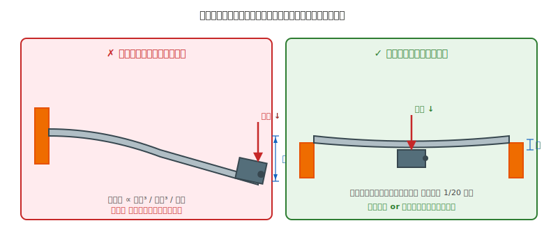
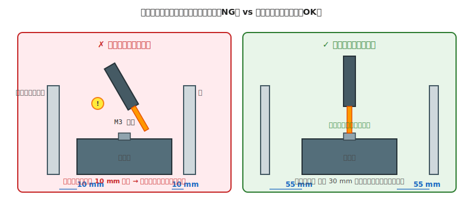

# 第 26 章　筐体

Part VII「機械系トピック」の最初の章。ロボットの **骨格** となる筐体（シャシー、フレーム）の選び方と、**モータや電池の荷重を受ける** 構造の作り方を扱います。

筐体は「ただの箱」に見えて、実は設計で最も失敗の多いパートです。「厚みが足りずたわむ」「薄板にモータを直付けして割れる」「重心が高すぎて転倒する」といった事故は、すべて筐体設計の段階で発生します。

!!! warning "この章で壊しやすいもの"
    - **アクリル板**（モータ荷重や振動で割れる、ねじ穴周りが欠ける）
    - **3D プリント筐体**（薄い壁で撓む、積層方向が荷重と直交して剥離）
    - **アルミフレームの結合部**（T スロットナットの入れ忘れで後から組み直し不能）

!!! info "最短で壊れにくくする初期構成"
    - 底板は 5 mm アクリル、または 3 mm 以上の PETG を基準にする
    - 重い部品（電池・モータ）を下段中央に寄せ、重心を下げる
    - モータ荷重を片持ちにせず、2 点以上で支持する
    - USB と工具アクセスを設計の最初に確保する

## この章のゴール

- アクリル / アルミフレーム / 3D プリント の **使い分け** ができる
- **片持ち支持の NG パターン** を見抜ける
- **ハイブリッド構成**（複数素材の組み合わせ）を設計できる
- モータ荷重に耐える **厚みと支持方式** を選べる

---

## 1. 動機：筐体はロボットの「背骨」

電気部品は高価で目立ちますが、**筐体が歪むとすべての電気部品が使えなくなる** のが機械の冷たい現実です。

- モータマウントが曲がる → 車輪が斜めに回る → 直進できない
- 底板がたわむ → センサの向きがずれる → 検出エリアが狂う
- 筐体が共振する → マイコンの I/O がノイズを拾う（振動で基板にも影響）

筐体選びは **最初の数分の判断で、プロジェクト全体の成否が決まる** 場面です。

---

## 2. 素朴な（NG）設計：アクリル 3 mm 片持ちでモータを付ける

多くの初心者が最初に採る設計。アクリル板 3 mm を底板にして、その端にモータマウントを接着＋ねじ止め。短時間の動作確認では問題ないように見えます。

### NG 例

- 底板：アクリル 3 mm、外寸 180 × 140 mm
- モータマウント：底板の端から **片持ちで** 5 mm 飛び出す PLA 部品
- モータ：FA-130（約 30 g）、先端に車輪（約 20 g）

**この構成の何が問題か**:



片持ち構造の撓みは **長さの 3 乗 / 厚みの 3 乗** に比例します。たわみ量は同じ荷重・同じ板でも、両端支持と比べて **20 倍前後** になります。

---

## 3. なぜダメか：数字で見る片持ちの弱さ

### 3.1 撓み量の直感

アクリル 3 mm 板（E = 約 3 GPa）に、片持ちで 100 mm 先端に 50 g の荷重をかけた場合の **撓み量** は、目に見えるレベル（1〜3 mm）になります。

これは **静止時の撓み** なので、実際にモータが回転を始めると **振動** が加わり、撓みが増幅されます。結果として:

- モータ軸が常に下向きに傾く
- 車輪の床への接地が片寄る
- センサ基板の向きが演算時とズレる

### 3.2 割れに至るメカニズム

撓みそのものが部品を割るわけではありませんが、**繰り返し撓み** が疲労破壊を誘発します。

- 静止時：3 mm 板は 50 g なら耐える
- 振動時：モータの 100 rpm 回転 = 毎秒 1.7 回の繰り返し荷重
- 1 時間稼働 = 約 6,000 回の繰り返し
- **数時間〜数日で、ねじ穴の周りからクラックが発生**

### 3.3 データシート相当の根拠

機械材料にも「データシート」相当のものがあります。アクリル板なら:

- **降伏強度**：約 70 MPa — この値までなら **力を抜けば元の形状に戻る**（弾性変形）
- **破壊強度**：約 75 MPa — これを超えると **割れる**（破断）
- 2 つの間は「塑性変形」と呼ばれる領域で、**変形が戻らなくなる**。設計は常に **降伏強度の半分以下** で使うのが安全
- **ヤング率**（剛性）：約 3 GPa（力に対する撓みやすさ）
- **衝撃強度**：低い（ガラスよりは強いが、アルミより弱い）

これらの値が **板の形状 × 荷重** と組み合わさって、撓みや破壊の判定になります。詳細な計算は省きますが、**「アクリル 3 mm の片持ち 10 cm で 50 g」は、撓みが目に見えるレベル** というのが結論です。

---

## 4. 正しい設計：両端支持 or アルミフレームで剛性を稼ぐ

### 4.1 設計原則 4 つ

1. **モータ荷重は片持ちにしない** — 必ず 2 点以上で支持する
2. **アクリル板で強度が足りない部位は厚みを変える**（3 mm → 5 mm で剛性 約 4.6 倍）
3. **アルミフレーム or 3D プリント部品との組み合わせ** を検討する
4. **荷重方向と部材の向きを合わせる** — 3D プリントなら積層方向も考慮（第 22 章）

### 4.2 具体的な正解パターン

**(a) アクリル底板 + PLA モータブラケット（両持ち）**

- 底板：アクリル 5 mm
- モータブラケット：PLA、**モータの両側から L 字で挟む** 形状
- モータ軸の反対側にベアリングを追加してさらに支持

**(b) アルミフレーム 2020 + アクリル天板**

- 主構造：2020 アルミフレーム（約 15 × 15 cm のコ字型 or ロ字型）
- モータマウント：アルミフレームに直接ねじ止め（T スロットナット経由）
- 天板：アクリル 3 mm（構造材としてではなく、カバーとして）

**(c) 全 3D プリント（PETG）**

- 底板＋側板＋マウントを一体でプリント
- 壁厚 3 mm 以上、積層は荷重と平行
- PETG は振動・疲労に対して PLA より 2 倍以上強い

### 4.3 素材選びの判断フロー

```
  完成サイズは？
    ├─ 手のひらサイズ（最長辺 〜15 cm、総重量 〜300 g 程度）→ 3D プリント一体 or アクリル 5 mm 主体
    ├─ テーブルサイズ（15〜30 cm）→ アクリル + 3D プリント ハイブリッド
    └─ それより大きい → アルミフレーム 2020 + アクリル天板
```

---

## 5. 動作確認チェックリスト

### 5.1 製作直後（静止時）

- [ ] 完成体を平らな床に置いて、**ガタつかない**（四点が同時に接地する）
- [ ] 各部品を指で押して、**目に見える撓み（1 mm 以上の明らかな変位）が出ない**
- [ ] 部品の端を指で軽く揺すって、**ねじの緩みがない**
- [ ] 接合部（ねじ、接着、3D プリントの層間）に **ひび・割れがない**

### 5.2 稼働中

- [ ] モータ駆動中、筐体を手で触って **異常振動を感じない**
- [ ] モータ最大出力で 1 分以上動かしても、**撓みが視認できるレベルにならない**
- [ ] ねじ緩みの兆候（カラカラ音、ガタつき）が出ない

### 5.3 長時間使用後（1 週間、1 ヶ月）

- [ ] ねじ穴周辺に **クラック** が出ていない
- [ ] 板の重量がかかる箇所に **永久変形**（戻らない撓み）が出ていない

---

## 6. 工具と手のアクセスを確保する（設計段階で忘れがち）

筐体の強度を確保したあとに、**初心者がほぼ必ずはまる落とし穴** が「**ねじ穴は付けた、でも工具がそこに届かない**」という問題です。CAD モデルの中では寸法的に問題なく見えても、実物になると **プラスドライバの柄** や **六角レンチのアーム** が壁に当たって回せない、という状況が発生します。



### 6.1 なぜ危険か（遠回しに安全問題）

「工具が入らない」だけなら組み立てられないという失敗で済みますが、**初心者ほど「無理やりやる」ほうを選びがち** です:

- ドライバを斜めに差し込んで無理に回す → **ねじ頭をなめる**（二度と回せなくなる）
- 斜めのドライバが滑る → **刃先が手のひらや指に刺さる**（切創、深いと縫合が必要）
- L 字型の六角レンチを曲げてアクセスしようとする → **レンチが折れて破片が飛ぶ**（目に入ると失明の恐れ）
- 片手で部品を押さえながら無理な姿勢で作業 → **部品ごと落として足の上に**（打撲、骨折の可能性）

遠回しですが、**設計段階での工具アクセス確保は、製作時の怪我予防になります**。

### 6.2 確保すべき空間の目安

| 工具 | 必要な作業空間 |
|---|---|
| **プラスドライバ（柄 φ 25 mm × 長さ 150 mm）** | ねじの真上に **直径 30 mm、高さ 100 mm 以上** の円筒空間 |
| **六角レンチ（L 字、2020 アルミ用 M5 = 4 mm）** | ねじの **90° 回転する扇形** 空間（半径 60 mm） |
| **指（部品を押さえる）** | 部品の周辺に **一辺 15 mm 以上** の隙間 |
| **ピンセット（小部品の位置合わせ）** | 狭い場所でも可、ただし **先端が届く直線経路** が必要 |

### 6.3 「入らない」を事前に見つける方法

1. **CAD で実寸のドライバモデルを置いてみる**（Fusion 360 にはライブラリあり、または自分で簡易的な直径 25 mm の円柱を置く）
2. **3D プリントの実寸モックアップ** で指／ドライバの実物を当ててみる
3. **組立順を逆再生する**：完成体から「分解するには何を外す？」を辿ると、組立に必要な工具経路が自動的に分かる

### 6.4 筐体設計時の具体ルール

- **側板を取り外せる構造にする**（スライド式、ねじ留めでも可）— 中のねじに横からアクセスできる
- **電池ボックスは外側から交換できる位置に**（裏返さないと交換できない設計は NG）
- **USB 書き込みポートが塞がれない位置に** Arduino を配置
- **ねじの真上に別の部品や配線が来ない**

!!! warning "「組み立てに成功したが、分解できない」も NG"
    接着剤で固めた筐体、ねじを内側からしか締められない構造 — これらは **1 回目は動いても、部品交換できないので長期運用できません**。「組めた」だけで満足せず、「また分解して直せる」かも検証してください。

---

## 7. よくあるトラブル FAQ

??? question "モータ駆動すると筐体が小刻みに振動する"
    共振です。モータの回転数と筐体の固有振動数が近いと起きます。
    - 対策 1：**筐体の剛性を上げる**（厚みを増す、リブを追加する）
    - 対策 2：**モータマウントに防振ゴム**（第 28 章）を入れる
    - 対策 3：**回転数を変える**（ギア比の変更、PWM の設定変更）

??? question "アクリル板のねじ穴周辺がひび割れてきた"
    繰り返し応力で、ねじ穴から亀裂が伸びるパターン。
    - 対策 1：ねじを外して **平ワッシャを挟み** 、応力を分散させる
    - 対策 2：**アクリル板を 5 mm に厚くする** か、ねじ穴周辺に補強板を貼る
    - 対策 3：**アクリル → PETG 3D プリント** に変更（アクリルは疲労に弱い）

??? question "3D プリント筐体の壁が撓む"
    壁厚不足か、充填率不足。
    - 対策 1：**壁厚を 3 mm 以上** に（層数 3 → 5 に増やすのも可）
    - 対策 2：**充填率を 40% 以上** に
    - 対策 3：**内部に補強リブを追加**（設計変更）

??? question "アルミフレームに重い電池ボックスを付けたら筐体がたわむ"
    フレーム単体でも無限に強いわけではありません。
    - 対策 1：**フレームを太くする**（2020 → 3030）
    - 対策 2：**補強ブレース**（斜め材）を追加
    - 対策 3：**電池を底板近くの位置に移動**（重心を下げる効果もある。第 29 章）

---

## 8. 次章への橋渡し

筐体が決まったら、次は **駆動部** — モータから車輪への動力伝達をどう作るかです。

次の [第 27 章「駆動部」](27-drivetrain.md) では、車輪・ギアボックス・シャフト結合（D カット軸 + イモねじ、キー溝、カップリング）を扱います。「モータは回っているのに車輪が回らない」という頻出トラブルの原因は、ほぼ駆動部の結合不良です。
