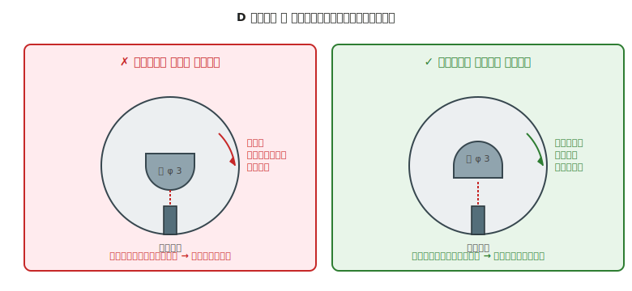

# 第 27 章　駆動部

モータの回転を **実際の走行／可動動作** に変換する部分を扱う章です。車輪・ギアボックス・シャフト結合（D カット軸＋イモねじ、キー結合、フレキシブルカップリング）が主役です。

「モータは回っているのに車輪が回らない」は、機械デバッグで最も頻発する症状（第 25 章 §4.1）。原因はほぼ確実に **駆動部の結合** にあります。本章でその根本を押さえます。

!!! warning "この章で壊しやすいもの"
    - **モータ軸**（接着のみで車輪を付けて空転、繰り返しで軸が曲がる）
    - **ギア**（かみ合わせ不良で歯が欠ける、偏心で異音）
    - **ベアリング**（斜め圧入で玉が砕ける）
    - **シャフトカップリング**（芯ずれで破損）

## この章のゴール

- **D カット軸 + イモねじ** の正しい当て方を実装できる
- **減速比とトルク/速度のトレードオフ** を直感で掴む
- **ベアリングを斜め圧入しない** 取り付けができる
- **フレキシブルカップリング** の使いどころが分かる

---

## 1. 動機：モータ単体では走れない

モータは高速で回るが、トルクは小さい — というのが基本特性です。DC モータの場合、**数千〜数万 rpm** で回転しますが、それをそのまま車輪に繋いでも「速すぎて制御できない」「トルク不足で坂道で止まる」状態になります。

したがって次のいずれかを介して、**減速してトルクを稼ぎ**、**軸と車輪を確実に結合** する必要があります:

- **ギアボックス**（モータに内蔵、または外付け）
- **シャフト結合**（モータ軸と車輪の直結）
- **ベルト・プーリ駆動**（回転を離れた位置に伝える）

---

## 2. 素朴な（NG）設計：接着剤だけで車輪を軸に固定

### NG 例

「ホビーショップで買った φ 40 mm のゴム車輪の中心に、瞬間接着剤でモータの D カット軸を差し込んで固定」

- モータ：FA-130（軸 φ 2 mm、D カットなし）
- 車輪：中心穴 φ 3 mm、接着剤で充填して固定
- 走行テスト：数秒間は走る、モータが軽く負荷を受けた瞬間に **車輪だけ空転**

この NG は初心者の 8 割が通る道です。

---

## 3. なぜダメか：摩擦だけで大きなトルクは伝わらない

### 3.1 トルク伝達の物理

モータから車輪に伝わる力は、**接着剤の固着力 + 摩擦力** の合計です。

- 接着面積が数 mm² 程度
- 接着剤の強度は **引き剥がしには強いが、剪断（軸周りのねじり）にはずっと弱い**
- 動作中の振動と熱で、接着剤が少しずつ劣化

DC モータのストール時トルク（数十 mN·m）ですら、この接着力を **瞬間的に超える** ことがあります。一度接着層が滑ると、表面が平滑化してますます滑りやすくなる悪循環です。

### 3.2 機械的な固定 = 「形状で引っかかる」

摩擦ではなく、**物理的な形状で引っかける** のが機械結合の基本。それが:

- **D カット軸 + イモねじ**（軸の平面にねじが当たる）
- **キー溝 + キー**（軸と部品の両方に溝を切り、キー材を挟む）
- **スプライン**（軸の周囲に多数の歯を刻む、重量物用）

ホビー範囲では **D カット + イモねじ** が 90% をカバーします。

---

## 4. 正しい設計：D カット軸 + イモねじ

### 4.1 当て方の肝

D カット軸は、円柱の一部が **平らに切り落とされている** 軸です。このフラット面にイモねじ先端が垂直に当たるように、車輪のねじ穴を設計します。

- **正しい**：イモねじの先端が **フラット面（D 面）に垂直** に当たる → 機械的にロック
- **誤り**：イモねじが **丸い面** に当たる → 摩擦のみ、トルクを受けると滑る

### 4.2 車輪側の設計

- **中心穴**：軸径 + 0.1〜0.2 mm（φ 3 軸なら穴 φ 3.1）
- **イモねじ穴**：車輪の側面から中心へ向かう M3 または M2.5 の **タップ穴**（＝ **内側にねじ山が切られた穴**。下穴を空けてからタップ工具でねじ山を刻む、または金属インサートを圧入して作る）
- **イモねじの長さ**：車輪の厚みより長く（先端が軸まで届く必要がある）
- **イモねじの位置**：車輪を軸に差し込んだとき、**フラット面がねじ穴の位置にくる回転角** で取り付ける

### 4.3 市販の車輪を使うとき

Tamiya・Pololu 等の市販車輪は、既に **D カット軸対応のねじ穴付き** で売られていることが多いです。仕様を確認:

- **対応軸形状**（D カット φ 3、丸軸 φ 3、スプライン 等）
- **イモねじが付属しているか**
- **ゴム素材の硬度**（路面グリップに影響）

### 4.4 補助としての接着剤

イモねじだけでも十分な結合力ですが、**振動で緩む可能性** があります。対策として:

- **ねじロック剤（ロックタイト 222）** をイモねじに塗る
- **補助として接着剤** を使う（ただし主固定はイモねじ）

---

## 5. ギア比とトルク／速度のトレードオフ

モータと車輪の間にギアボックスを入れる場合、**減速比** がロボットの走行特性を決めます。

### 5.1 基本法則

減速比 N:1 のギアボックスを通すと:

- **回転数** が **1/N** になる
- **トルク** が **N 倍** になる（理論上、実際は効率ロスで N × 0.7〜0.9）

### 5.2 本書の作例範囲での目安

| 用途 | 減速比の目安 | 例 |
|---|---|---|
| 高速走行（レース、ライントレース）| 1:30〜1:50 | Pololu 50:1 マイクロモータ |
| バランス型（多くのライントレース、ローバー）| 1:100〜1:150 | タミヤ 130:1 ギアボックス |
| 低速・高トルク（坂道、重量物）| 1:200〜1:300 | Pololu 298:1 マイクロモータ |

迷ったら **1:100 前後** から始めます。根拠：モータの定格回転数（3000 rpm 前後）を 1/100 に減速すると 30 rpm ≒ 0.5 回転/秒で、車輪径 φ 40 mm なら周速が 6.3 cm/秒（人が歩くスピードの 10 分の 1 程度）。**ホビーロボットで「操作しながら見やすい速さ」** にちょうど合います。これを基準に、速度が欲しければ減速比を下げる（1:50 なら 2 倍速）、トルクが欲しければ上げる（1:150 なら 1.5 倍のトルク）、というイテレーションで詰めます。

### 5.3 ギアの噛み合わせ

ギア同士の噛み合わせが悪いと:

- **異音（キーキー、ガリガリ）** が発生
- **効率が大きく低下**（理論値の半分以下に）
- **歯飛び** が起きる

ギアボックスは完成品を買うのが基本で、自作は避けるのが無難です（モジュール・歯数の設計は想定以上に難しい）。

---

## 6. ベアリングの取り付け

車軸を滑らかに回転させるには、**ベアリング**（主に 608ZZ など。第 19 章 §4 参照）を筐体に圧入します。

### 6.1 圧入の原則

- **外輪を押して筐体の穴に圧入**（内輪を押すと玉が砕ける）
- **軸にベアリングを付けるときは内輪を押す**
- **必ず平行に押す** — 斜めに圧入すると玉が偏って高摩擦・短寿命

### 6.2 圧入工具

- **正式には油圧プレスや手動プレス** を使う
- ホビー範囲なら **木槌 + 当て板（硬質樹脂 or 木材）** で軽く叩く
- 3D プリントの筐体なら **手で押し込める程度の穴寸法** に設計する（熱で軟化させれば楽）

### 6.3 ガタの確認

圧入したら、**軸を手で動かして** 異常な遊び（ガタ）がないかを確認します。

- ベアリングが筐体に対して動く → 穴が緩すぎる（接着で補強、または作り直し）
- 軸がベアリング内でガタつく → 軸が細すぎる（すきま嵌めのクリアランスが過大）

---

## 7. フレキシブルカップリングの使いどころ

2 本の軸（モータ軸と車軸など）を直結する場合、**両者の中心が 0.1 mm レベルで一致していない** とベアリングに負担がかかります。

### 7.1 芯ずれに強い結合：フレキシブルカップリング

- **ジョー式カップリング**（爪形状で多少の芯ずれを吸収）
- **スプリングカップリング**（ばね構造で角度ずれも吸収）
- **ラバーカップリング**（ゴムで振動も吸収）

ホビー向けには **Pololu や Misumi のアルミ製ジョーカップリング** が定番です。軸径 φ 3〜6 mm で選べます。

### 7.2 使う場面

- 3D プリンタの Z 軸（ステッピングモータとリードスクリュを結合）
- 延長シャフト（モータ軸を長く延ばす）
- **ホビー車輪には通常不要**（モータ軸に直接車輪を付けるため）

---

## 8. 動作確認チェックリスト

### 8.1 組立直後

- [ ] 車輪を手で持って回す：**モータ軸と車輪が一緒に回る**（空転しない）
- [ ] モータ軸を手で持って回す：**車輪が引っかかりなくスムーズに回る**
- [ ] ベアリングの **ガタ** がない（軸が外周にブレない）
- [ ] イモねじが **平面に当たっている** 角度で取り付けられた

### 8.2 モータ駆動中

- [ ] 異音（キーキー、カラカラ）がしない
- [ ] 振動が過度ではない（手で触って強く伝わらない）
- [ ] 車輪が空転しない（モータ軸と同じ方向・速度で回る）
- [ ] ベアリング部が発熱していない（ストール時以外）

### 8.3 長時間稼働後

- [ ] イモねじが緩んでいない（増し締めして OK）
- [ ] ベアリングがゴロゴロしない（寿命目安：連続運転で数百時間）

---

## 9. よくあるトラブル FAQ

??? question "モータは回っているのに車輪が回らない"
    最頻出。原因は大抵次のいずれか。
    - **イモねじが丸い面に当たっている** → 車輪を差し直して、フラット面に当てる
    - **イモねじが緩んでいる** → 増し締め、ねじロック剤を塗布
    - **接着剤だけで固定していて滑っている** → イモねじに変更
    - **D カット面が浅すぎる** → 別の車輪（対応軸が合うもの）に変更

??? question "車輪が回るときにキーキー異音がする"
    - **ベアリングが斜め圧入されている** → ベアリングを抜いて再圧入
    - **車輪がモータハウジングに擦れている** → クリアランス（第 24 章）の確認
    - **ギアの噛み合わせ不良** → ギアボックスのガタを確認

??? question "走行時に軸がブレる"
    - **ベアリングのガタ** → 筐体の穴寸法を確認、必要なら接着で固定
    - **軸の曲がり**（落下等で発生）→ 軸を交換
    - **左右のベアリング高さがズレている** → 筐体の平行度を再確認

??? question "ベアリング圧入時に玉が砕けた"
    斜め圧入 or 内輪を押してしまった。
    - 新しいベアリングに交換、今度は **外輪側** を押す
    - 家庭では **万力 + 当て板** でまっすぐ押すのが安全

??? question "モータは速すぎる、またはトルクが足りない"
    ギア比の見直し時期。
    - **速すぎる** → 減速比を上げる（1:100 → 1:150）
    - **遅い・坂で止まる** → 減速比を上げるか、モータ自体を大きいものに交換

??? question "車輪を取り付けた後で、イモねじが締められない／緩められない"
    D カット軸のイモねじ穴が **筐体の壁に隠れて六角レンチが入らない** 典型的な組立失敗。
    - **先にイモねじを緩めてから車輪を軸に差し込み、軸方向の位置決めをしてから締める** 順序で回避できることが多い
    - どうしても届かないなら、**車輪側ねじ穴の位置を車輪の 120° 側（3 方向）に複数設ける設計** にして、回転させれば 1 箇所はアクセスできるようにする
    - **ボールポイント六角レンチ**（先端が斜めでも噛む）を使うと、狭い場所でも操作できる
    - 無理に工具を突っ込むと **レンチが折れて破片が飛ぶ** リスクがあるので、「入らない」を感じた時点で止まる

---

## 10. 次章への橋渡し

駆動部の結合が正しくできても、**モータ自体が筐体に確実に固定** されていなければ、結局は回らない・振動する・壊れることになります。

次の [第 28 章「モータマウント」](28-motor-mount.md) では、モータを筐体に取り付ける方法を扱います。**片持ちマウントの NG パターン**、**振動対策**、**ねじ規格別のマウント設計** が中心テーマです。
