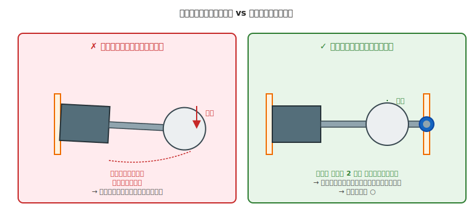

# 第 28 章　モータマウント

モータを筐体に **安定に固定** する方法を扱います。駆動部（第 27 章）でモータと車輪を結合しても、モータ自体が筐体に対して安定していなければ、走行中にガタが出たり振動が増幅されたりします。

!!! warning "この章で壊しやすいもの"
    - **モータ軸**（片持ちマウントで軸が垂れる、長時間で軸受が焼損）
    - **マウント部材**（振動で緩む、3D プリント品にクラックが入る）
    - **ねじ**（オーバートルクでなめる、振動で緩む）
    - **3D プリントマウント**（モータの発熱で変形する）

## この章のゴール

- **片持ちマウントのリスク** を理解し、**両持ち支持**（軸受追加）の判断ができる
- モータの種類別のねじ規格（N20、FA-130、ホビーサーボ、NEMA17）を把握する
- **振動対策**（緩み止め、防振）の基本を実装できる

---

## 1. 動機：モータは「支点が肝心」

モータの回転軸は、内部のベアリングで支えられています。しかし多くのホビー用モータ（FA-130、N20 ギヤードモータ等）の **内蔵ベアリングは最低限**  で、軸先端に大きな横向き荷重をかけると:

- 軸が下に垂れる（微小だが累積で効く）
- 内蔵ベアリングが偏摩耗する
- モータ本体の軸受部が発熱する

これを避けるには、**外部で軸先端を支える** か、**横荷重を最小化する配置** にする必要があります。

---

## 2. 素朴な（NG）設計：片持ちマウント + 先端に車輪

### NG 例

- モータ：N20 ギヤードモータ（軸 φ 3、軸長 10 mm）
- 車輪：φ 40 mm、重量 20 g、モータ軸の **先端** に固定
- マウント：L 字の 3D プリント部品、ねじ 2 本で底板に固定、**軸受なし**

### 何が起きるか

- 車輪の自重（20 g）が軸先端にかかり続ける
- 走行中は地面からの反力（加速時の押し戻し）も加わる
- モータの内蔵軸受に常時モーメント荷重がかかる
- 数時間〜数日の稼働で、**軸の先端が目に見えて下がる**
- 車輪が斜めに回って、直進性が悪化する
- 最悪、モータ自体が焼損する

---

## 3. なぜダメか：モーメント荷重の集中

### 3.1 モーメント = 力 × 距離

軸先端にかかる力が同じでも、**マウントから先端までの距離** が長いほど、内蔵軸受にかかる **モーメント** は大きくなります。

- 車輪が軸の根元にある：モーメント小（軸受への負担小）
- 車輪が軸の先端にある：モーメント大（軸受への負担大）

ホビー向け N20 の軸長は通常 10〜13 mm ですが、これの先端に車輪を付けると、軸受から車輪までが 10 mm 程度あり、**車輪質量の数倍の力が内蔵軸受にかかる** ことになります。**実害としての症状**：

- 運転中は内蔵軸受に異常な摩擦が発生 → **軸受部の発熱**（触れないほど熱くなる）
- 内蔵軸受のボールや樹脂ブッシュが **偏摩耗** → 数十時間〜数百時間でガタが出始める
- モータ軸の中心がずれる → 車輪が斜めに回って **直進性が悪化**
- 最悪：軸受が焼損してモータ本体ごと交換が必要になる

### 3.2 動的な増幅

静止時だけでなく、**走行時の加減速・振動** でさらに増幅されます。

- 段差や小石を乗り越える → 瞬間的な衝撃が軸先端に
- 急加速・急停止 → 慣性力が横方向に
- 長時間の振動 → 疲労破壊の蓄積

### 3.3 「片持ち」の見分け方

- モータが **1 点でしかねじ止めされていない** → 片持ち
- モータのハウジング側だけで支えている → 片持ち
- 軸の先端に **外部ベアリング** がない → 事実上の片持ち

---

## 4. 正しい設計：軸受追加 or 配置の工夫

### 4.1 両持ち支持の実装

モータ軸の **先端近く** に外部ベアリングを追加して、2 点支持にします。

- ベアリング選定：**608ZZ**（第 19 章 §4）が汎用的
- 筐体にベアリングハウジング（圧入穴）を設計
- モータと軸受の間に車輪を配置する（車輪が両端から支えられる形）

3D プリント筐体なら、**モータハウジングとベアリングホルダを一体でプリント** するのが最もシンプルです。

### 4.2 配置の工夫（軸受を使わない選択肢）

軸受を追加する余裕がない場合:

- **車輪を軸の根元近く** に配置する（モーメント小）
- **モータを軸方向にずらして**、車輪が筐体内に収まる構造に
- **ホビー用モータ付属のマウントブラケット** を使う（**軸先端側にも支持構造を持つタイプ**を選ぶ。判別ポイントは「モータ本体だけでなく、軸が貫通する先にブラケット or ベアリングホルダがあるか」。Tamiya のダブルギアボックスや、Pololu の N20 マイクロメタルギアモータ用ブラケットがこのタイプ）

### 4.3 モータ別のマウント規格

| モータ | 取付けねじ | フランジ形状 | 備考 |
|---|---|---|---|
| **N20 ギヤードモータ** | M2 × 2 本（前面）| 12 × 10 mm 程度 | モータ本体に直接タップ穴、3D プリント品と直結しやすい |
| **FA-130（タミヤ）** | M2 × 2 本 or マウント圧入 | 端面ねじ穴 | 純正マウントブラケットあり |
| **ホビーサーボ（SG90 等）** | M3 × 4 本（本体の耳部分）| 本体 23 × 12 mm | サーボブラケット既製品多数 |
| **NEMA17 ステッピング** | M3 × 4 本（前面フランジ）| 42 × 42 mm | 3D プリンタ流用なので選択肢多数 |
| **DC ブラシレス（BLDC）** | 型番による | 型番による | データシート必読 |

### 4.4 ねじの取り付け順と工具アクセス（見落としがち）

モータマウントは **「ねじを締める工具がちゃんと届くか」** を設計段階で確認しないと、組立途中で手が止まります。特にありがちなのが:

- **モータを筐体に入れたあとでないと、マウントねじが見えない位置にある** → しかしモータを入れると、**そのねじが壁や他部品で隠れる** → ドライバが入らない
- **両持ちマウントのベアリングホルダ側のねじ**が、モータ本体に隠れてドライバが届かない
- **N20 モータの前面 M2 ねじ**を、モータを筐体に挿入してから締めようとする → モータで塞がれてアクセス不可

対策：

- **「ねじを先に仮通ししてからモータを入れる」** 順序が成立するか、CAD で確認
- **ねじ頭の真上に 30 mm 以上の空間** を確保（§6 図参照は [第 26 章 §6.2](26-chassis.md)）
- **どうしても狭い場所に締結が必要なら、ボールポイントの六角レンチ**（ヘッドが斜めでも入る）を用意
- それでもダメなら **モータ固定を片方だけ／差し込み＋ピン留めに変える**（分解組み立ての頻度を下げる）

!!! warning "無理な工具操作は怪我のもと"
    狭い場所でねじを締めようとしてドライバが滑ると、**刃先が手のひらに突き刺さる** 事故が起きます（ホビー工作で意外と多い怪我）。工具が入らないことに気付いたら、**「設計を直す」を最初の選択肢にする**。力任せに回さない。

---

## 5. 振動対策

モータは必然的に振動を発生させます。筐体・マウントに対して振動対策がないと、稼働中に ねじが緩む・マウントが疲労破壊する・制御精度が落ちる といった症状が出ます。

### 5.1 緩み止め

| 手段 | 効果 | 備考 |
|---|---|---|
| **スプリングワッシャ** | 弱〜中 | 最も簡易、1 円未満 |
| **ナイロンロックナット** | 中〜強 | 振動には強いが、何度も着脱する場所には不向き |
| **ねじロック剤（ロックタイト 222）** | 強 | 後で外すには溶剤か加熱が必要 |
| **歯付きワッシャ** | 強 | 締結面にわずかな跡が残る |

振動するモータ周辺は、**スプリングワッシャ + 平ワッシャ** を標準とし、特に重要な箇所（モータ取付ねじ）には **ねじロック剤** を追加するのが実用的です。

### 5.2 防振ゴム

モータの振動が筐体に直接伝わるのを防ぐために、**ゴム製の防振部材** をマウントとモータの間に挟みます。

- **ラバーグロメット**（ゴム製の筒状部材）
- **ウレタン防振ブッシュ**
- **ゴムシート**（単純、薄型）

ただし防振ゴムは **モータの位置精度を悪化** させる副作用があります。車輪駆動のような精度が重要な用途では、まず振動源自体の抑制（アンバランス解消、第 29 章）を優先し、それでも足りなければ追加します。

### 5.3 熱対策

PLA 3D プリントのマウントは、**モータの発熱で変形** することがあります。

- PLA のガラス転移温度：約 60℃
- 高負荷モータの表面温度：容易に 50〜70℃
- PLA マウントは **ストール状態や長時間運転** で軟化 → 形状が崩れる

対策:
- **PETG や ABS を使う**（ガラス転移温度は 70〜90℃）
- **モータと 3D プリント部品の間に金属プレートを挟む**（熱の橋渡し防止）
- **モータ周辺に通気スペースを確保**

---

## 6. 動作確認チェックリスト

### 6.1 組立直後

- [ ] モータを手で揺すって、**マウントにガタがない**
- [ ] モータ軸を指で持って **先端を下に 100 g 相当（水の入ったペットボトルの軽量版程度の力）で押したとき、垂れが 1 mm 以下**（目視でほぼ動きが見えないレベル）
- [ ] すべての取付ねじが適切なトルクで締まっている（第 24 章 §2）
- [ ] **緩み止め**（スプリングワッシャ / ナイロンナット / ねじロック剤）が入っている
- [ ] モータと周辺部品のクリアランスが十分（第 24 章 §4）

### 6.2 稼働中

- [ ] 稼働中にモータ周辺から **異音（カタカタ、カラカラ）がしない**
- [ ] 筐体を触って **過度な振動が伝わらない**
- [ ] モータ表面の温度が、触っていられるレベル（第 8 章 §5）
- [ ] ねじに **緩みの兆候**（微動、色の変化）がない

### 6.3 長期使用後

- [ ] 1 時間以上の連続稼働後、ねじが緩んでいない
- [ ] マウント部材に **クラックや変形** がない
- [ ] モータハウジングと車輪・筐体の間隔が変わっていない（垂れが進行していない）

---

## 7. よくあるトラブル FAQ

??? question "モータ軸が垂れ下がってきた"
    片持ちマウントで、内蔵軸受が負けている兆候。
    - 対策 1：**外部ベアリングを追加** して両持ち化
    - 対策 2：**車輪を軸の根元近く** に配置し直す
    - 対策 3：モータを大きめのもの（内蔵軸受が大きいもの）に変更

??? question "走行中にモータマウントからガタガタ音がする"
    ねじ緩み、マウントの剛性不足、ベアリングの斜め圧入のいずれか。
    - **まず全ねじを再締め**（スプリングワッシャとねじロック剤を追加）
    - 改善しなければマウントの剛性を確認（薄い 3D プリントは厚くする）
    - ベアリング部はガタ（遊び）がないかチェック

??? question "3D プリントのモータマウントが変形した"
    - PLA で作った場合、**熱変形** の可能性（モータ温度が高い）
    - **PETG / ABS に変更**、または金属スペーサーで熱隔離

??? question "ねじを締めすぎてマウントが割れた"
    3D プリントあるある。
    - **熱圧入インサート** を使う設計に変更（第 19 章 §3.3）
    - 割れたら割れ拡大前にエポキシ接着、再プリントがベター

??? question "サーボマウントがグラグラする"
    - サーボ側の耳（取付タブ）は薄いので、**4 本ねじすべて** 締めているか確認
    - 3D プリントブラケットなら、**取付穴を少し緩め**（M3 なら φ 3.2）にしてサーボの位置調整ができるように
    - サーボ交換用に **後付けアクセスできるレイアウト** にしておくと便利

??? question "組み立てる途中で「ねじが締められない」ことに気づいた"
    工具アクセスの確保を忘れた典型。
    - **組立順を見直す**：「モータを置く前にねじを仮通し」「マウントを組んでからモータを載せる」で解決することがある
    - **長柄のドライバ or ボールポイント六角レンチ** を用意（斜めから差し込める）
    - **どうしても入らないなら設計を戻す**：ねじ穴の位置をずらす、壁の一部を切り欠く、アクセス用の開口部を作る
    - 絶対にやってはいけないこと：**ドライバを無理に斜めに差し込む、柄を叩く、プライヤで強引に回す** → 工具破損・怪我の原因

??? question "モータ周りに手を入れていたら、急にモータが回って指が挟まれた"
    ロボット工作でいちばん多い **作業者の怪我** のパターンです。原因はほぼ例外なく **電源を切らずに作業していた** こと。
    - ジャンパ変更中にセンサ線に工具が触れて、プログラムがそれを「ライン検知」と解釈してモータを回した
    - 手のひらがマイコンのボタンに触れて、リセット後のデフォルト動作でモータが起動した
    - USB ケーブルがパソコン側から抜けかかり、再接続時の瞬間的な電源復帰で初期動作が走った
    
    **対策は 1 つだけ**：**ハードに手を入れる前に、電源スイッチを OFF、USB ケーブルを抜く**。毎回やる。数秒の手間。
    
    挟まれた後の対処：すぐに電源を切る／ケーブルを抜く → 指を慎重に引き抜く（無理に引くと裂傷）→ 流水で洗って消毒 → 必要なら病院。ロボットの軽いモータでも、指の皮膚は簡単に切れます。

---

## 8. 次章への橋渡し

モータがしっかり固定されたら、次はロボット全体の **重心・剛性・バランス** です。

次の [第 29 章「重量・剛性・バランス」](29-weight-rigidity-balance.md) では、倒れない・壊れない・振動しないロボットを作るための、重心位置と剛性配分の考え方を扱います。第 26 章の筐体設計、第 28 章のモータマウントが決まった段階で、全体としてどうバランスを取るかという視点です。
