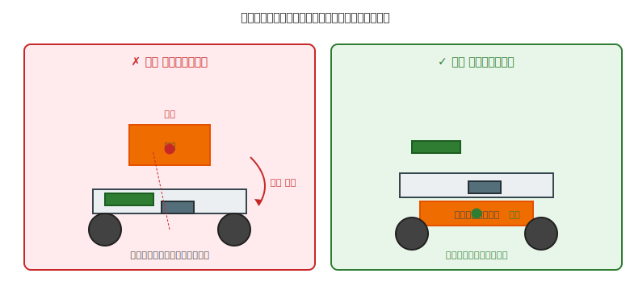

# 第 29 章　重量・剛性・バランス

ロボットが **倒れない／壊れない／振動しない** ための機械的な直感を扱います。個々の部品が正しくても、**全体として** バランスが取れていなければロボットは動きません。

本章では厳密な力学計算には踏み込まず、**定性的な直感**（第 18 章の方針）で読めるレベルに留めます。

!!! warning "この章で出会う失敗パターン"
    - **上部に電池を載せて** 加減速で転倒
    - **筐体の剛性不足** で、モータ駆動時に全体がたわむ
    - **モータと筐体の共振周波数** が重なって激しく振動
    - **片側だけに重量が偏り** 、直進させたいのに曲がる

## この章のゴール

- **重心位置** を意識した部品配置ができる
- **剛性**（曲げにくさ・ねじれにくさ）の直感で、部品追加の要否を判断できる
- **バランスと共振** が走行や動作に及ぼす影響を予測できる

---

## 1. 動機：軽く作るだけでは動かない

「軽ければ良い、剛性があれば良い」は単純な発想で、実際にはトレードオフが多くあります。

- **軽すぎる** → モータの反動で車両ごと揺れる、ブレーキ時に前のめり、小さな衝撃で飛ぶ
- **重すぎる** → モータトルクが足りなくなる、電池消費が激しい、減速距離が伸びる
- **剛性が高すぎる** → 重くなる、衝撃を吸収できず部品に直接衝撃が伝わる
- **剛性が低すぎる** → モータ駆動で筐体がたわみ、センサ位置がズレる、振動する

本章で扱う 3 要素（重量、剛性、バランス）は、**どれかを極端にすると他の問題が生まれる** 関係にあります。

---

## 2. 素朴な（NG）設計：電池を一番上に載せる

### NG 例

- 筐体：180 × 140 × 60 mm のアクリル製
- **電池ボックス（重量 100 g）を筐体の天面** に両面テープで貼り付け
- マイコン・モータ・センサは筐体内部（下半分）に搭載
- 総重量：200 g、**重心は筐体の上から 1/3 付近（高い）**

走行テスト：

- 低速では問題なく動く
- **急加速すると後ろに、急減速すると前に傾く**
- 方向転換（左右に急ハンドル）で **横転する**

---

## 3. なぜダメか：重心が高いと転倒モーメントが増える

### 3.1 転倒モーメントの直感

加減速時、重い物体には **慣性力** が働きます（急ブレーキで体が前に倒れる感覚）。

- **重心が高い** → 慣性力が高い位置にかかる → てこの原理で転倒しやすい
- **重心が低い** → 慣性力も低い位置 → 車輪の内側で受け止められ、転倒しにくい

ざっくり言えば、**転倒のしやすさ ∝ 重心の高さ** です。

### 3.2 接地面の広さも効く

もう一つの要素として、**車輪間の距離** があります。自動車用語を借りて:

- **ホイールベース**（wheelbase）= **前輪と後輪の中心間距離**（= 前後方向の車輪の間隔）が長い → 前後方向の安定性↑
- **トレッド**（tread）= **左右の車輪の中心間距離**（= 左右方向の車輪の間隔）が広い → 左右方向の安定性↑

ロボットを上から見下ろしたとき、4 つ（または 2 つ）の車輪が作る四角形（または線）が大きいほど、その内側に重心が収まる余地が大きくなります。

重心の高さと、接地面の広さの **比率** で転倒しやすさが決まります。**高さ ÷ 接地面の幅 が 1 を超える** と転倒リスクが大きく上がる、というのが実用的な目安です。

**具体例：** 長さ 200 mm、幅 140 mm のロボットで、重心が高さ 60 mm の位置にある場合、左右方向の比率は 60 / 140 ≒ 0.43 で安全域。前後は 60 / 200 = 0.30 でさらに安全。一方、天面に電池を載せて重心が高さ 150 mm になった場合、150 / 140 ≒ 1.07 となり転倒リスク域に入ります。

### 3.3 具体的な重量配分の典型

200 g のロボットの典型的な重量内訳:

| 部品 | 重量 | 位置の推奨 |
|---|---|---|
| 電池（単 3 × 4 本）| 100 g | **最下層**（底板付近） |
| モータ × 2 | 50 g | 底板〜中層（車軸の高さ）|
| マイコンボード（Arduino Uno）| 25 g | 中層 |
| モータドライバ | 5 g | 中層 |
| センサ | 5 g | 中層〜上層 |
| 筐体・ねじ類 | 15 g | 全体に分散 |

**電池が総重量の半分を占める** ため、**電池を底板付近に配置** するだけでロボット全体の重心が大きく下がります。

---

## 4. 正しい設計：重心を低く、対称に、剛性を確保

### 4.1 重心を低くする

- **電池は底板直上**（可能なら底板の下の空間に吊る）
- モータは車軸の高さで、モータ本体を筐体の下半分に収める
- **上に来る部品はマイコンボード程度の軽量品** に絞る

### 4.2 重量を対称に配置

- 左右のモータ・車輪は当然対称
- **電池を中央に置く**、あるいは左右 2 分割（単 3 × 2 を左右に配置）
- センサの配置は中央線に対して対称を意識する

### 4.3 剛性を確保する

剛性は「曲げにくさ」「ねじれにくさ」の指標です。

- **厚板を使う**（第 26 章 §3：厚さの 3 乗で剛性が増える）
- **閉じた形状を作る**（箱型は板状より強い）
- **リブ（補強材）を入れる**（L 字の横に小さな板を入れるだけで曲げ剛性は 2 倍以上）
- **ねじ止め点を増やす**（多点支持は荷重を分散する）

### 4.4 軽量化のタイミング

設計初期は **剛性優先**（厚め、重め）で作り、動作確認後に「ここは重要ではない」部位を軽くするのが実用的です。

- 3D プリント部品：充填率を下げる、リブを抜く
- アクリル板：不要な穴を追加（機能部は残す）
- アルミフレーム：短くする

「軽くしてから剛性不足で作り直し」は時間がかかります。**最初から軽く作ろうとしない**。

---

## 5. 振動と共振

モータは必ず振動します。その振動が筐体の **固有振動数** と一致すると、**共振** を起こして振動が増幅されます。

### 5.1 共振の見つけ方

- **特定の回転数でだけ激しく振動** する → 共振の可能性大
- 回転数を変えても常に同程度の振動 → 単なるアンバランス（車輪・ギア）
- 稼働時間の経過で振動が増える → ねじ緩み（第 28 章）

### 5.2 共振の対策

- **筐体の剛性を上げる**（固有振動数を上げる方向）
- **質量を追加する**（固有振動数を下げる方向）
- **モータの回転数を変える**（PWM Duty 比を調整、ギア比を変える）
- **防振ゴム** を挟む（第 28 章 §5.2）

どの方向に動かすかは、**試してみる** のが早道です。質量を追加して改善すればそのまま、悪化すれば逆方向（剛性追加）に動かす。

### 5.3 アンバランス（共振ではない振動）

共振ではなく単純な **重心ずれによる振動** も多くあります。

- **車輪の重心が軸中心にない** → 回転時に遠心力の不均衡
    - 対策：車輪を軸から外してバランス用おもりを追加、または別の個体に交換
- **プロペラやファンが片寄っている** → 同上
- **搭載物の重量が左右非対称** → 配置を見直す

---

## 6. 動作確認チェックリスト

### 6.1 設計段階

- [ ] 重量内訳を書き出し、**重量上位 3 項目** の位置を決めた
- [ ] 電池が **下層** に配置されている
- [ ] 左右対称 or 意図的な非対称（例：センサ 1 個のみ）が理由付きで許容されている
- [ ] ホイールベースとトレッドが、重心高さ以上になっている

### 6.2 完成後（静止時）

- [ ] **ロボットを前後左右に傾けて** みて、転倒する角度を確認（15〜30 度までは耐えるのが目安）。手順：① 平らな机にロボットを置く、② 机の片側を本やブロックで徐々に持ち上げる（または電源 OFF 状態のロボットを手で傾ける）、③ ちょうど転倒する角度を分度器 or スマホのアプリ（水平器）で測る、④ 前後 → 左右 → 斜めの 4 方向で確認
- [ ] 指で筐体を押して、たわみが視認できない
- [ ] 上下左右に振ったとき、**内部でガタつく音がしない**

### 6.3 稼働中

- [ ] 加速時・減速時にロボットが **前のめり／後ろに傾く** 挙動が過度でない
- [ ] 急ハンドル時に **左右に転倒** しない
- [ ] 特定の回転数で異常振動（共振）が出ない
- [ ] 長時間稼働でねじが緩んでこない

---

## 7. よくあるトラブル FAQ

??? question "急発進すると後ろに転がる"
    重心が高い or 後方に寄っている。
    - **電池を前寄り・低層に移動**
    - **ホイールベースを長く**（モータ位置を前後にずらす）
    - ソフト側で **PWM の立ち上がりを緩やかに**（急加速を避ける）

??? question "直進させているつもりが曲がる"
    原因は複数。まず機械 vs 電気の切り分け（第 25 章 §1）。
    - 左右のモータ特性差なら、PWM で補正（速い側を遅くする）
    - 左右の重量配分が非対称なら、電池位置で調整
    - 車輪径のわずかな差でも発生するので、**車輪の周長** を実測して比較

??? question "モータ駆動時に特定回転数でガタガタ大振動"
    共振。
    - **回転数を変える** で避けるのが最速
    - **防振ゴム** をモータマウントに追加
    - **質量追加** で固有振動数を下げる（電池位置を変える等）

??? question "筐体がたわんでセンサの向きが狂う"
    剛性不足。
    - **板厚を増やす**（アクリル 3 → 5 mm）
    - **補強リブ** を追加
    - **センサを重心近くに配置** して、たわみの影響を減らす

??? question "重くしすぎた結果、モータが非力に感じる"
    重量超過でトルク不足。
    - **電池容量を減らして軽量化**（運用時間と引き換え）
    - **モータを大きいもの（高トルク）に交換**
    - **減速比を上げてトルク倍率を大きく**（ただし速度は落ちる）

---

## 8. 次章への橋渡し

機械系トピックの最後は **配線の機械的管理** です。電気を守るのも、実は機械の仕事です。

次の [第 30 章「配線の機械的管理」](30-wiring-mechanical.md) では、電気系の章（第 6 章、第 9 章）で組んだ配線が、機械的な振動・摩擦・引っ張りに耐えるように守る方法を扱います。Part VII の締めくくりです。
