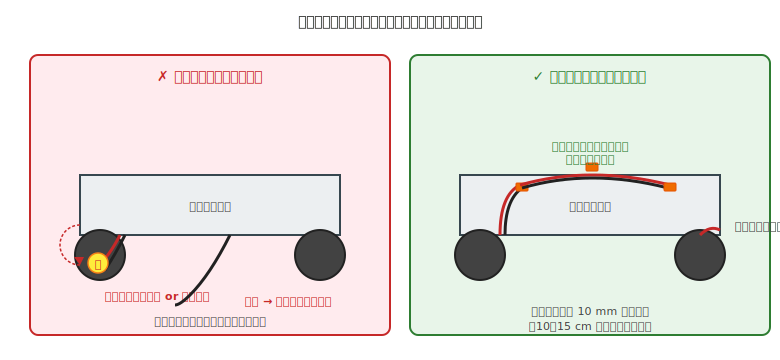

# 第 30 章　配線の機械的管理

Part VII「機械系トピック」の最終章。電気系の章（第 6 章 組立、第 9 章 デバッグ）で組んだ **配線を、機械的な振動・摩擦・引っ張りに耐えるように守る** 方法を扱います。

電気で完璧に配線しても、機械的に守れなければ、組立直後は動いたロボットが数日後に断線します。ここは電気と機械の交差点で、**どちらの章にも完全には収まらない** トピックです。

!!! warning "この章で壊れるパターン"
    - **可動部への巻き込み** で配線が切れる、ドライバ IC が壊れる
    - **モータ近傍で被覆が擦れて** ショート（ロジックに戻ってきて別の事故を誘発）
    - **熱収縮チューブがかかっていない半田部** が露出してショート
    - **ケーブルタイの締めすぎ** で導体がつぶれて断線
    - **コネクタの抜け** で接触不良、走行中に突然停止

!!! info "最短で断線を防ぐ配線ルール"
    - 可動部から 10 mm 以上離し、熱源の近傍を避ける
    - 配線は 10〜15 cm ごとに固定し、締めすぎない
    - 半田接合部は熱収縮チューブで必ず絶縁する
    - モータ／電源系はラッチ付きコネクタを優先する

## この章のゴール

- 配線を **可動部から遠ざけ、固定する** レイアウトができる
- ケーブルタイ・熱収縮チューブ・スパイラルチューブの **使い分け** ができる
- **コネクタを使った取り外し可能な配線** ができる
- 配線のラベリングと文書化で、後日のデバッグを楽にできる

---

## 1. 動機：電気の章で完璧に配線しても、機械で守れないと意味がない

電気的に「正しい回路」は、**物理的に形状を保って動き続ける** 前提で設計されます。しかし稼働中のロボットでは:

- モータ近傍の配線が **振動で擦れる**
- 車輪やアームに配線が **巻き込まれる**
- 熱源（レギュレータ、モータ）の近くで **被覆が溶ける**
- コネクタが **振動で抜ける**
- ケーブルタイの締めすぎで **内部の銅線が切れる**

こうした機械的な要因で配線が破損すると、**通電前チェックでは見つからなかった不具合** が稼働中に発生します（第 9 章の症状別カタログにも「突然動かなくなる」という症状が多いのはこのため）。

---

## 2. 素朴な（NG）設計：モータ近傍に配線を這わせる

### NG 例

- マイコン基板からモータドライバまでの信号線を、**モータの真横** を通して配線
- 余った長さは **垂れ下がったまま**、ケーブルタイで束ねていない
- コネクタは使わず、**はんだ付けで直結**
- 半田接合部に **熱収縮チューブを入れ忘れ**

### 何が起きるか

- **被覆の摩耗**：モータの振動で配線が揺すられ、筐体のエッジに擦れて被覆が削れる
- **車輪への巻き込み**：走行中に垂れた配線が車輪に絡まり、断線
- **はんだ部のショート**：むき出しの半田が隣の配線や筐体に触れる
- **修理困難**：直結されているため、故障箇所の交換ができない

---

## 3. なぜダメか：機械的ストレスの蓄積

### 3.1 摩擦と振動の累積

稼働中のロボットで、**1 秒に 100 回のモータ振動** があるとすると、1 時間で 36 万回、100 時間で 3,600 万回の微動が発生します。被覆を擦る力は 1 回あたり無視できるレベルでも、**累積で確実に被覆を削ります**。

これは第 18 章の「疲労破壊」と同じ現象が、配線に対して起きている状態です。

### 3.2 熱による劣化

モータ表面は 60℃、レギュレータは 50℃、モータドライバ IC は 70℃ にもなります。配線の被覆材（PVC）は **85℃ 前後で軟化**、**100℃ 以上で変形・劣化** します。

- モータの表面に配線が触れていると、数時間で被覆が柔らかくなる
- 柔らかくなった被覆は剥がれやすく、隣の配線とのショートを招く

### 3.3 ケーブルタイの締めすぎ

意外な盲点。ケーブルタイで強く締めると:

- 被覆がつぶれて、**中の銅線が断線** する（動作中はまだ繋がっていて、時間経過で切れる）
- 締め付け箇所が **疲労集中点** になり、振動で線が切れる
- コネクタ側が引っ張られて、**コネクタが抜ける**

---

## 4. 正しい設計：可動部回避・束ね・保護

### 4.1 取り回しの原則 5 つ

1. **可動部から 10 mm 以上離す** — 車輪、アーム、ギアの近くを通さない
2. **熱源から離す** — モータ表面、レギュレータ、ドライバ IC の近くは経路に選ばない
3. **短すぎず、長すぎず** — サービスループ（第 6 章 §5.1）を確保
4. **10〜15 cm ごとに固定** — ケーブルタイで筐体に固定する。間隔の根拠：この距離より広いと、配線の自重や振動で **固定点の間が大きくたわみ（目安で最大 5 mm 以上）**、可動部との干渉や被覆擦れの原因になる。逆に細かすぎる間隔（5 cm 以下）は配線が硬くなりすぎて取り外し時の曲げ半径が確保できない
5. **エッジには保護** — 筐体の鋭い角を通るときは、**ゴム保護（グロメット = 中央に穴が空いたドーナツ型のゴム部品、配線をエッジから守るために穴にはめ込む）や丸み付け** を入れる

### 4.2 ケーブルタイの使い方

- **材質**：汎用ナイロン（屋内）、耐熱ナイロン（モータ近傍）、耐候性（屋外）
- **締め加減**：**手で動かしたときに少しだけ動く** 程度。強く締めすぎない
- **固定方法**：筐体に **2〜3 mm 程度の小穴**を開けておき、ケーブルタイのベルト部分をその穴に通してから配線束を巻き付けて締める。または **M3 ねじ + 平ワッシャの下に挟んで共締め** する方法もある。市販の **タイマウント**（裏面に両面テープ or ねじ穴付きの小座）を使うのが一番手軽
- **巻き込み防止**：可動部に入る配線は、タイを可動範囲の外に置く

### 4.3 熱収縮チューブで絶縁

はんだ接合部や、ジャンパ線の剥き出し部分は、**熱収縮チューブ** で覆います。

- **内径はケーブル径の 1.5 倍程度** を選ぶ
- **熱源はライターではなくヒートガン**（= 熱風を吹き出す工具、家電量販店で 2,000〜5,000 円。ライターだと炎が集中して被覆が焦げる）。**代替**：はんだごての熱気を近づける（3〜5 cm 離して動かす）、**ドライヤーの高温風**（温度低めだが時間をかければ可）
- **縮む前に位置を合わせる**（縮んでからは動かせない）

### 4.4 スパイラルチューブ / メッシュチューブ

複数本の配線を束ねて保護するチューブ。

- **スパイラルチューブ**：螺旋状で後から追加しやすい、軽い
- **メッシュチューブ**：編み込み構造、耐摩耗性が高い
- **波付き管（コルゲート）**：耐摩耗性・耐熱性が最も高い、重い

**可動部を通る配線束** にはメッシュチューブか波付き管、**固定配線の見た目を整えたい箇所** にはスパイラルチューブを使い分けます。

### 4.5 コネクタで取り外し可能に

直結（はんだ付け）は頑丈ですが、**修理・メンテナンス時に分解できない** のが欠点です。主要な接続は **コネクタ** で繋いでおきます。

| コネクタ | 用途 | 特徴 |
|---|---|---|
| **JST XH**（2.54 mm ピッチ）| 電源、モータ、センサ | 抜け止め爪付き、定番、1 A まで |
| **JST PH**（2.0 mm ピッチ）| 小型機器、リポバッテリ | 小型、電流容量は小さめ |
| **Dupont（デュポン）ピン** | ブレッドボード互換、開発用 | 抜けやすい、本番には向かない |
| **XT60 / XT30** | 大電流（RC・ドローン）| 電源専用、ラッチ機構 |
| **T ブロック端子台** | 電源配分 | 工具で締める、抜けにくい |

**モータとドライバ、電池と電源入力** は JST XH で接続するのが定番です。

### 4.6 ラベリング

両端にラベルを貼ります（第 6 章 §5.2）。特に機械組立後は、どの配線がどこから来ているか **目視で追えなくなる** ので、ラベル必須です。

- **マスキングテープ + 油性ペン** — 簡易、いつでも剥がせる
- **熱収縮チューブ + 印字** — 永続的、きれい（ダイモで印字可能）

---

## 5. 可動部への配線（特殊ケース）

サーボのアームや、首振りセンサのように **配線先が動く** 場合、特別な配慮が必要です。

### 5.1 サービスループを大きく取る

可動範囲の **最大時で配線がピンと張らない** 長さにします。

- 可動範囲の両端で配線が突っ張らないか確認
- 可動中に配線が **擦れない経路** を選ぶ
- 配線の **折り返し点** には曲げ半径を確保（折り目ができると断線する）

### 5.2 フレキシブルな配線を使う

- **シリコン被覆配線**（柔らかく、繰り返し曲げに強い）
- **フレキシブルフラットケーブル（FFC）** — 可動部専用、非常に柔らかい
- **リボンケーブル** — 複数線を平行に束ねたもの、取り回しが楽

### 5.3 ケーブルキャリアやドラッグチェーン

大型の可動部では、**ドラッグチェーン**（リンク状のケーブル保護）を使います。ホビー範囲ではあまり使いませんが、大きなアームや長距離のスライダーには有効です。

---

## 6. 動作確認チェックリスト

### 6.1 組立直後（通電前に実施）

- [ ] 配線が **可動部から 10 mm 以上** 離れている
- [ ] 配線が **熱源（モータ、レギュレータ）に触れていない**
- [ ] 10〜15 cm ごとに **ケーブルタイで固定** されている
- [ ] ケーブルタイが **締めすぎていない**（配線が動かせる）
- [ ] すべての半田接合部に **熱収縮チューブ or 絶縁テープ**
- [ ] コネクタが確実に挿さっている（爪がカチッと掛かっている）
- [ ] 両端に **ラベル** がある

### 6.2 通電後（第 7・8 章のチェックに追加）

- [ ] 走行中に配線が **視覚的に動いていない**（振動で大きく揺れていない）
- [ ] モータ稼働中に、**配線の触れる音**（擦れる音）がしない

### 6.3 長時間使用後

- [ ] 被覆に **摩耗・クラック** がない
- [ ] **コネクタの緩み** がない
- [ ] ケーブルタイの **劣化**（熱で変色、硬化）がない
- [ ] 熱収縮チューブが **ずれていない**

---

## 7. よくあるトラブル FAQ

??? question "稼働中に突然動かなくなる"
    配線断線 or コネクタ抜けの可能性大。
    - **コネクタをすべて一度抜き差し** して接触を確認
    - **配線を動かしてみて、動作が変わる場所** があれば、そこが断線している
    - 被覆の内部断線は外見では分からないので、**テスタの導通モードで 1 本ずつ確認**

??? question "モータ近くの配線が溶けた／被覆が変色した"
    熱害。
    - **配線をモータから離した位置に移す**
    - **耐熱被覆の電線（シリコン、ガラス繊維）** に交換
    - **モータドライバの発熱を抑える**（電流制限の見直し）

??? question "ケーブルタイで締めたところから配線が切れた"
    締めすぎ。
    - 新しい配線に交換し、**指 1 本が入る程度の緩さ** で締める
    - **保護チューブを挟んで** から締めると、圧力が分散される

??? question "コネクタが走行中に抜ける"
    振動で抜け。
    - **ラッチ付きコネクタ** に交換（JST XH は爪で抜け防止）
    - コネクタ本体を **ホットボンドで追加固定**（ただし修理性が落ちる）
    - 配線に **サービスループ** を入れて、引っ張り力がコネクタに直接かからないようにする

??? question "どれがどのケーブルか分からなくなった"
    ラベル不足 or 同色配線の使いすぎ。
    - **テスタの導通モード** で 1 本ずつ追跡（片端に触れて、他端で鳴るか確認）
    - その場で **ラベル** を貼り直す。**配線シート** を作り直すのも良い機会

??? question "コネクタを抜きたいが、筐体に覆われて手が入らない"
    組立時には繋がっていたが、**あとからデバッグで外そうとしたら抜けない** という典型的失敗。
    - **対策 1**：コネクタ位置を **筐体の開口部の近く** に配置し、細いラジオペンチで引き抜けるようにする
    - **対策 2**：**延長ケーブルを仕込む**（コネクタを筐体外側に引き出しておく）
    - **対策 3**：コネクタに **プルタブ（引き出し用のリボン）** を事前に結んでおく
    - 力任せにケーブルを引っ張るとコネクタごと基板から外れる（= 基板のパッドが剥がれる深刻な故障）ので、**入らない／抜けないと気付いたら設計に戻る**

??? question "Arduino の USB ポート（書き込み用）が筐体に塞がれて書き込めない"
    デバッグの度に分解するハメになる失敗。
    - **USB ポートの正面に筐体の切り欠きを入れる**（組立前に CAD 上で確認）
    - 分解せずに書き込むために、**短い USB 延長ケーブル** で筐体外側に USB コネクタを引き出す
    - それも難しい構造なら、**OTA アップデート（ESP32 などの無線書き込み）** に設計変更を検討

---

## 8. Part VII のまとめと次章への橋渡し

Part VII「機械系トピック」はこれで完了です。

- **第 26 章** — 筐体の選び方と支持方式
- **第 27 章** — 駆動部と D カット軸の結合
- **第 28 章** — モータマウントと振動対策
- **第 29 章** — 重量・剛性・バランスのトレードオフ
- **第 30 章** — 配線の機械的管理（本章）

電気系トピック（Part IV）と機械系トピック（Part VII）が揃い、**個別の要素技術** が全部出そろいました。次は **統合** のフェーズ：

次の [第 31 章「プロジェクト A：ライントレースカーを作る」](../projects/31-project-a-linetracer.md) は、本書の **卒業課題** です。ここまで学んだすべての章の内容 — 電気設計、機械設計、ワークフロー、個別技術 — を一つのロボットに統合します。実際のプロジェクトを最後まで通して、読者は「自分で動くロボットを一台作れた」という成果を手にします。
