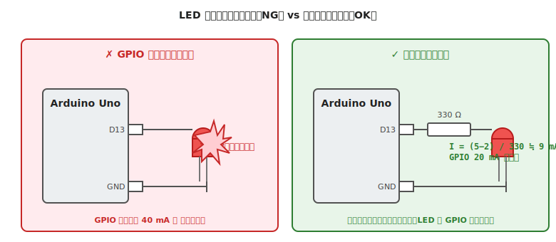

# 第 10 章　LED を正しく光らせる

Part IV「電気系トピック」の最初の章。LED を安全に点灯させる方法を扱います。本書で最も簡単な部品ですが、**最も頻繁に壊される部品でもあります**。電流制限抵抗の計算は、以降のあらゆる部品選定で繰り返し使う基礎です。

**代表ボード：Arduino Uno R3** ／ 他ボードへの読み替えは AI エージェントに依頼してください（第 1 章 §4）。

!!! warning "この章で壊しやすいもの"
    - **LED**（電流制限抵抗なしで焼損。1〜3 秒で壊れる）
    - **マイコンの GPIO**（LED と道連れに焼損。復旧不能）
    - **高輝度 LED**（直視で網膜に残像・角膜損傷の報告あり）

## この章のゴール

- LED の **順方向電圧 V_F**（LED が光り始めるのに必要な電圧、色で決まる物理定数）と **順方向電流 I_F**（LED に流す電流、明るさを決める）をデータシートから読める
- オームの法則で **電流制限抵抗の値** を計算できる
- **GPIO 1 ピンで安全に駆動できる LED の本数** を根拠付きで答えられる

---

## 1. 動機：LED は「電流を制限しないと必ず壊れる」

LED は電圧源に直結すると、**ほぼ無制限に電流を引き込む** 特性を持っています。発光ダイオード（LED）は、順方向電圧（V_F）を超えた瞬間から急激に電流が流れ始めるため、抵抗のような「電圧に比例して電流が増える」素子とは挙動が違います。

この特性を理解しないまま GPIO に直結すると、LED と GPIO の両方を焼きます。**LED は「電流を決めてから電圧を渡す」部品** である、というのが本章の核です。

---

## 2. 素朴な（NG）回路：抵抗なしで GPIO に直結

### NG 例

Arduino Uno の D13 ピンに、赤色 LED を直接接続。



### NG コード

```cpp
// ⚠ この回路を組んで digitalWrite(13, HIGH) すると壊れます
// 頭の中だけで追ってください（実機で試さない）

void setup() {
  pinMode(13, OUTPUT);
}

void loop() {
  digitalWrite(13, HIGH);   // LED に制限なしで電流が流れる
  delay(500);
  digitalWrite(13, LOW);
  delay(500);
}
```

1〜3 秒で以下のいずれかが起きます:
- LED が光らなくなる（内部が焼き切れて断線）
- D13 ピンが壊れる（永久的に LOW のまま、または常時 HIGH）
- 最悪の場合、ATmega328P ごと書き込み不能に

---

## 3. なぜダメか：データシート根拠

### 3.1 赤色 LED の絶対最大定格

一般的な赤色 3mm LED（OSR5JA3Z74A など）のデータシート:

| 項目 | 値 |
|---|---|
| 順方向電圧 V_F typ. | 2.0 V @ I_F = 20 mA |
| 順方向電流 I_F max.（推奨）| 20 mA |
| 順方向電流 絶対最大定格 | 30 mA（パルス）|

LED は V_F（約 2 V）を超えた電圧がかかると、**電流は電圧差とダイオード内部抵抗だけで決まる** ようになります。内部抵抗は数 Ω しかないので:

\[
I = \frac{V_{CC} - V_F}{R_{internal}} = \frac{5 - 2}{\text{数 Ω}} \approx \text{数百 mA}
\]

### 3.2 ATmega328P の GPIO 定格（第 2 章 §2 再掲）

- 推奨：20 mA / ピン
- 絶対最大：40 mA / ピン

**LED の引く数百 mA は、GPIO の絶対最大を 10 倍以上超える**。両方が焼損します。

---

## 4. 正しい回路：電流制限抵抗を入れる

### 4.1 抵抗値の計算

LED と抵抗を直列に入れ、オームの法則で電流を決めます:

\[
R = \frac{V_{CC} - V_F}{I_F}
\]

- V_CC = 5 V（Arduino Uno の VCC）
- V_F = 2.0 V（赤 LED の typ.）
- I_F = 10 mA（GPIO 定格 20 mA の半分でマージン確保）

→ R = (5 − 2) / 0.010 = **300 Ω**

実際には E24 系列で近い値の **330 Ω** を選びます（10% 程度の誤差は問題になりません）。

### 4.2 正しいコード

```cpp
// 配線：D13 → 330Ω → LED アノード（長足）
//       LED カソード（短足）→ GND
// 電流は約 9 mA、GPIO 定格の半分以下で安全

const int LED_PIN = 13;

void setup() {
  pinMode(LED_PIN, OUTPUT);
  Serial.begin(9600);
  Serial.println("LED blink start");
}

void loop() {
  digitalWrite(LED_PIN, HIGH);
  delay(500);
  digitalWrite(LED_PIN, LOW);
  delay(500);
}
```

### 4.3 抵抗値の目安表（5V 電源、I_F = 10 mA 設計）

| LED の色 | 典型 V_F | 推奨抵抗値（330 Ω 近傍）|
|---|---|---|
| 赤 | 2.0 V | 330 Ω（I ≈ 9 mA）|
| 黄 | 2.1 V | 330 Ω（I ≈ 9 mA）|
| 緑（古いタイプ）| 2.2 V | 330 Ω（I ≈ 8 mA）|
| 青・白・緑（高輝度）| 3.2 V | 220 Ω（I ≈ 8 mA）|

!!! tip "V_F は色で決まる"
    LED の V_F は **発光波長（色）で決まる物理定数** に近く、個体差より色差のほうが大きいです。赤系は 2V 前後、青・白系は 3V 前後と覚えておけば、大抵の LED は計算できます。

---

## 5. 高輝度 LED の扱い

### 5.1 眼への危険

高輝度白色 LED（数千 mcd 以上）は、**裸眼での直視で残像や網膜損傷の報告** があります。特に青色 LED（450 nm 前後）は、網膜のメラニンが吸収しやすい波長です。

- **直視しない**（実験中も）
- **拡散キャップ** を付ける（市販品あり）
- **眼鏡やサングラス** で数十%の減光効果

### 5.2 発熱

1W クラスの高輝度 LED は **放熱板（ヒートシンク）が必須** です。単体で 1〜2 秒動作させると 70℃ 以上になることがあり、放熱なしでは寿命が数百時間しか持ちません。本書の作例範囲ではまず使わないので、詳細は割愛します。

---

## 6. GPIO 1 ピンで LED を何本まで駆動できるか

ATmega328P の GPIO は 1 ピンあたり **推奨 20 mA まで**。LED 1 本で 10 mA 使うなら、単純には 2 本が上限です。

ただし次の条件も守ります:
- **VCC/GND ピン合計の絶対最大 200 mA**（全ピンの合計）
- **1 ポート（8 ピン）合計で 100 mA**（ATmega328P の場合）

多数の LED を同時点灯したい場合は、**GPIO で直接駆動せず、トランジスタ or LED ドライバ IC を介する**（[第 12 章](12-transistor-mosfet.md)）。

---

## 7. 動作確認チェックリスト

### 7.1 電源投入前（[第 7 章](../workflow-electrical/07-pre-test-check.md) §§A〜E に加えて）

- [ ] 抵抗値が計算と一致している（カラーコード読み）
- [ ] LED の極性：**長い足（アノード）が GPIO 側**
- [ ] 抵抗が **LED と直列** に入っている（並列ではない）

### 7.2 電源投入後（[第 8 章](../workflow-electrical/08-test-check.md)）

- [ ] **LED が適度な明るさで光る**（眩しすぎない、暗すぎない）
- [ ] LED が **熱くない**（触って 10 秒以上耐えられる温度）
- [ ] LED や抵抗から **焦げ臭がしない**
- [ ] 抵抗両端の電圧（テスタで測定）が約 (V_CC − V_F) ＝ 3 V 付近

### 7.3 電流の実測（オプション）

抵抗の両端電圧から電流を逆算すると、回路が設計どおりかを確認できます。

- 抵抗両端電圧 V_R を測定
- I = V_R / R（例：V_R = 3.0 V、R = 330 Ω なら I = 9.1 mA）

---

## 8. よくあるトラブル FAQ

??? question "LED が光らない"
    - **極性逆**：短い足が GPIO 側になっていないか確認
    - **GPIO が HIGH になっていない**：`digitalWrite(LED_PIN, HIGH)` が呼ばれているか
    - **抵抗値が大きすぎる**：10 kΩ などを使うと電流が小さすぎて見えない（330Ω 前後が目安）
    - **LED が既に焼損している**：GPIO 直結経験があるなら別個体で確認

??? question "LED が暗い"
    - **抵抗値が大きすぎる**：再計算して、GPIO 定格内で最も電流を取れる抵抗値に
    - **電源電圧が低下している**（ブラウンアウト、電池消耗）：[第 4 章 §7](../getting-started/04-power.md) の検出方法

??? question "LED が常時点灯したまま消えない"
    - **GPIO が常時 HIGH になっている**：過去に焼損した可能性、別 GPIO に変更して確認
    - **配線ミス**：直接 VCC に繋がっていないか

??? question "触ると熱い"
    - **抵抗値が小さすぎて電流過多**：再計算、より大きい抵抗に
    - **高輝度 LED で放熱不足**：通常の 5mm LED では稀。高輝度品ならヒートシンクを検討

??? question "複数 LED を同時に光らせたい"
    - **1 本の抵抗に直列で複数 LED**：合計 V_F が V_CC に近づく → 電流が不安定、推奨しない
    - **LED ごとに個別の抵抗**：安全、推奨
    - **10 本以上**：トランジスタ／MOSFET or LED ドライバ IC を使う（[第 12 章](12-transistor-mosfet.md)）

---

## 9. 次章への橋渡し

LED は「出力」の基本でした。次は「入力」の基本 — **スイッチ入力** を扱います。

次の [第 11 章「スイッチ入力」](11-switch.md) では、プルアップ／プルダウン抵抗の必要性、浮き入力の危険性、そしてチャタリング対策を扱います。LED 点灯と同じくらい基本なのに、**抵抗 1 本の省略で動作不安定になる** 頻出トラブルを予防するのが目的です。
