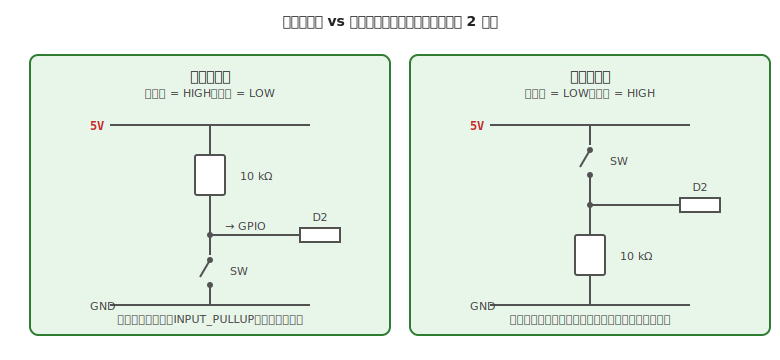

# 第 11 章　スイッチ入力

ボタンやタクトスイッチで **マイコンに入力を渡す** 回路を扱います。LED（第 10 章）が最も壊しやすい出力なら、スイッチは **最も誤動作しやすい入力** です。抵抗 1 本を省略するだけで挙動が不安定になる、配線上は地味ですが重要な章です。

**代表ボード：Arduino Uno R3**

!!! warning "この章で壊しやすい・失敗しやすいもの"
    - **マイコンの GPIO**（オープン入力で誤動作、最悪 ESD で破壊）
    - **スイッチの読み取り**（**チャタリング**＝スイッチの接点が押下の瞬間に数 ms だけ急速に ON/OFF を繰り返す物理現象。1 回押したのに 3 回反応してしまう原因になる。詳しくは §6）
    - **誤配線による即座のショート**（スイッチで VCC と GND を直結してしまう）

## この章のゴール

- **プルアップ／プルダウン抵抗** がなぜ必要かを [第 3 章 §4](../getting-started/03-datasheet.md) の V_IH / V_IL から説明できる
- **内蔵プルアップ**（`INPUT_PULLUP`）の使い方を押さえる
- **チャタリング** をソフトとハードの両方で対策できる

---

## 1. 動機：スイッチだけでは「押していない状態」が決まらない

LED と違って、スイッチは **「電気的に 2 状態のある部品」ではない**。ボタンが押されていないときに、GPIO が何 V になるかは **抵抗が決める** のです。

- ボタンを押す = 2 点の端子が導通
- ボタンを押さない = 2 点の端子が **電気的に切り離されただけ**（GPIO は "浮いた"（floating）状態）

**浮いた GPIO 入力** が何を読むかは、周囲の電磁ノイズ・手の湿度・近くの配線の電位で決まります。まったく予測不能です。

---

## 2. 素朴な（NG）回路：スイッチだけで GPIO と GND を繋ぐ

### NG 例

Arduino Uno の D2 ピンとタクトスイッチの一方、スイッチのもう一方を GND に接続。抵抗なし。

```
    D2 ─── [スイッチ] ─── GND
```

### NG コード

```cpp
void setup() {
  pinMode(2, INPUT);        // ← 内蔵プルアップを有効化していない
  Serial.begin(9600);
}

void loop() {
  int state = digitalRead(2);
  Serial.println(state);
  delay(100);
}
```

### 何が起きるか

- スイッチを押した瞬間：D2 が GND に繋がる → `digitalRead` は LOW を返す（これは正しい）
- **スイッチを押していないとき**：D2 はどこにも繋がっていない（浮き）→ `digitalRead` は HIGH か LOW かランダムに返す（正しくない）

シリアルモニタには、スイッチに触っていないのに 0 と 1 が揺れ動く表示が出ます。

---

## 3. なぜダメか：V_IH / V_IL の不定領域

### 3.1 デジタル入力のしきい値（第 3 章 §4 再掲）

ATmega328P（VCC = 5V）での入力判定:

- V_IL max. = 1.5 V（これ以下なら LOW と判定）
- V_IH min. = 3.0 V（これ以上なら HIGH と判定）
- **1.5〜3.0 V の範囲は「不定領域」** — HIGH と LOW のどちらに読まれるか保証されない

### 3.2 浮き入力の危険性

配線されていない GPIO は、**周囲の電磁ノイズを拾って** 1.5〜3.0 V の不定領域を彷徨います。結果:

- 読み値がランダムに 0/1 を切り替わる
- **内部で HIGH/LOW の判定が揺れ** 、貫通電流による発熱が発生（消費電流が増える）
- 人の手が近づいただけで電位が変わる（人体がアンテナになる）

これを防ぐために、**スイッチが開いているときに GPIO を 5V または 0V に確実に引っ張る抵抗** が必要です。

---

## 4. 正しい回路：プルアップ or プルダウン



### 4.1 プルアップ方式（推奨）

- **スイッチ未押下：GPIO は HIGH**（抵抗経由で VCC に繋がっている）
- **スイッチ押下：GPIO は LOW**（スイッチが GND に直接繋ぐ）

### 4.2 プルダウン方式

- **スイッチ未押下：GPIO は LOW**
- **スイッチ押下：GPIO は HIGH**

どちらも機能的には等価ですが、**プルアップが業界標準** です。理由は:

1. CMOS 入力は 1 が「浮いた」電位に近いので、GND に引くほうがノイズマージンが大きい
2. **多くのマイコンに内蔵プルアップがあり、外付け抵抗が省ける**
3. スイッチの信号コード規約で LOW = アクティブが慣用

### 4.3 抵抗値の選び方

プルアップ／プルダウンとも、**10 kΩ** が定番です。理由:

- **大きすぎる（100 kΩ 以上）** → ノイズ感受性が上がる、反応が遅くなる
- **小さすぎる（1 kΩ 以下）** → スイッチ押下時の電流（5V / 1kΩ = 5mA）が過剰、電力の無駄
- **10 kΩ** は両者のバランス良し、電流は 0.5 mA 程度で負担小

---

## 5. 内蔵プルアップを使う（Arduino のおすすめ）

Arduino Uno（ATmega328P）は **すべての GPIO に内蔵プルアップ抵抗（約 20〜50 kΩ）** を持っています。`INPUT_PULLUP` モードで有効化できます。

### 5.1 正しいコード（内蔵プルアップ使用）

```cpp
// 配線：D2 ─── [スイッチ] ─── GND
//       （外付け抵抗なし、マイコン内蔵プルアップを使う）

const int BUTTON_PIN = 2;
const int LED_PIN = 13;

void setup() {
  pinMode(BUTTON_PIN, INPUT_PULLUP);  // 内蔵プルアップ有効
  pinMode(LED_PIN, OUTPUT);
  Serial.begin(9600);
}

void loop() {
  int state = digitalRead(BUTTON_PIN);
  // INPUT_PULLUP なので、押下 = LOW / 未押下 = HIGH
  digitalWrite(LED_PIN, state == LOW ? HIGH : LOW);
  Serial.println(state);
  delay(50);
}
```

### 5.2 メリット

- **外付け抵抗が不要** — 配線がシンプル
- **ブレッドボード上のジャンパが 2 本減る** — 組立ミスが減る
- **どんなマイコンでも使える一般的な機能**（ESP32、RP2040 など）

!!! tip "まず `INPUT_PULLUP` を試す"
    外付け抵抗にこだわる理由は通常ありません。**Arduino 系ではまず `INPUT_PULLUP` を使い、問題があれば外付けに変える** のが実用的です。ノイズが多い環境や、**内蔵プルアップが弱すぎて 5V まで上がらない** ようなときだけ外付けを検討します。

---

## 6. チャタリング（バウンス）対策

### 6.1 チャタリングとは

機械的なスイッチの接点は、押下時に **数 ms〜数十 ms のあいだ、急速に ON/OFF を繰り返します**。これが **チャタリング（bounce）** です。デジタル入力としては、**1 回押したのに複数回反応する** トラブルの原因になります。

### 6.2 ソフトウェアでのチャタリング対策（推奨）

`delay()` を使う素朴な方法よりも、**`millis()` で時間経過を管理する** ほうが他の処理を止めないので実用的です。

```cpp
const int BUTTON_PIN = 2;
const int LED_PIN = 13;

int lastButtonState = HIGH;       // 前回の読み値
int buttonState = HIGH;           // 確定した状態
unsigned long lastDebounceTime = 0;
const unsigned long DEBOUNCE_MS = 20;   // 20 ms 安定したら確定

bool ledOn = false;

void setup() {
  pinMode(BUTTON_PIN, INPUT_PULLUP);
  pinMode(LED_PIN, OUTPUT);
  Serial.begin(9600);
}

void loop() {
  int reading = digitalRead(BUTTON_PIN);

  // 前回と違う値を読んだらタイマ開始
  if (reading != lastButtonState) {
    lastDebounceTime = millis();
  }

  // 20 ms 変化がなければ確定
  if ((millis() - lastDebounceTime) > DEBOUNCE_MS) {
    if (reading != buttonState) {
      buttonState = reading;
      if (buttonState == LOW) {
        // 立ち下がりエッジ（押された瞬間）で LED トグル
        ledOn = !ledOn;
        digitalWrite(LED_PIN, ledOn ? HIGH : LOW);
        Serial.println(ledOn ? "ON" : "OFF");
      }
    }
  }

  lastButtonState = reading;
}
```

### 6.3 ハードウェアでのチャタリング対策

低レベル回路でチャタリングを吸収する方法:

- **RC フィルタ**：スイッチと GND の間に並列に **0.1 μF コンデンサ** を入れる（プルアップ抵抗 10 kΩ と組み合わせて時定数 1 ms のローパスフィルタ）
- **シュミットトリガ IC**（74HC14 等）：立ち上がり／立ち下がりでヒステリシスを持たせて、不定領域を通過するときの揺らぎを吸収

**一般用途ではソフトウェアで十分** です。ハードウェア対策は、割り込みで即反応する必要がある場面（モータの緊急停止など）で使います。

---

## 7. 動作確認チェックリスト

### 7.1 電源投入前

- [ ] 配線が **GPIO → スイッチ → GND** になっている（プルアップ方式の場合）
- [ ] **`INPUT_PULLUP` を使うか、外付けプルアップ抵抗** が入っている
- [ ] スイッチを押したときに **GPIO が直接 GND にショート** する（抵抗を介さない、これは正しい）
- [ ] VCC と GND がスイッチを介して短絡していない

### 7.2 電源投入後

- [ ] **スイッチ未押下で `digitalRead` が HIGH**（プルアップの場合）
- [ ] **スイッチ押下で `digitalRead` が LOW**
- [ ] 触っていないのに値が **ランダムに揺れない**（ランダムなら浮き入力）
- [ ] 1 回押下で LED が 1 回トグル（複数回トグルするならチャタリング未対策）

---

## 8. よくあるトラブル FAQ

??? question "スイッチを押していないのに反応している"
    **浮き入力** の典型症状。
    - `pinMode(pin, INPUT_PULLUP)` に変更
    - または外付けプルアップ抵抗（10 kΩ）を追加

??? question "1 回押しただけで複数回反応する"
    **チャタリング**。
    - ソフトウェアでデバウンス処理（§6.2 のコード）を入れる
    - それでも出る場合、ハードウェアで RC フィルタを追加

??? question "反応したりしなかったりする"
    - **接触不良**：タクトスイッチが劣化、別個体で確認
    - **配線の緩み**：ブレッドボードの差しを確認
    - **プルアップ抵抗値が大きすぎる**：内蔵 20〜50 kΩ ではなく、外付け 10 kΩ に

??? question "シリアルモニタに大量の 0/1 が流れる"
    状態変化していないのに出力しているのが問題。
    - **値が変化したときだけ出力** するようにコードを修正（`if (state != lastState) { Serial.println(state); lastState = state; }`）

??? question "ESP32 や Pico で同じコードを使いたい"
    ロジック電圧が 3.3V になるだけで、`INPUT_PULLUP` の機能は同じ。ただし:
    - **ESP32 は一部のピンで内蔵プルアップが無効**（GPIO 34-39 は入力専用で内蔵プルアップなし）
    - Pico（RP2040）は **内蔵プルアップ／プルダウンの両方** を選べる
    - 詳細は AI エージェントに「このコードを ESP32 用に書き換えて」と依頼

---

## 9. 次章への橋渡し

入力（スイッチ）と出力（LED）の基本が押さえられたので、次は **「GPIO では直接駆動できない大きな負荷」** を扱います。

次の [第 12 章「トランジスタ／MOSFET をスイッチとして使う」](12-transistor-mosfet.md) では、LED を複数同時点灯したい、小型リレーを駆動したい、大電流の装置を GPIO で制御したい、という場面で必須のトランジスタ／MOSFET の使い方を扱います。第 2 章で扱った「GPIO 直結の危険性」を、実際に解決する方法です。
