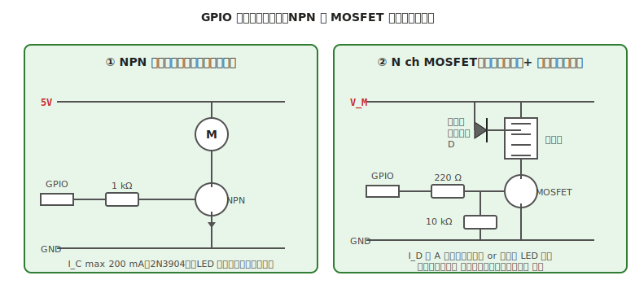

# 第 12 章　トランジスタ／MOSFET をスイッチとして使う

[第 2 章](../getting-started/02-safety-basics.md) で触れた「GPIO 直結の危険性」を、**実際に解決する方法** を扱います。LED の多灯・リレー・小型モータなど、**GPIO の 20 mA では足りない負荷** を安全に制御する鍵が、トランジスタ／MOSFET のスイッチ回路です。

**代表ボード：Arduino Uno R3**

!!! warning "この章で壊しやすいもの"
    - **MOSFET**（静電気で破壊、ゲート抵抗なしで発振、ゲート電圧不足で半オン状態になり発熱）
    - **NPN トランジスタ**（ベース抵抗計算ミスで熱破壊、過電流でセカンダリブレークダウン）
    - **マイコンの GPIO**（ロジックレベル不一致の MOSFET ゲートを駆動しきれず、ピン電流超過）
    - **フライホイールダイオード**（還流ダイオードとも呼ぶ。コイルを含む負荷で電流を遮断した瞬間に発生する逆向きの高電圧パルス＝**逆起電力** を吸収するダイオード。詳しくは §4）**を入れ忘れた回路の全部品**（コイル系負荷の逆起電力で IC 即死）

## この章のゴール

- **NPN トランジスタ** でスイッチを組み、ベース抵抗を計算できる
- **ロジックレベル N-ch MOSFET** を選び、ゲート抵抗とプルダウン抵抗を決められる
- 誘導性負荷（モータ、リレー、ソレノイド）に **フライホイールダイオード** を入れる
- 「この負荷にはトランジスタか MOSFET か」を判断できる

---

## 1. 動機：GPIO は「信号を出す」ところ、「電力を出す」ところではない

[第 2 章 §4](../getting-started/02-safety-basics.md) で見たとおり、ATmega328P の GPIO は 1 ピン 20 mA 定格、40 mA 絶対最大。これでは多くのアクチュエータは動きません。

| 負荷 | 典型電流 | GPIO 直結可？ |
|---|---|---|
| LED 1 本（抵抗付き）| 10 mA | ○ |
| LED 5 本並列 | 50 mA | ✗（多灯は別回路）|
| 小型ブザー | 30〜50 mA | △ |
| 小型リレー | 50〜100 mA | ✗ |
| 小型 DC モータ | 150〜1000 mA | ✗（モータドライバ IC 必須、[第 13 章](13-dc-motor.md)）|
| ソレノイド | 数百 mA 〜 | ✗ |
| 高輝度 LED（1W）| 350 mA | ✗ |

**GPIO で制御信号を出し、大電流は別の回路（トランジスタ or MOSFET）に流す** のが解決策です。これは「2 段階の増幅」の考え方。

---

## 2. NPN トランジスタでのスイッチ：基本

### 2.1 回路



（上図左：NPN トランジスタ）

- VCC → 負荷 → トランジスタのコレクタ（C）
- トランジスタのエミッタ（E）→ GND
- GPIO → ベース抵抗 → トランジスタのベース（B）

GPIO が HIGH のとき、ベースに電流が流れ、コレクタ-エミッタ間が導通して負荷に電流が流れます。

### 2.2 ベース抵抗の計算

2N3904（汎用 NPN）のデータシートから:

- **h_FE typ.**（電流増幅率）：100〜300（個体差大、保守的に 100 を採用）
- **V_BE**（ベース-エミッタ電圧、ON 時）：0.7 V

負荷に流したい電流 I_C が 100 mA なら、必要なベース電流は:

\[
I_B = \frac{I_C}{h_{FE}} = \frac{100 \text{ mA}}{100} = 1 \text{ mA}
\]

実用上は **飽和領域（トランジスタが完全に ON した状態）に確実に入れるため、計算値の 5〜10 倍のベース電流** を流します（I_B = 5〜10 mA）。オーバードライブすると、トランジスタの C-E 間電圧降下が最小になり（V_CE(sat) ≒ 0.2 V）、発熱も最小になります。

ベース抵抗 R_B の計算:

\[
R_B = \frac{V_{GPIO} - V_{BE}}{I_B} = \frac{5.0 - 0.7}{0.005} = 860\,\Omega \approx 1\,\text{k}\Omega
\]

E24 系列で **1 kΩ** を選びます。

### 2.3 NG：ベース抵抗なし

GPIO → ベース直結で制御しようとすると、**ベース-エミッタ間が順方向 PN 接合** なので 0.7 V でクランプされ、GPIO から数十〜数百 mA が流れ込みます。GPIO 定格を超えて **マイコン側が破壊** されます。ベース抵抗は必須です。

### 2.4 正しいコード

```cpp
// 配線：
//  D3 → 1kΩ → NPN (2N3904) のベース
//  NPN のコレクタ → 負荷（LED や小型リレー）
//  NPN のエミッタ → GND
//  負荷の反対側 → VCC（5V or 別電源）

const int TR_PIN = 3;

void setup() {
  pinMode(TR_PIN, OUTPUT);
}

void loop() {
  digitalWrite(TR_PIN, HIGH);   // 負荷 ON
  delay(1000);
  digitalWrite(TR_PIN, LOW);    // 負荷 OFF
  delay(1000);
}
```

---

## 3. N-ch MOSFET でのスイッチ：大電流向け

### 3.1 NPN との違い

| 項目 | NPN トランジスタ | N-ch MOSFET |
|---|---|---|
| 入力 | **電流** 駆動（ベース電流）| **電圧** 駆動（ゲート電圧）|
| 入力時の消費電力 | やや多い | ほぼゼロ（静的）|
| 最大電流 | 数百 mA | 数 A〜数十 A |
| 導通時電圧降下 | 0.2〜0.7 V（V_CE(sat)）| 低抵抗 × 電流（R_DS(on) × I_D）|
| 静電気破壊 | 起きにくい | **非常に起きやすい**（ゲート薄膜破壊）|

**大電流（数百 mA 以上）なら MOSFET が有利** です。

### 3.2 ロジックレベル MOSFET を選ぶ

MOSFET には **ゲート-ソース間しきい電圧 V_GS(th)** があり、この値以上の電圧をゲートに印加しないと導通しません。

- 一般 MOSFET：V_GS(th) = 3〜5 V（完全 ON には 10V 必要）
- **ロジックレベル MOSFET**：V_GS(th) = 1〜2 V（**5V or 3.3V の GPIO で完全 ON できる**）

Arduino（5V）で駆動するなら **ロジックレベル品**（IRLB8721、IRLZ44N、FQP30N06L など）を選びます。

### 3.3 ゲート抵抗とプルダウン抵抗


（上図右：MOSFET）

- **ゲート抵抗（220 Ω〜1 kΩ）**：GPIO からゲートまでの間に入れる。理由:
  - ゲートは寄生キャパシタを持つので、瞬間的に大電流（数百 mA）が流れ込む → GPIO 定格超過の防止
  - 高速スイッチングでの発振抑制
- **プルダウン抵抗（10 kΩ）**：ゲートと GND の間。理由:
  - GPIO が ハイインピーダンス（初期化中、書き込み中）のときに、**ゲートが浮いて半オン状態になる** のを防ぐ
  - 半オン状態は電流が中途半端に流れて **MOSFET が発熱**、破壊に至る

### 3.4 正しいコード

コードは NPN と同じ（HIGH/LOW で ON/OFF）。違いは回路側のみ。

---

## 4. フライホイールダイオード（還流ダイオード）

### 4.1 なぜ必要か

モータ・リレー・ソレノイドなど **コイル（インダクタ）を含む負荷** は、電流を遮断した瞬間に **逆起電力**（数十 V〜数百 V の高電圧パルス）を発生させます。この逆起電力がトランジスタ／MOSFET に加わって、**素子が即座に破壊** されます。

### 4.2 対策

負荷のコイルと並列に、**カソードを VCC 側、アノードを MOSFET ドレイン側** にダイオードを入れます（図の右パネル参照）。逆起電力はこのダイオードを経由して自己消費し、スイッチング素子を守ります。

- **選定基準**：ダイオードの順方向電流定格 ≥ 負荷の定常電流
- **推奨型番**：1N4007（汎用、1 A）、1N5819（ショットキー、高速）、SR360（3 A）
- **向き（重要）**：カソード（帯がある側）が **VCC 側**（電流が流れない向き）

これを **フライホイール** や **還流ダイオード**、**キャッチダイオード** と呼びます。

### 4.3 LED や抵抗だけの負荷には不要

コイルを含まない純粋な抵抗負荷（LED + 抵抗）では、逆起電力は発生しないのでフライホイールダイオードは不要です。

---

## 5. 動作確認チェックリスト

### 5.1 電源投入前

- [ ] **トランジスタ／MOSFET のピン配置** をデータシートで確認した（型番違いで順序が違うことあり）
- [ ] **ベース抵抗／ゲート抵抗** が入っている
- [ ] MOSFET には **ゲートプルダウン抵抗** が入っている
- [ ] 誘導性負荷には **フライホイールダイオード** が入り、**向きが正しい**
- [ ] [第 7 章](../workflow-electrical/07-pre-test-check.md) の VCC-GND ショートチェック通過

### 5.2 電源投入後

- [ ] GPIO LOW のときに **負荷がオフ**（電流 0）
- [ ] GPIO HIGH のときに **負荷が期待通りに ON**
- [ ] トランジスタ／MOSFET に触れて **熱くない**（熱いなら半オン状態、または電流過多）
- [ ] 長時間動作で **温度が安定** している

---

## 6. よくあるトラブル FAQ

??? question "負荷が動かない（ON にならない）"
    - **MOSFET が非ロジックレベル品**：V_GS(th) を確認、5V では足りていない可能性。ロジックレベル品に交換
    - **ベース／ゲート抵抗が大きすぎ**：ベース電流が不足。値を半分にして再試行
    - **配線逆**：E/C／S/D を逆に挿していないかデータシート再確認

??? question "GPIO を LOW にしても負荷が切れない"
    MOSFET のゲートが浮いている可能性。
    - **ゲートプルダウン抵抗**（10 kΩ）を G-GND 間に追加

??? question "トランジスタ／MOSFET が熱い"
    - **半オン状態**（ゲート電圧不足）：ロジックレベル品への交換、またはプルダウン追加
    - **電流過多**：I_C（NPN）or I_D（MOSFET）が定格を超えている。負荷電流を測定
    - **放熱不足**：大電流ではヒートシンクが必要

??? question "モータを切った瞬間にマイコンがリセットする"
    フライホイールダイオード不足 or 電源分離不足。
    - **ダイオードの向き** 再確認
    - それでも出るなら **電源分離**（[第 4 章 §5](../getting-started/04-power.md)）

??? question "何もしていないのに MOSFET が壊れていた"
    静電気（ESD）破壊の可能性。
    - 作業前に **金属に触れて除電**
    - 保管は **導電スポンジ** か **静電袋** で
    - 高性能機は **ESD 保護ダイオード付き** の MOSFET を選ぶ

---

## 7. 次章への橋渡し

1 方向だけ電流を流すスイッチ回路ができたら、次は **両方向に電流を切り替えられる** モータドライバです。

次の [第 13 章「DC モータを回す」](13-dc-motor.md) では、H ブリッジ構造を持つモータドライバ IC（DRV8835 等）を使って、DC モータを正転・逆転・停止で制御する方法を扱います。本章の MOSFET 知識をもとに、「なぜ H ブリッジ IC を使うのか」を理解します。
