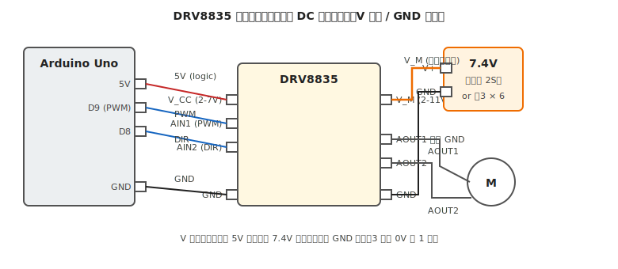

# 第 13 章　DC モータを回す

ブラシ付き DC モータを駆動する方法を扱います。LED やスイッチと違い、モータは **GPIO 直結では絶対に動かない** 負荷の代表格。[第 12 章](12-transistor-mosfet.md) で学んだ MOSFET 技術をさらに進化させた **H ブリッジ回路** を内蔵した「モータドライバ IC」を使う方法を中心に扱います。

**代表ボード：Arduino Uno R3**

!!! warning "この章で壊しやすいもの"
    - **マイコン**（モータ直結、逆起電力での破壊）
    - **モータドライバ IC**（電源分離不足、突入電流、ヒートシンク不足による熱破壊）
    - **電源**（モータ起動時の突入電流で電圧ドロップ、電池が膨張）
    - **モータ自体**（ストール状態の長時間継続で焼損）

## この章のゴール

- ブラシ付き DC モータに **モータドライバ IC が必要な理由** を説明できる
- 代表 IC（**DRV8835 / TB67H450 / L298N**）の違いを理解し選べる
- **ロジック電源とモータ電源の分離** を回路レベルで実装できる
- 正転・逆転・停止・ブレーキを PWM で制御できる

---

## 1. 動機：モータはなぜ難しいか

DC モータは電気的には「コイル + 接点（ブラシ）」ですが、実用上は 3 つの難しさがあります:

1. **大電流**：定常 150〜500 mA、ストール時 1 A 超（GPIO 直結不可）
2. **逆起電力（バック EMF）**：DC モータは内部にコイル（インダクタ）を持つので、電流を急に止めた瞬間に **電源電圧の数倍〜数十倍の逆向きの電圧パルス** が瞬間的に発生する現象。対策なしだと、周囲の IC やマイコンが即座に破壊される
3. **双方向駆動**：正転・逆転の両方を実現するには、電流の向きを変えられる回路が必要

これを 1 つの IC にまとめたのが **モータドライバ IC**（H ブリッジ内蔵）。本章では、単体 MOSFET ではなく、ほぼ例外なく **モータドライバ IC を使う** 方針で進めます。

---

## 2. 素朴な（NG）回路：GPIO にモータを直結

[第 2 章 §4](../getting-started/02-safety-basics.md) で扱った NG 例の再掲ですが、初心者が最も詰まるポイントなので改めて。

### NG パターン 1：GPIO 直結

```
D9 ─── モータ ─── GND
```

[第 2 章 §4](../getting-started/02-safety-basics.md) の通り、**定常電流が GPIO 定格の数倍**、ストール時はさらに数倍。即座に GPIO 破壊。

### NG パターン 2：単体 MOSFET 1 個で制御（正転のみ）

```
D9 ── MOSFET のゲート
VCC ── モータ ── MOSFET ドレイン
MOSFET ソース ── GND
```

これは動きますが **正転しかできない**（逆転するには電流の向きを変える必要があり、MOSFET 1 個では無理）。H ブリッジ（MOSFET 4 個）が必要になります。

### NG パターン 3：モータ電源をマイコンの 5V から取る

```
Arduino 5V ── モータ（VCC） ── H ブリッジ ── ...
```

モータが 200 mA 引くと、Arduino の USB 給電（500 mA 上限）は簡単に飽和します。ブラウンアウトループ（[第 4 章 §7](../getting-started/04-power.md)）の典型。

---

## 3. なぜダメか：逆起電力と突入電流

### 3.1 逆起電力（バックEMF）

モータのコイルが電流を遮断された瞬間、**電源電圧の数倍の逆向きパルス** が発生します。

- 5V 駆動のモータでも、遮断時に 50V 以上のスパイクが出る
- MOSFET のドレイン-ソース絶対最大電圧（V_DS）を容易に超える
- 電源側にも回り込んで、マイコンを巻き込んで破壊

対策：**フライホイールダイオード**（[第 12 章 §4](12-transistor-mosfet.md)）。モータドライバ IC は内部に 4 個のフライホイールダイオードを内蔵しているので、外付け不要です。

### 3.2 突入電流

モータ起動時 0 rpm では、内部抵抗だけが電流を制限する（逆起電力がゼロのため）。

- 定常電流 200 mA のモータでも、起動時は 1〜3 A の瞬間電流
- ストール（拘束）状態では常時このピーク電流
- モータドライバの連続電流定格ではなく、**ピーク電流定格** を見る必要

**定常電流の 3〜5 倍の電流容量を持つ電源とドライバ** を選びます。

---

## 4. 正しい回路：モータドライバ IC + 電源分離

### 4.1 代表的なモータドライバ IC

| 型番 | 連続電流 | ピーク | ロジック電圧 | モータ電圧 | 特徴 |
|---|---|---|---|---|---|
| **DRV8835**（Pololu）| 1.5 A / ch | 3 A | 2〜7 V | 2〜11 V | 小型、本書のデフォルト |
| **TB67H450**（東芝）| 3.5 A | 5 A | 3.3 / 5 V | 4.5〜44 V | 高電流、やや大型 |
| **L298N**（STM）| 2 A / ch | 3 A | 5 V | 〜46 V | 老舗、発熱が大きい、非推奨だが教材多数 |
| **A4950** | 3.5 A | 5 A | 3〜5.5 V | 7.5〜40 V | TB67H450 と競合 |
| **MX1508**（汎用）| 1.5 A | 2.5 A | 5 V | 2〜9.6 V | 格安、評価用 |

本書の作例は **DRV8835（デュアル H ブリッジ）** を基準にします。小型ロボットには十分で、入手性・扱いやすさともに良好。

### 4.2 配線図（DRV8835 使用）



### 4.3 配線のポイント

1. **マイコンの VCC（5V）と モータ電源（7.4V）は別系統**（V 分離）
2. **マイコンの GND と モータ電源の GND は 1 点で繋ぐ**（GND 共通）
3. ドライバの **V_CC**（ロジック電源）にマイコンの 5V を接続
4. ドライバの **V_M**（モータ電源）にバッテリを接続
5. モータの 2 端子を **AOUT1 / AOUT2** に接続（左右の向きは任意、制御で補正）
6. ドライバの近くに **デカップリングコンデンサ**（電解 100 μF + セラミック 0.1 μF）を配置

### 4.4 正しいコード（PWM 制御、正転・逆転・停止）

```cpp
// 配線：
//  D9 → DRV8835 AIN1 (PWM 対応ピン)
//  D8 → DRV8835 AIN2 (方向)
//  マイコン 5V → DRV8835 V_CC
//  マイコン GND → DRV8835 GND
//  バッテリ + → DRV8835 V_M
//  バッテリ GND → DRV8835 GND（マイコン GND と同じラインに繋ぐ）
//  DRV8835 AOUT1, AOUT2 → モータの 2 端子

const int IN1_PIN = 9;   // PWM
const int IN2_PIN = 8;   // 方向

void setup() {
  pinMode(IN1_PIN, OUTPUT);
  pinMode(IN2_PIN, OUTPUT);
  Serial.begin(9600);
  Serial.println("Motor test");
}

void setMotor(int speed) {
  // speed: -255 〜 +255（符号で方向、絶対値で PWM Duty）
  if (speed > 0) {
    analogWrite(IN1_PIN, speed);
    digitalWrite(IN2_PIN, LOW);
  } else if (speed < 0) {
    digitalWrite(IN1_PIN, LOW);
    analogWrite(IN2_PIN, -speed);
  } else {
    // 両方 LOW で惰性停止（コースト）
    digitalWrite(IN1_PIN, LOW);
    digitalWrite(IN2_PIN, LOW);
  }
}

void loop() {
  Serial.println("forward");
  setMotor(200);    // 78% duty で正転
  delay(2000);

  Serial.println("stop");
  setMotor(0);
  delay(1000);

  Serial.println("reverse");
  setMotor(-200);   // 78% duty で逆転
  delay(2000);

  Serial.println("stop");
  setMotor(0);
  delay(1000);
}
```

!!! tip "DRV8835 の制御モードは 2 つある"
    DRV8835 には **PHASE/ENABLE モード**（MODE ピン HIGH）と **IN/IN モード**（MODE ピン LOW）の 2 つがあります。上のコードは IN/IN モード（MODE ピンを GND にする想定）。PHASE/ENABLE モードでは「AIN1 = 方向、AIN2 = PWM」になります。AI に「DRV8835 の MODE を PHASE/ENABLE に変えたコード」と依頼すれば書き換えてくれます。

---

## 5. モータ選び

本書の作例範囲で使う DC モータ:

| モータ | 電圧 | 定常電流 | ストール電流 | 典型用途 |
|---|---|---|---|---|
| **FA-130**（タミヤ）| 1.5〜3 V | 150〜250 mA | 1 A | おもちゃ、軽量ライントレース |
| **FA-130 + ギアボックス** | 同上 | 同上 | 同上 | タミヤギアボックス付き |
| **N20 ギヤードモータ** | 3〜12 V | 100〜400 mA | 0.5〜1.5 A | ホビーロボット、小型ライントレース |
| **540 / 380 クラス** | 6〜12 V | 1〜3 A | 5〜10 A | RC カー、重量ロボット |

**FA-130 と N20 が本書の主戦場**。540 クラス以上は本書のスコープ外（高電流帯域、発熱管理が別次元）。

---

## 6. 動作確認チェックリスト

### 6.1 電源投入前

- [ ] [第 7 章](../workflow-electrical/07-pre-test-check.md) の (A)〜(E) 全項目通過
- [ ] **V_CC と V_M の分離**（(D) で確認）
- [ ] **GND が 1 点に集約されている**（スター接続）
- [ ] モータドライバの **MODE ピン** が用途通り（DRV8835 なら IN/IN モードなら GND へ）
- [ ] 定格確認：**モータのストール電流 ≤ ドライバの連続電流定格**
- [ ] 電源電圧確認：**モータ定格 ≤ V_M ≤ ドライバの V_M 上限**

### 6.2 電源投入後

- [ ] モータが **指令通りに回る**（正転・逆転・停止が期待通り）
- [ ] モータドライバ IC が **触って 30 秒以上耐えられる温度**（50℃ 以下目安）
- [ ] モータ **最大出力で 30 秒** 連続駆動してもブラウンアウトしない（[第 4 章 §7](../getting-started/04-power.md) のシリアル監視法）
- [ ] モータ停止直後にマイコンがリセットしない（フライホイール作用で守られているか）
- [ ] モータ電源の電圧降下が **定格の 10% 以内**（ストール時測定）

---

## 7. よくあるトラブル FAQ

??? question "モータが回らない"
    - **ロジック電圧が届いていない**：DRV8835 の V_CC に 5V が来ているか実測
    - **モータ電源が届いていない**：V_M に適正電圧が来ているか
    - **MODE ピンの誤設定**：データシート確認、どちらかのモードに確定
    - **モータ自体の故障**：モータ単体で電池に繋いで回るか確認（[第 25 章](../workflow-mechanical/25-debugging.md)）

??? question "モータは回るが予想より弱い"
    - **PWM Duty が低い**：`analogWrite` の値を確認、最大 255
    - **モータ電源の電圧降下**：ストール時に V_M が落ちている、電源強化
    - **ドライバの過熱保護が働いた**：温度確認、ヒートシンク追加または電流低下

??? question "モータを切った瞬間にマイコンがリセットする"
    - **電源分離不足**：[第 4 章 §7](../getting-started/04-power.md) のブラウンアウト対策
    - **GND 未共通**：(D) チェックを再実施

??? question "DRV8835 が熱い・焼けた"
    - **定格オーバー**：モータストール電流がドライバ連続定格を超えている
    - **短絡**：モータ配線が AOUT1 と AOUT2 の間で短絡
    - **ヒートシンク不足**：表面にヒートシンクを追加
    - 対策：大電流対応の **TB67H450** に変更

??? question "正転と逆転の向きが逆"
    - AOUT1 と AOUT2 に繋いでいるモータ配線を **入れ替える**
    - またはコードで IN1/IN2 の割当を入れ替え（どちらでもよい）

??? question "低速で回らず、ある閾値を超えると急に回り始める"
    DC モータの摩擦トルクとギアボックスの引っかかりによる **デッドバンド**。
    - PWM Duty を低いほうでも試す：Duty 30〜50 で回らなければ、ギア側の摩擦を確認
    - ソフト側で最低 Duty を設けて **起動時だけ高 Duty**、回り始めたら目標 Duty に落とす制御

---

## 8. 次章への橋渡し

DC モータを制御できたら、次は **速度制御の核** である PWM をもう一歩詳しく見ます。

次の [第 14 章「PWM と速度制御」](14-pwm.md) では、`analogWrite` が実は何をやっているのか、周波数・Duty の選び方、ハード PWM とソフト PWM の違いを扱います。モータの可聴域ノイズ対策や、LED の目で感じる周期（ちらつき）など、PWM 絡みの細かい知識を集めます。
