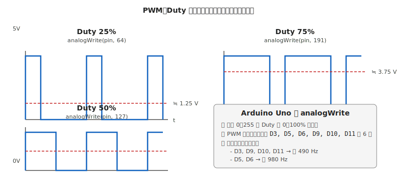

# 第 14 章　PWM と速度制御

[第 13 章](13-dc-motor.md) でモータを動かせるようになったので、**速度制御** の中核技術である PWM（Pulse Width Modulation、パルス幅変調）を扱います。LED の明るさ調整、モータの速度制御、サーボの位置指令 — 多くのアクチュエータ制御が PWM で動いています。

**代表ボード：Arduino Uno R3**

!!! warning "この章で起こしやすい失敗"
    - **モータドライバ IC の過熱**（高すぎる PWM 周波数でスイッチング損失増）
    - **マイコンのハング**（ソフト PWM での割り込み濫用）
    - **LED のちらつき**（低すぎる PWM 周波数）
    - **モータからの不快な「キーン」音**（可聴域の PWM 周波数）

## この章のゴール

- PWM の原理（Duty 比、周波数）を説明できる
- **ハードウェア PWM** と **ソフトウェア PWM** の違いを理解し選び分ける
- モータ／LED それぞれに適した **PWM 周波数** を決められる
- `analogWrite()` が内部で何をしているかを理解する

---

## 1. 動機：連続値の出力を「オン/オフの比率」で作る

マイコンの GPIO は **HIGH か LOW か の 2 値** しか出せません。DAC（デジタル-アナログ変換器）があれば中間の電圧を出せますが、Arduino Uno には DAC がありません。

では「LED を半分の明るさにしたい」「モータを 60% の速度で回したい」をどう実現するか。答えは:

> **HIGH と LOW を高速で切り替え、平均電圧を調整する**

これが PWM です。

---

## 2. PWM の基本：Duty 比と周波数



### 2.1 Duty 比

1 周期（T）のうち、HIGH の時間（t_on）の割合。

\[
\text{Duty} = \frac{t_{on}}{T} \times 100\%
\]

- Duty 0%：常に LOW（平均 0V）
- Duty 50%：HIGH と LOW が半分ずつ（平均 2.5V）
- Duty 100%：常に HIGH（平均 5V）

負荷にかかる **平均電圧** は Duty に比例します。負荷が十分に遅い（LED の人間の目、モータの機械的慣性）場合、この平均電圧で動作するように見えます。

### 2.2 周波数

1 秒間に何回の周期があるか。Arduino Uno のデフォルト PWM 周波数:

- D3, D9, D10, D11：**約 490 Hz**（Timer2, Timer1）
- D5, D6：**約 980 Hz**（Timer0、`delay()` / `millis()` と共用）

PWM 周波数は負荷の特性で選びます（§4 参照）。

---

## 3. Arduino の `analogWrite()` の中身

```cpp
analogWrite(pin, value);   // value: 0-255
```

これは「**Duty = value / 255 × 100% の PWM を、指定ピンから連続して出す**」命令です。`analogWrite(pin, 127)` は Duty 約 50%。

### 3.1 実体はハードウェア PWM

Arduino Uno 上で `analogWrite` を呼ぶと、ATmega328P の **ハードウェアタイマ**（Timer0/1/2）が自動的に設定され、**CPU を使わずに連続して PWM を出し続けます**。関数呼び出し後は `loop()` の他の処理を続けても PWM は止まりません。

### 3.2 使えるピンが限られている理由

PWM 出力はタイマと結びついています。Arduino Uno（ATmega328P）には 3 つのタイマ（Timer0/1/2）があり、それぞれが 2 ピンを担当します:

- Timer0：D5, D6（`millis()`, `delay()` と共用）
- Timer1：D9, D10（16-bit、サーボライブラリも使う）
- Timer2：D3, D11（Tone ライブラリも使う）

**合計 6 本の PWM 出力ピン**（D3, D5, D6, D9, D10, D11）。他のピンでは `analogWrite` は使えません。

---

## 4. PWM 周波数の選び方

負荷の種類で最適値が変わります。

### 4.1 LED

- **最低 100 Hz 以上**（人の目でちらつきを感じない）
- Arduino デフォルト（490 / 980 Hz）で十分
- ちらつきが気になるのは、**視線を素早く動かしたとき** に線状の軌跡が見える場面（「フリッカー」と呼ばれる）

### 4.2 DC モータ

- **1 kHz 以上**（可聴域 20 Hz〜20 kHz の下限近くを避ける）
- Arduino デフォルト 490 Hz は **耳に聞こえる「キーン」音** が出やすい → D5 or D6（980 Hz）を使うと改善
- **20 kHz 以上**（超音波域）にすれば完全に聞こえないが、MOSFET のスイッチング損失が増え、ドライバ IC が発熱する

!!! tip "DC モータの PWM は 1〜5 kHz がスイートスポット"
    可聴域を超えすぎると効率が落ちる、低すぎると音が聞こえる。**1〜5 kHz** が多くのモータドライバ IC とモータで両立できる範囲です。
    Arduino の `analogWrite` の 980 Hz は下限ギリギリですが、小型モータ用途では実用上問題ありません。

### 4.3 スイッチング電源・DC-DC 用途

- **数十 kHz 〜 数百 kHz** が標準
- これは Arduino の `analogWrite` の範囲外。専用 PWM コントローラや別マイコンが必要

### 4.4 サーボモータ

- **50 Hz（周期 20 ms）固定**、かつ HIGH 時間が 1〜2 ms
- これは PWM というより「**パルス位置変調**」に近い制御
- Arduino は `Servo` ライブラリで別途実装される（詳細は [第 15 章](15-servo.md)）

---

## 5. ハードウェア PWM vs ソフトウェア PWM

### 5.1 ハードウェア PWM

`analogWrite` で使われる。タイマ回路が自動で PWM を生成。

- **長所**：CPU を使わない、ジッタがない、高精度
- **短所**：使えるピンが限られる（Arduino Uno で 6 本）、周波数の設定が自由に変えられない（タイマレジスタ操作が必要）

### 5.2 ソフトウェア PWM

コード内で `digitalWrite` を高速に切り替えて PWM を再現する方式。

```cpp
// ソフトウェア PWM の例（非推奨の書き方）
const int LED_PIN = 2;  // PWM 非対応ピン
int duty = 128;         // 0-255

void loop() {
  digitalWrite(LED_PIN, HIGH);
  delayMicroseconds(duty * 10);   // HIGH 時間
  digitalWrite(LED_PIN, LOW);
  delayMicroseconds((255 - duty) * 10);  // LOW 時間
}
```

- **長所**：任意のピンで PWM を作れる
- **短所**：**CPU が PWM を回している間、他の処理ができない**（ジッタ、ブロッキング）
- 割り込みで実装すれば他の処理と並行できますが、設計が複雑

### 5.3 本書の指針

- **まず `analogWrite` を使う**（PWM 対応ピンの範囲で設計）
- ピン数が足りない場合のみ、**専用の PWM 拡張ボード**（PCA9685 など）を使う
- ソフトウェア PWM は最後の手段

---

## 6. 正しい使い方：DC モータの速度制御

```cpp
// 配線は第 13 章と同じ（DRV8835 経由）

const int IN1_PIN = 9;   // PWM 対応
const int IN2_PIN = 8;

void setMotor(int speed) {
  if (speed > 0) {
    analogWrite(IN1_PIN, speed);
    digitalWrite(IN2_PIN, LOW);
  } else if (speed < 0) {
    digitalWrite(IN1_PIN, LOW);
    analogWrite(IN2_PIN, -speed);
  } else {
    digitalWrite(IN1_PIN, LOW);
    digitalWrite(IN2_PIN, LOW);
  }
}

void setup() {
  pinMode(IN1_PIN, OUTPUT);
  pinMode(IN2_PIN, OUTPUT);
  Serial.begin(9600);
}

void loop() {
  // 0〜255 で徐々に加速
  for (int s = 0; s <= 255; s += 5) {
    setMotor(s);
    Serial.print("speed = ");
    Serial.println(s);
    delay(100);
  }
  // 停止
  setMotor(0);
  delay(1000);

  // 減速しながら逆転
  for (int s = 0; s >= -255; s -= 5) {
    setMotor(s);
    delay(100);
  }
  setMotor(0);
  delay(1000);
}
```

### 6.1 デッドバンドへの対処

小型モータでは Duty が低すぎる（30〜50 程度）と摩擦で回らないことがあります。**最低 Duty を設けて、起動時だけ高 Duty でキックする** 制御が実用的です。

```cpp
void setMotorWithDeadband(int speed) {
  const int MIN_DUTY = 60;  // 個体で調整、回り始める最低値
  if (speed == 0) {
    setMotor(0);
    return;
  }
  int adjusted;
  if (speed > 0) {
    adjusted = map(speed, 1, 255, MIN_DUTY, 255);
  } else {
    adjusted = -map(-speed, 1, 255, MIN_DUTY, 255);
  }
  setMotor(adjusted);
}
```

---

## 7. 動作確認チェックリスト

### 7.1 PWM 出力の確認

- [ ] `analogWrite(pin, 128)` を実行後、テスタの DCV モードで **約 2.5V** が測れる（テスタは平均値を表示する）
- [ ] Duty 0 / 64 / 128 / 192 / 255 で、電圧が **線形に変化する**（0 / 1.25 / 2.5 / 3.75 / 5.0 V）

### 7.2 モータ速度の確認

- [ ] 低 Duty（20 程度）で回らない → デッドバンド対策（§6.1）
- [ ] 中 Duty（128）でスムーズに回転
- [ ] 高 Duty（255）でフルスピード
- [ ] モータからの **可聴音が許容範囲**（気になるなら 980 Hz ピンに変更）

### 7.3 発熱の確認

- [ ] モータドライバ IC の温度（[第 8 章 §5](../workflow-electrical/08-test-check.md) の手かざし判定）
- [ ] モータ本体の温度（長時間動作後）

---

## 8. よくあるトラブル FAQ

??? question "analogWrite してもモータが回らない"
    - **PWM 非対応ピンを使っている**：D2, D4, D7, D8 等は PWM 不可。D3, D5, D6, D9, D10, D11 を使う
    - Duty が低すぎる（デッドバンド）：§6.1 の対策
    - 配線確認（[第 13 章](13-dc-motor.md) §6）

??? question "モータから「キーン」という高音がする"
    PWM 周波数が可聴域。
    - D5 or D6（980 Hz）に配線を変える（低周波はもっと聞こえやすい）
    - より高い周波数（20 kHz など）に設定したい場合、タイマレジスタ直接操作（上級）or PCA9685 等を使う

??? question "LED がちらついて見える"
    - **視線を動かしたときだけちらつく** → PWM 周波数を 500 Hz 以上に（Arduino デフォルトで対応）
    - **常時ちらつく** → 電源が不安定、[第 9 章 §5](../workflow-electrical/09-debugging.md) の VCC 測定を試す

??? question "delay() が効かなくなった"
    Timer0 を使うライブラリ（`millis`, `delay`, `tone`, `Servo` など）の干渉。
    - Timer0 は `millis()` 用に予約されている。D5, D6 の PWM は使えるが、**タイマ設定を変更しないこと**
    - Servo ライブラリは Timer1 を使うので、D9, D10 の PWM が効かなくなる。その場合は D5, D6, D3, D11 を使う

??? question "6 ピンでは PWM 出力が足りない"
    - **PCA9685（I2C PWM ドライバ）** を使う：16 チャンネルの PWM を I2C 経由で追加可能
    - **ESP32 / RP2040** を使う：内蔵 PWM 出力が多い（ESP32 なら LEDC で 16 ch、RP2040 は 16 ピン）

---

## 9. 次章への橋渡し

PWM の基本と DC モータ速度制御が押さえられたので、次は **位置制御** を扱います。

次の [第 15 章「サーボモータ」](15-servo.md) は、PWM の特殊形（50Hz 周期 + 1〜2ms のパルス幅）を使って、**指令角度で位置を決める** サーボモータの制御方法を扱います。Arduino の `Servo` ライブラリが内部で何をしているかも含めて解説します。
