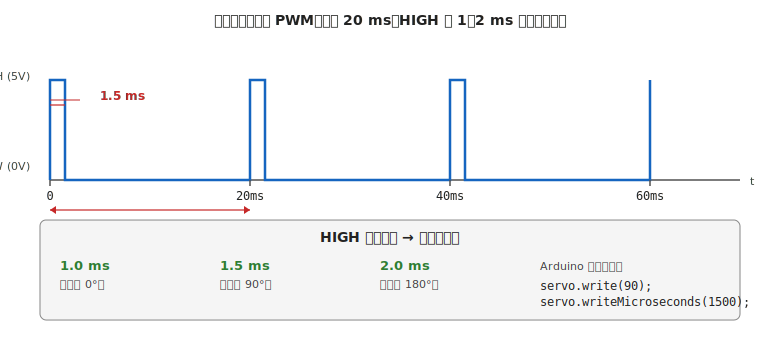

# 第 15 章　サーボモータ

DC モータ（[第 13 章](13-dc-motor.md)）が「速度を指令する」モータだったのに対し、**サーボモータは「角度を指令する」モータ** です。ホビーロボットのアーム、ロボット脚、カメラパン／チルト、グリッパ（挟む手）などに多用されます。

**代表ボード：Arduino Uno R3**

!!! warning "この章で壊しやすいもの"
    - **マイコン本体**（USB 給電のままサーボを動かしてブラウンアウト → 頻発）
    - **サーボモータ**（無理な角度指令で内部ギアが焼損）
    - **電源**（複数サーボ同時駆動で突入電流オーバー、電池膨張）
    - **サーボホーン**（オーバートルクで内部スプラインがなめる）

## この章のゴール

- ホビーサーボの **PWM 信号仕様**（20ms 周期、1〜2ms パルス幅）を理解する
- Arduino `Servo` ライブラリで角度指令ができる
- **電源容量** の見積もりと、複数サーボでのブラウンアウト対策を実装できる
- **ストール**（= サーボが目標角度に到達できず、モータが回らない状態で最大電流が流れ続ける過負荷状態）時の発熱と焼損リスクを避ける

---

## 1. 動機：角度を直接指令したい

DC モータで特定の角度に止めるには、**エンコーダ + PID 制御** のフィードバックループが必要で、ソフトウェアが複雑になります。サーボモータは **この制御回路を内蔵した「角度指令式モータ」** です。パルス幅を送るだけで目標角度に動いて止まります。

- ホビーサーボ（SG90、MG996R 等）：可動範囲 0〜180°、内部にポテンショメータと制御基板
- 産業用サーボ：可動範囲 360° 以上、高精度、高価

本書で扱うのは **ホビーサーボ** です。

---

## 2. ホビーサーボの PWM 仕様



- **周期 20 ms（50 Hz）** 固定
- **HIGH パルス幅 1〜2 ms** が角度に対応
    - 1.0 ms → 0°（左端）
    - 1.5 ms → 90°（中央）
    - 2.0 ms → 180°（右端）
- LOW 時間は 18〜19 ms（パルスの合間）

これは [第 14 章](14-pwm.md) で扱った一般的な PWM とは別物で、**パルス位置変調（PPM）** に近い制御です。Arduino の `analogWrite` では扱えず、専用ライブラリ（`Servo`）を使います。

---

## 3. 配線とコード

### 3.1 ホビーサーボの 3 線

| 色 | 意味 |
|---|---|
| 赤 | V_CC（モータ電源、4.8〜6 V）|
| 茶 / 黒 | GND |
| オレンジ / 黄 / 白 | 信号（PWM）|

### 3.2 `Servo` ライブラリの基本

```cpp
#include <Servo.h>

Servo myServo;

const int SERVO_PIN = 9;   // Timer1 を使う D9 推奨

void setup() {
  myServo.attach(SERVO_PIN);   // ピンを指定
  Serial.begin(9600);
}

void loop() {
  myServo.write(0);         // 0°（左端）
  delay(1000);
  myServo.write(90);        // 90°（中央）
  delay(1000);
  myServo.write(180);       // 180°（右端）
  delay(1000);

  // より細かい制御：マイクロ秒単位でパルス幅を指定
  myServo.writeMicroseconds(1500);   // 中央（1.5 ms）
  delay(1000);
}
```

!!! tip "Servo ライブラリは Timer1 を使う"
    Arduino Uno の `Servo` ライブラリは Timer1 を占有するため、**D9, D10 の analogWrite（PWM）が使えなくなります**。モータドライバを D9/D10 に繋いでいる場合は、D3 や D11（Timer2）に移すか、別のボードを検討します。

### 3.3 機械的な接続

- サーボの回転軸に「サーボホーン」（付属のプラスチック腕）を取り付ける
- ホーンの取り付けねじ（M2 など、型番で違う）を使う
- **サーボホーンを取り付ける向き** は、0°／90°／180° のどこを「機械的な中央」にするかで決まる
    - ホーン取り付け手順：①サーボをマイコンに接続して電源を入れ、②`servo.write(90)` をスケッチから実行してサーボが「ジジッ」と動いて静止するのを確認、③電源を入れたまま（またはサーボは指令を保持するので、電源を切っても手で動かさなければ位置は保たれる）、サーボホーンを取り付け、④ホーン固定ねじを締める。この手順で、機械的な中央（ホーンが真横を向く位置）が 90° の指令に一致する

---

## 4. 素朴な（NG）設計：USB 給電で複数サーボを駆動

### NG 例

Arduino Uno の 5V ピンからサーボの VCC を取り、USB 給電で動かす。

```
USB 5V → Arduino 5V ピン → サーボ 赤線
Arduino GND → サーボ 黒線
D9 → サーボ 信号線
```

これはサーボ 1 個なら動くこともありますが、**複数サーボでは確実にブラウンアウト** します。

### 何が起きるか

- サーボ 1 個の定常電流：50〜100 mA
- サーボ 1 個のストール電流：500 mA 〜 1 A（動作開始時、負荷トルクが大きいとき）
- Arduino Uno の USB 給電上限：500 mA（USB 2.0）
- サーボ 2〜3 個を同時に動かすと、**電流要求が USB 上限を超え** → VCC 低下 → Arduino がブラウンアウトリセット（[第 4 章 §7](../getting-started/04-power.md)）

---

## 5. 正しい設計：外部電源 + V 分離 / GND 共通

### 5.1 電源を分ける

- **Arduino は USB 給電（ロジック側）**
- **サーボは外部電源**（単 3 × 4 本 = 6V、または 5V レギュレータ経由の AC アダプタ）
- **両電源の GND は共通に**（[第 4 章 §5](../getting-started/04-power.md)）

これは [第 13 章](13-dc-motor.md) の DC モータと同じ設計パターンです。

### 5.2 配線（サーボ 2 個の場合）

```
電池 4.8〜6V（単3 × 4本） ─┬─ サーボ1 赤
                          └─ サーボ2 赤

電池 GND ─┬─ サーボ1 黒
          ├─ サーボ2 黒
          └─ Arduino GND  ← 1 点で共通化（スター接続）

Arduino D9 → サーボ1 信号
Arduino D10 → サーボ2 信号
```

### 5.3 デカップリングコンデンサ

サーボ電源ラインに **100〜470 μF 電解コンデンサ** を入れると、突入電流による電圧低下が緩和されます。サーボ 1 個あたり 100 μF が目安。

```
電池 + ─┬─ サーボ 赤
        └─ [100 μF 電解 C] → GND
```

### 5.4 複数サーボの起動タイミングをずらす

全サーボが同時に動き始めると、**ストール電流の重ね合わせ** で電源が足りなくなります。対策:

```cpp
#include <Servo.h>

Servo servos[4];
const int PINS[] = {9, 10, 11, 6};

void setup() {
  for (int i = 0; i < 4; i++) {
    servos[i].attach(PINS[i]);
    servos[i].write(90);  // 中央位置で開始
    delay(100);           // 起動タイミングをずらす
  }
}

void loop() {
  // 同時に動かしたい場合も、可能なら時間差を入れる
  for (int angle = 0; angle <= 180; angle += 10) {
    for (int i = 0; i < 4; i++) {
      servos[i].write(angle);
      delay(5);   // わずかな時間差
    }
    delay(100);
  }
}
```

---

## 6. ストール電流と発熱、オーバートルク

### 6.1 ストール状態

サーボが目標角度に到達できない状態（機械的干渉、過負荷、可動範囲外の指令）を **ストール** と呼びます。このとき:

- 常時最大電流が流れる（〜1 A / サーボ）
- サーボ内部のモータコイルが発熱
- 数秒〜数十秒で内部ギア or 制御基板が焼損

### 6.2 対策

- **可動範囲外の指令を送らない**（`write(200)` などは送らない）
- **サーボホーンが物理的に届かない位置を避ける**
- **壁やフレームに当たらないように機械設計**（[第 28 章](../topics-mechanical/28-motor-mount.md)）
- 長時間同じ位置を保持するなら、**トルクが足りているか** データシートで確認

### 6.3 サーボの選定表

本書で出会うホビーサーボ:

| 型番 | トルク | 電流（ストール）| 重量 | 用途 |
|---|---|---|---|---|
| **SG90**（9g）| 1.8 kg·cm | 500 mA | 9 g | 小型、軽負荷、最安 |
| **MG90S**（金属ギア）| 1.8 kg·cm | 500 mA | 13 g | SG90 の金属ギア版、耐久性高 |
| **MG996R** | 10 kg·cm | 2.5 A | 55 g | 中型ロボット、アーム |
| **MG995** | 9.4 kg·cm | 2 A | 55 g | MG996R の兄弟機 |

---

## 7. 動作確認チェックリスト

### 7.1 電源投入前

- [ ] [第 7 章](../workflow-electrical/07-pre-test-check.md) の全項目通過
- [ ] **サーボ用外部電源** が単独の電池 or レギュレータ経由で確保されている
- [ ] 両電源の **GND 共通** ができている（導通モードでブザー）
- [ ] サーボ信号線が PWM 対応ピン（Uno なら Servo が使える D3/D5/D6/D9/D10/D11 など）
- [ ] 3 線の色（赤＝VCC、黒＝GND、オレンジ＝信号）が正しい

### 7.2 電源投入後

- [ ] サーボが **「ジジ…」と短い唸り声** を出して、指令角度に到達する
- [ ] 指令範囲（0〜180°）で **機械的干渉がない**
- [ ] ストール状態に入っていない（唸り続けていない）
- [ ] サーボ本体が **触って熱くない**（60℃ 超なら即電源 OFF）
- [ ] マイコンがブラウンアウトしていない（[第 8 章 §7](../workflow-electrical/08-test-check.md) のシリアル監視）

---

## 8. よくあるトラブル FAQ

??? question "サーボが動かない・唸るだけ"
    - **電源容量不足**：USB 給電ではなく外部電源に
    - **信号線の接続ミス**：PWM ピンに繋がっているか
    - **ストール状態**：可動範囲外の指令、機械的干渉を確認

??? question "サーボが振動し続ける（ブブブ…）"
    - **電源の容量不足**：VCC が下がって内部制御が不安定
    - **ノイズ**：信号線とモータ線を離す、ケーブルを短く
    - **サーボ個体の故障**：別個体で確認

??? question "マイコンがサーボを動かすと再起動する"
    ブラウンアウトの典型。
    - **電源分離**（§5.1）
    - **デカップリング C 追加**（§5.3）
    - それでもダメなら、AC アダプタのほうに切り替え

??? question "狙った角度と微妙にずれる"
    - **`writeMicroseconds` で微調整**：`write(90)` の代わりに `writeMicroseconds(1500)` 等
    - サーボ個体差（±数度は普通）
    - 機械的なホーンの取り付け位置（§3.3）

??? question "起動時にサーボが急に動く"
    電源投入順とサーボの起動特性による。
    - `attach()` の直前に `write(初期角度)` を呼んでおく
    - 電源投入前にサーボを正しい位置に手で戻しておく（電源が入ると動くのでいずれにせよ危険）
    - **起動シーケンスを緩やかに**（徐々に目標角度に移動）

??? question "Servo ライブラリを使うと D9/D10 の analogWrite が効かない"
    Timer1 占有のため仕様。
    - D3, D5, D6, D11 の PWM は使える
    - モータドライバをそちらに移す
    - または **PCA9685（I2C PWM ドライバ）** で別系統を作る

---

## 9. 次章への橋渡し

LED、スイッチ、トランジスタ／MOSFET、DC モータ、PWM、サーボとアクチュエータ系が一通り揃いました。次はロボットの「目と耳」となる **センサ** の扱い方を扱います。

次の [第 16 章「センサ入門」](16-sensors.md) では、アナログ入力、I2C、SPI の 3 つの信号規格を比較し、**5V と 3.3V の混在時のレベル変換** という頻出トラブルを中心に扱います。サーボ駆動と並んで、5V/3.3V 混在事故が最も起きやすい領域です。
