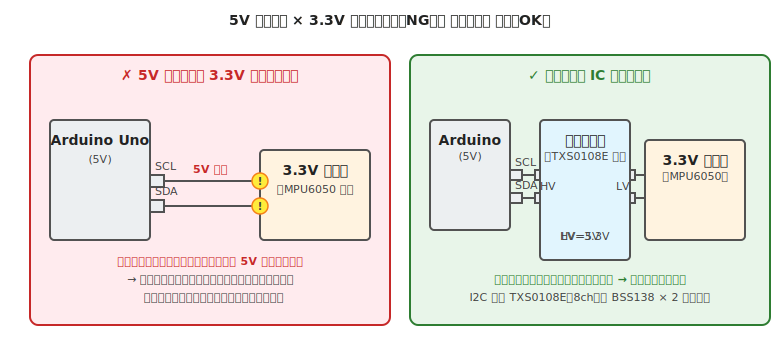

# 第 16 章　センサ入門

ロボットが外界を「知る」ための入り口、**センサ** の使い方を扱います。本章が 1 章では収まり切らないほど多様な分野ですが、**4 つの信号規格（アナログ、デジタル 0/1、I2C、SPI）の見分け方** と、本書の頻出トラブルの核である **5V / 3.3V 混在** を中心に押さえます。

**代表ボード：Arduino Uno R3**

!!! warning "この章で壊しやすいもの"
    - **3.3V センサ**（5V ロジックに直結して即死、煙が出ないので後から気付く）
    - **I2C バス**（レベル変換誤設計で通信が壊れる、プルアップ値ミス）
    - **マイコンのアナログ入力**（ADC のリファレンス電圧を超える電圧の印加）

## この章のゴール

- センサの **出力形式**（アナログ／デジタル 0/1／I2C／SPI／UART）を見分けられる
- Arduino の **アナログ入力** の使い方と、AREF ピンの役割を理解する
- **I2C プルアップ抵抗** の必要性と値の選び方
- **5V / 3.3V 混在時の対処**（レベル変換 IC、抵抗分圧）を実装できる

---

## 1. 動機：センサは「種類が多すぎる」

ロボット用センサを挙げるだけでも:

- **距離**：超音波（HC-SR04）、赤外線反射（TCRT5000）、ToF（VL53L0X）
- **向き・姿勢**：IMU（MPU6050）、磁気コンパス（HMC5883L）
- **光**：CdS セル、フォトトランジスタ、RGB（TCS34725）
- **音**：マイク（MAX9814）、音量しきい値
- **温度・湿度**：DHT11、BME280、LM35
- **圧力・力**：フォースレジスタ、ロードセル（HX711 経由）
- **スイッチ・接触**：リミットスイッチ、静電タッチ

これら全部を 1 章で扱うのは無理なので、**どう繋ぐかの 4 分類** を押さえて、個別センサは AI エージェントと公式ライブラリに任せる戦略をとります。

---

## 2. センサ出力の 4 分類

| 分類 | 出力の形 | 例 | 読み方 |
|---|---|---|---|
| **アナログ電圧** | 0〜Vcc の連続電圧 | CdS、TCRT5000、ポテンショメータ | `analogRead()` |
| **デジタル 0/1** | HIGH or LOW | リミットスイッチ、タクトスイッチ | `digitalRead()` |
| **I2C** | SDA と SCL の 2 線で多数のセンサと通信 | MPU6050、BME280、VL53L0X | `Wire.requestFrom()` 等 |
| **SPI** | 4 本線（MOSI/MISO/SCLK/CS）で高速通信 | 一部の IMU、ディスプレイ | `SPI.transfer()` |

センサを選んだら、**データシートの Pin Configuration** を見て「何のピンが出ているか」を確認し、上の分類にあてはめます。

---

## 3. アナログ入力

Arduino Uno は **A0〜A5 の 6 ピン** でアナログ電圧を読めます。内部に 10 bit の ADC（Analog-to-Digital Converter）があり、0〜5 V を 0〜1023 の整数に変換します。

### 3.1 基本コード

```cpp
// 配線：A0 → CdS セルまたはポテンショメータの中点
// （分圧回路：VCC → 抵抗 → A0 → センサ → GND、など）

void setup() {
  Serial.begin(9600);
}

void loop() {
  int raw = analogRead(A0);        // 0〜1023
  float volts = raw * (5.0 / 1023.0);
  Serial.print(raw);
  Serial.print(" → ");
  Serial.print(volts, 2);
  Serial.println(" V");
  delay(200);
}
```

### 3.2 AREF ピンの役割

ADC の「5 V」を別の電圧に変えたいとき、**AREF ピンに外部基準電圧** を印加し、`analogReference(EXTERNAL)` を呼びます。例えば精密な温度センサ（LM35、10 mV/℃）で 50℃ までしか測らないなら、AREF を 0.5V に設定して分解能を 10 倍に上げる、といった使い方です。

!!! warning "AREF より大きい電圧をアナログ入力に入れない"
    AREF を 3.3V に設定した状態で、A0 に 5V を入れると **ADC が破壊** されます。AREF を変更したら、入力電圧も AREF 以下に制限する回路（分圧など）を入れてください。

### 3.3 ノイズ対策

アナログ入力は電磁ノイズの影響を受けやすいです。

- 配線を **短く**、シールド付きケーブルを使う
- 入力と GND 間に **0.01〜0.1 μF のセラミックコンデンサ** を入れる
- ソフト側で **移動平均** をとる（例：10 回の読み値の平均）

---

## 4. デジタル 0/1 入力

スイッチ（[第 11 章](11-switch.md)）と同じ扱いです。ON/OFF を返すセンサ:

- リミットスイッチ
- 傾斜スイッチ（振るとパチッと切り替わる球入り）
- 一部の PIR（人感）センサの出力

`digitalRead()` で読みます。プルアップ／プルダウンが必要な点も同じ（[第 11 章 §4](11-switch.md)）。

---

## 5. I2C 通信（最頻出）

**I2C**（Inter-Integrated Circuit）は、2 本の線（SDA、SCL）で **多数のデバイスと通信できる** 規格。IMU、温湿度、ToF、OLED ディスプレイなど、ホビーセンサの大半が I2C 対応です。

### 5.1 基本接続

```
Arduino SDA (A4 or 専用ピン) ── [センサ SDA]
Arduino SCL (A5 or 専用ピン) ── [センサ SCL]
Arduino 5V ── [センサ VCC]
Arduino GND ── [センサ GND]
```

### 5.2 プルアップ抵抗

I2C は **オープンドレイン** 方式を採用しています。これは「各デバイスが信号線を **GND に引っ張ることしかできず、HIGH に押し上げる回路を持たない**」という仕組みで、第 2 章 §4 で見た GPIO の PMOS/NMOS プッシュプル構造とは違って、**NMOS 側（LOW に引く側）しかない** 出力段です。このため HIGH は **プルアップ抵抗** で VCC に吊り上げる必要があります。メリットは、複数デバイスが 1 本の信号線を共有しても、どれかが LOW に引けば勝つので衝突が起きにくいこと。

- **典型値**：4.7 kΩ 〜 10 kΩ
- **位置**：SDA、SCL それぞれから VCC へ

多くのセンサブレークアウトモジュールには **プルアップ抵抗が内蔵** されています。モジュールの回路図を確認して、**内蔵があれば外付け不要**。**複数モジュールを並列に繋ぐ場合**、それぞれ内蔵プルアップを持つとバス全体の合成抵抗が小さくなりすぎ（例：4.7 kΩ × 3 並列 ≒ 1.57 kΩ）、信号の立ち上がりが鈍くなって通信が不安定になることがあります。対処は「**各モジュールのプルアップ抵抗を外すか（基板上のジャンパやはんだジャンパで切り離す）、一つのモジュールのみに残す**」のどちらか。デバッグ章の対処カタログは [第 9 章 §8](../workflow-electrical/09-debugging.md) の「センサ値がおかしい」も参照。

### 5.3 アドレススキャン

I2C デバイスにはそれぞれアドレス（0x00 〜 0x7F）があります。未知のモジュールを繋ぐときは、**アドレススキャナ** で認識を確認します。

```cpp
// I2C アドレススキャナ（Arduino IDE サンプルより）
#include <Wire.h>

void setup() {
  Wire.begin();
  Serial.begin(9600);
  while (!Serial);
  Serial.println("I2C Scanner");
}

void loop() {
  int nDevices = 0;
  for (byte address = 1; address < 127; address++) {
    Wire.beginTransmission(address);
    byte error = Wire.endTransmission();
    if (error == 0) {
      Serial.print("Found: 0x");
      if (address < 16) Serial.print("0");
      Serial.println(address, HEX);
      nDevices++;
    }
  }
  if (nDevices == 0) Serial.println("No I2C devices found");
  delay(5000);
}
```

### 5.4 クロック速度

- **標準モード**：100 kHz
- **ファストモード**：400 kHz
- 多くのセンサは両対応、`Wire.setClock(400000)` で高速化

---

## 6. SPI 通信

**SPI**（Serial Peripheral Interface）は、I2C より高速で、4 本線（MOSI、MISO、SCLK、CS）で通信する規格。使用例は I2C より少ないですが、高速・高精度が必要な場面（SD カード、ディスプレイ、一部の IMU）で登場します。

本書では深追いせず、必要になったら AI エージェントに「このセンサの SPI サンプルコード」と聞く運用で十分です。

---

## 7. 5V / 3.3V 混在時のレベル変換

ロボットで最も頻発する事故のひとつが、**5V マイコンに 3.3V センサを直結してセンサを壊す** です。



### 7.1 なぜ壊れるか

3.3V 動作センサの **絶対最大定格入力電圧** は、**VCC + 0.3 V（約 3.6V）** が典型です。ここに 5V のロジック信号を入れると:

- センサ内部の保護ダイオードに大電流が流れ、**保護ダイオードが焼損**
- I/O ピンそのものが破壊
- 最悪、センサ IC 全体が死ぬ

**煙が出ないことが多い** ため、「買ったばかりのセンサが反応しない」という症状で後から発覚します。

### 7.2 レベル変換の 3 つの選択肢

#### (a) 双方向レベル変換 IC（おすすめ）

- **TXS0108E**：8 チャンネル双方向、I2C 対応、Arduino-3.3V センサ接続に定番
- **BSS138（N-ch MOSFET）**：1 チャンネルの基本単位、SparkFun 方式で自作
- **TXB0104**：4 チャンネル、似た用途

これらを SDA/SCL の間に挟むと、Arduino 側は 5V 動作、センサ側は 3.3V 動作で安全に通信できます。

#### (b) 抵抗分圧（5V → 3.3V 片方向のみ）

送信（マイコンからセンサへ）だけなら、**抵抗分圧** でも落とせます:

```
Arduino TX（5V） ── 1 kΩ ── センサ RX
                              │
                              2 kΩ
                              │
                             GND
```

ただし:
- **受信方向（センサ → マイコン）は変換できない**（3.3V HIGH が Arduino の V_IH 3.0V ギリギリ）
- I2C のような双方向通信には **使えない**
- UART の片方向シリアル（TX だけ）には使える

#### (c) 3.3V 対応マイコンに変える

ESP32、Raspberry Pi Pico、Raspberry Pi 4 はすべて 3.3V 動作。最初から 3.3V 動作のマイコンを使えば、3.3V センサは直結できます。「5V マイコンで 3.3V センサを使う」のが難しい設計選択であることに気付いたら、ボード選定から見直すのも選択肢です。

### 7.3 Arduino Uno で 3.3V センサを使うかの判断

- **1〜2 個のセンサで、I2C のみ** → レベル変換 IC 1 個で対応
- **多数の 3.3V センサ、高速通信** → 3.3V マイコン（Pico、ESP32）に移行するほうが早い

---

## 8. 動作確認チェックリスト

### 8.1 電源投入前

- [ ] [第 7 章](../workflow-electrical/07-pre-test-check.md) の全項目通過
- [ ] センサの **VCC 電圧**（3.3V / 5V）がデータシート指定通り
- [ ] 5V と 3.3V の混在があれば **レベル変換が入っている**（§7 (C) チェック）
- [ ] I2C の **プルアップ抵抗** がある（モジュール内蔵 or 外付け）
- [ ] アナログ入力に **AREF を超える電圧が入らない**

### 8.2 電源投入後

- [ ] I2C なら **アドレススキャナ** でセンサが認識される
- [ ] センサの VCC ピンに規定電圧が来ている（実測）
- [ ] センサ本体が **熱くない**（熱いなら破壊の初期症状）
- [ ] センサの読み値が **想定範囲**（光センサなら明暗で変化するか）

---

## 9. よくあるトラブル FAQ

??? question "I2C デバイスが認識されない"
    - **プルアップ抵抗がない**：4.7〜10 kΩ を SDA/SCL に追加
    - **アドレス違い**：スキャナで実際のアドレスを確認
    - **配線逆**：SDA と SCL を入れ替えていないか
    - **電源不足**：VCC が所定電圧に来ているか実測

??? question "3.3V センサを直結したが反応がない（過去に 5V 入れた）"
    **センサ破壊の可能性大**。
    - 別個体で確認
    - 今後は必ずレベル変換経由に

??? question "アナログ入力が常に 0 または 1023 を返す"
    - **0 固定**：GND に直結している（配線確認）、または ADC リファレンスを超えた入力で壊れた可能性
    - **1023 固定**：入力が AREF を超えている、または VCC に直結

??? question "センサ値が激しくノイズで揺れる"
    - **配線が長い** → 短くする、ツイスト配線
    - **デカップリング C がない** → センサ VCC-GND 間に 0.1 μF を追加
    - **移動平均／メディアンフィルタ** をソフトで

??? question "I2C の複数センサを繋いだら動かない"
    - **アドレス衝突**：2 つのセンサが同じアドレスを持っている → アドレスピンで変更
    - **プルアップが強すぎる**：各モジュール内蔵が並列で合成抵抗が 1 kΩ 以下になっていないか
    - **バス容量オーバー**：長距離配線で波形が鈍っている → 短く

??? question "5V マイコンで 3.3V 動作のセンサが多数ある"
    **ボード選定から見直し**。
    - ESP32-S3-DevKitC-1 や Raspberry Pi Pico（3.3V 動作）に切り替える
    - 本書の作例は Arduino Uno R3 ですが、「センサが多い」要件なら 3.3V マイコンを選ぶほうが設計が楽

---

## 10. 次章への橋渡し

電気系トピックの最終章は、モータの中でも高精度な位置決めができる **ステッピングモータ** です。

次の [第 17 章「（任意）ステッピングモータ」](17-stepper.md) では、A4988 / DRV8825 などの専用ドライバを使った制御、**電流制限（V_REF 調整）** という特有の設定、STEP / DIR 信号の基本を扱います。「位置決めが必要だが、サーボより高精度が欲しい」場面で使う技術です。
