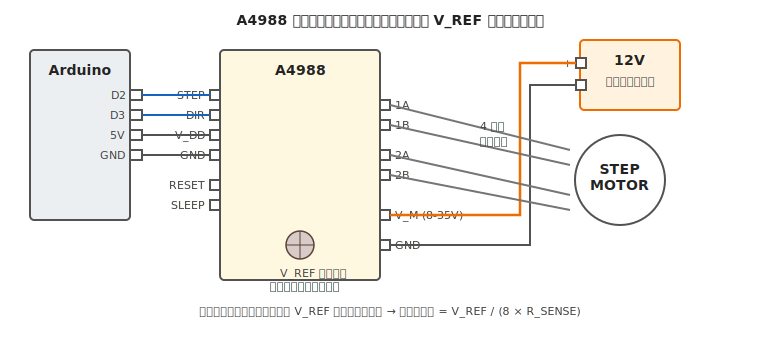

# 第 17 章　（任意）ステッピングモータ

Part IV「電気系トピック」の最終章。**ステッピングモータ** は、DC モータとサーボの中間のような存在で、**フィードバックなしで高精度な位置決め** ができるモータです。3D プリンタ、CNC、カメラ回転台などで活躍します。

本章は v1 では任意扱いです（[CONCEPT.md §14 未決事項](../CONCEPT.md)）。ライントレースカー程度では使いませんが、**次のステップに進みたい読者向け** の知識として置いておきます。

**代表ボード：Arduino Uno R3**

!!! warning "この章で壊しやすいもの"
    - **ステッピングモータドライバ**（電流制限設定ミスで過熱・焼損）
    - **モータ**（電流過多でコイル焼損、長時間のホールド電流で発熱）
    - **電源**（ユニポーラ／バイポーラ駆動の違いによる電流設計ミス）
    - **自分の指**（高速回転中にロボットアーム等が想定外の動きをして挟む）

## この章のゴール

- バイポーラ／ユニポーラの違いと **巻線構造** を理解する
- **A4988 / DRV8825** を選べる、違いを説明できる
- ドライバの **V_REF**（Reference Voltage ＝ 基準電圧。ドライバがモータに流す最大電流を決めるために使う、ドライバ基板上の可変抵抗の調整電圧）から **電流制限** を正しく設定できる
- STEP / DIR 信号で指定ステップ数だけ回せる

---

## 1. 動機：サーボと DC モータの間を埋めたい

| モータ種類 | 位置精度 | フィードバック必要 | 用途 |
|---|---|---|---|
| DC モータ | 低（エンコーダ併用で改善）| 必要 | 走行 |
| サーボ | 中（±2° 程度）| 内蔵済み | アーム、ステアリング |
| **ステッピング** | **高（0.1° 単位）**| **不要**（オープンループで使える）| 3D プリンタ、CNC、精密位置決め |

ステッピングモータは、**1 ステップごとに決まった角度だけ回転** する構造なので、「ステップ数を数えれば位置が分かる」という特性があります。ただし **ミスステップ（脱調）** が起きると位置がずれるので、高速・高負荷では限界があります。

---

## 2. ステッピングモータの構造

ローターに永久磁石、ステーターに複数のコイル。コイルに順番に電流を流すことで、ローターが決まった角度ずつ回ります。

### 2.1 ステップ角

- **1.8°/ステップ**（200 step/回転）：最も一般的、NEMA17 サイズの定番
- **0.9°/ステップ**（400 step/回転）：高精度、やや高価
- **7.5°/ステップ**（48 step/回転）：小型、ホビー用

### 2.2 バイポーラ vs ユニポーラ

- **バイポーラ**：2 相、**4 線**、電流を両方向に流す、**効率が高く主流**
- **ユニポーラ**：2 相、**5 線 or 6 線**、電流を片方向のみ、制御が簡単だが効率低

**本書はバイポーラ前提**。市販のほとんどのホビー用ステッピング（NEMA17、28BYJ-48 のバイポーラ改造版等）はバイポーラです。

---

## 3. 素朴な（NG）設計：GPIO 直接駆動

Arduino の GPIO から直接モータコイルに繋ぐ、は完全な NG:

- コイル電流は数百 mA 〜数 A、GPIO の 40 mA を遥かに超える
- バイポーラ駆動には電流方向の切替が必要、GPIO では無理
- 逆起電力対策も必要

**必ず専用ドライバ IC（A4988、DRV8825 等）を使う**。

---

## 4. 正しい設計：A4988 / DRV8825 ドライバ

### 4.1 代表ドライバの比較

| ドライバ | 連続電流 | モータ電圧 | マイクロステップ | 特徴 |
|---|---|---|---|---|
| **A4988** | 1 A（放熱なし）〜 2 A（放熱あり）| 8〜35 V | 1, 1/2, 1/4, 1/8, 1/16 | 最も流通、ホビー定番 |
| **DRV8825** | 1.5 A（放熱なし）〜 2.5 A | 8.2〜45 V | 1, 1/2, 1/4, 1/8, 1/16, 1/32 | A4988 より電流・マイクロステップ多い |
| **TMC2208 / TMC2209** | 1.4 A | 5.5〜36 V | 最大 1/256 | **静音、本格機種向け** |

**本書のデフォルトは A4988**。安価で情報が多く、学習用途に最適。

### 4.2 配線



- **STEP**：Arduino の GPIO（PWM 不要、`digitalWrite` で 1 ステップごとにパルスを送る）
- **DIR**：Arduino の GPIO（方向指定）
- **V_DD** / **GND**：Arduino の 5V / GND（ロジック電源）
- **V_M** / **GND**：**モータ電源**（8〜35V、A4988 の場合）
- **1A / 1B / 2A / 2B**：ステッピングモータの 4 線

!!! warning "ステッピングのモータ電源は高い"
    DC モータが 6〜12V なのに対し、ステッピングは **12〜24V** を使うのが普通です。これは **電流の立ち上がりを速くする** ため（コイルのインダクタンス L に対して dI/dt = V/L を大きくしたい）。電源の選定と、ショート時の被害範囲（[第 1 章 §6.5](../getting-started/01-introduction.md) の電源容量表）に注意。

### 4.3 最小スケッチ

```cpp
// 配線：
//   D2 → A4988 STEP
//   D3 → A4988 DIR
//   Arduino 5V → A4988 V_DD
//   Arduino GND → A4988 GND
//   モータ電源（12V） → A4988 V_M
//   モータ電源 GND → A4988 GND（共通）
//   A4988 1A,1B,2A,2B → ステッピングモータ 4 線
//   A4988 RESET と SLEEP をショート（繋いで両方 HIGH）

const int STEP_PIN = 2;
const int DIR_PIN = 3;
const int STEPS_PER_REV = 200;  // 1.8°/step

void setup() {
  pinMode(STEP_PIN, OUTPUT);
  pinMode(DIR_PIN, OUTPUT);
  digitalWrite(DIR_PIN, HIGH);   // 方向：正転
  Serial.begin(9600);
}

void loop() {
  // 1 回転分のステップ
  for (int i = 0; i < STEPS_PER_REV; i++) {
    digitalWrite(STEP_PIN, HIGH);
    delayMicroseconds(500);       // 500 us HIGH
    digitalWrite(STEP_PIN, LOW);
    delayMicroseconds(500);       // 500 us LOW → 1 step = 1 ms → 1000 step/s
  }
  Serial.println("1 rev done");
  delay(1000);

  // 逆転
  digitalWrite(DIR_PIN, LOW);
  for (int i = 0; i < STEPS_PER_REV; i++) {
    digitalWrite(STEP_PIN, HIGH);
    delayMicroseconds(500);
    digitalWrite(STEP_PIN, LOW);
    delayMicroseconds(500);
  }
  delay(1000);
  digitalWrite(DIR_PIN, HIGH);
}
```

上のスケッチで **1 秒間に 1000 ステップ = 5 回転** の速さで回ります。

---

## 5. 電流制限（V_REF）の設定

ステッピングドライバ使用で **最も重要、かつ最も間違えやすい** 設定が **電流制限** です。

### 5.1 なぜ電流制限が必要か

- モータコイルに流せる電流は **データシートの定格**（例：NEMA17 なら 1.5 A / コイル）
- ドライバはこれ以上の電流を流す能力を持っている
- **設定せずに使うと**、コイルが過電流で焼損、ドライバが過熱

### 5.2 V_REF 設定の手順

A4988 の場合、電流制限は **基板上の可変抵抗（ポット）** を調整して、V_REF ピンの電圧で決まります:

\[
I_{\text{max}} = \frac{V_{REF}}{8 \times R_{SENSE}}
\]

R_SENSE は基板固有（Pololu 製 A4988 なら 0.05 Ω、互換品は 0.1〜0.2 Ω）。

### 5.3 実際の調整手順

1. **モータ電源を接続しない**、ロジック電源（Arduino の 5V）のみで A4988 に給電
2. テスタの DCV モードで **V_REF ピンと GND** 間を測定
3. 可変抵抗（ポット）をマイナスドライバで **ゆっくり回して** V_REF を目標値に設定
    - NEMA17（定格 1.5 A）、R_SENSE 0.05 Ω なら V_REF = 1.5 × 8 × 0.05 = **0.6 V**
    - **マージンを取って定格の 70〜80%** で使う（= V_REF 0.4〜0.5 V）。理由は、**ドライバの発熱を抑える**（定格ギリギリで使うと IC 温度が上がり過熱保護が働いて動作が断続的になる）、**モータコイルの寿命を延ばす**（過電流は絶縁被膜の劣化を早める）の 2 点
4. モータ電源を繋ぐ前に、**目標 V_REF に設定できている** ことを再確認
5. モータ接続、電源投入、動作確認

!!! warning "V_REF 測定中にモータを繋がない"
    モータ電源を繋いだ状態で V_REF 調整すると、**ドライバが急に大電流を流してモータかドライバが焼ける** ことがあります。必ずロジック電源のみで V_REF を設定してから、モータ電源を繋ぎます。

### 5.4 発熱とホールド電流

ステッピングは **止めている状態でも電流を流し続ける**（ホールド電流）ので、DC モータより発熱が大きいです。

- ドライバ IC の **ヒートシンク必須**（両面テープ付きアルミフィンを貼る）
- モータ本体も **触って 60℃ 以上** は注意、**80℃ 以上** は危険域
- 長時間ホールドする必要がない場合、**SLEEP ピンで休止** すると発熱が減る

---

## 6. マイクロステップ

A4988 / DRV8825 は **1 ステップを複数に分割** して滑らかに回せます。

- **フルステップ**（デフォルト）：200 step/回転、粗い
- **1/2 ステップ**：400 step/回転
- **1/16 ステップ**（A4988 最大）：3200 step/回転、滑らか

マイクロステップを選ぶには、**MS1 / MS2 / MS3 ピン** の HIGH/LOW を組み合わせます（データシートの真理値表を参照）。

- **用途**：低速で滑らか動作が必要（精密機構、静粛性が必要な場面）
- **副作用**：トルクが落ちる（フルステップ比 70〜100%）、ステップ周波数が上がるのでマイコンの処理が忙しくなる

---

## 7. 動作確認チェックリスト

### 7.1 電源投入前

- [ ] [第 7 章](../workflow-electrical/07-pre-test-check.md) 全項目通過
- [ ] **V_REF を設定済み**（§5.3）、モータ電源を繋ぐ前に必ず確認
- [ ] **RESET / SLEEP ピン** が HIGH（動作可能状態）
- [ ] **ヒートシンク** が A4988 に貼り付けられている
- [ ] モータ電源が **A4988 の V_M 定格内**（8〜35V、A4988）

### 7.2 電源投入後

- [ ] STEP パルスでモータが **決まった角度ずつ回る**（DIR が正しければ正方向）
- [ ] ドライバ IC の温度（手かざし、[第 8 章 §5](../workflow-electrical/08-test-check.md)）
- [ ] モータ本体の温度（10 分連続動作で確認）
- [ ] **異音**（キーキー、脱調時のカチカチ）がない
- [ ] 指定ステップ数分、正確に回転している（脱調していない）

---

## 8. よくあるトラブル FAQ

??? question "モータが回らない、ジーッと唸るだけ"
    - **V_REF が低すぎる**：電流不足で脱調、V_REF を上げる（ただし定格内で）
    - **配線順違い**：モータの 4 線を 1A-1B-2A-2B の順で繋いでいるか。**2 つのペア**（1A-1B と 2A-2B）の判別はテスタの導通モードで（ペアは導通する）
    - **STEP パルス周波数が高すぎる**：低速（1000 step/s 以下）から試す

??? question "ドライバ IC が熱すぎる・煙が出た"
    - **V_REF が高すぎる**：電流過多、即電源 OFF し再設定
    - **ヒートシンク不足**：追加 or ファンを向ける
    - **ドライバの定格超過**：より電流容量の大きいドライバ（TMC2209 等）に

??? question "特定のステップ数で位置がずれる（脱調）"
    - **速度が速すぎる**：加減速プロファイルを入れる（AccelStepper ライブラリ）
    - **トルク不足**：V_REF を上げる、マイクロステップを粗くする、モータサイズを上げる
    - **機械的な引っかかり**：[第 25 章](../workflow-mechanical/25-debugging.md) の機械デバッグへ

??? question "モータから「キーキー」音がする"
    ステッピングは本質的に振動しやすい。
    - **マイクロステップを細かく**（1/16 など）して滑らかに
    - 本気で静音化するなら **TMC2208 / TMC2209** に変更（3D プリンタで定番）

??? question "AccelStepper ライブラリを使いたい"
    加減速を自動処理してくれる人気ライブラリ。
    ```cpp
    #include <AccelStepper.h>
    AccelStepper stepper(AccelStepper::DRIVER, STEP_PIN, DIR_PIN);
    
    void setup() {
      stepper.setMaxSpeed(1000);       // steps/sec
      stepper.setAcceleration(500);    // steps/sec^2
      stepper.moveTo(2000);            // 2000 step 先へ
    }
    
    void loop() {
      stepper.run();  // 非ブロッキング、毎ループ呼ぶ
    }
    ```

---

## 9. Part IV のまとめ

電気系トピック 8 章はこれで完了です。

- **第 10 章** LED — 電流制限の基礎
- **第 11 章** スイッチ — 入力とプルアップ
- **第 12 章** トランジスタ／MOSFET — 大電流スイッチ
- **第 13 章** DC モータ — モータドライバ IC と電源分離
- **第 14 章** PWM — 速度制御の基礎
- **第 15 章** サーボモータ — 角度指令と電源容量
- **第 16 章** センサ入門 — アナログ／I2C／SPI とレベル変換
- **第 17 章** ステッピングモータ（本章）— 電流制限と高精度位置決め

これで電気系の主要部品が揃いました。これらを **Part V〜VII の機械系** と組み合わせ、**Part III のワークフロー** で動かして、最終的に [第 31 章 プロジェクト A](../projects/31-project-a-linetracer.md) のライントレースカーで統合します。

---

## 10. 次章への橋渡し

電気系が一通り揃ったら、**機械系の後半** に入ります。

次は Part V 機械の基礎から順に進むのが本書の想定順ですが、本書全体を通読する読者にとって、本章は **機械系の第 18 章「壊さないための機械基礎」への橋渡し** にあたります。電気系で身につけた「NG → データシート根拠 → 正解」の思考法が、機械系でも同じリズムで続くのを体験してもらうフェーズです。
