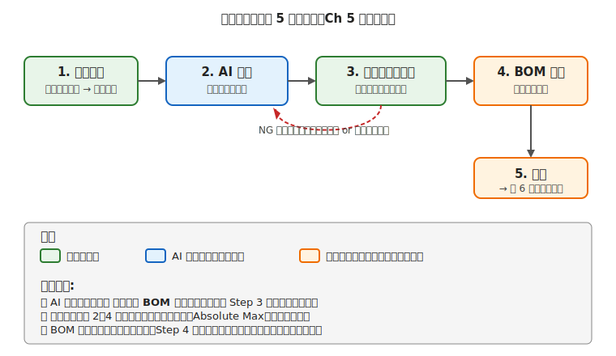

# 第 5 章　電気の設計フェーズ

Part III「電気のワークフロー」の最初の章です。ここからは、プロジェクトを動かす **タイムライン** に沿って、各フェーズで何をするかを扱います。本章は **設計フェーズ** — 「作りたいロボットの輪郭ができた」段階から、**買うべき部品のリスト（BOM）が確定するまで** の作業です。

AI エージェント全盛期には、この設計フェーズは **AI との協働が最も効く場所** でもあります。マイコンやモータの候補を並べさせる・仕様を比較させる、といった作業は AI が秒で片付けてくれます。ただし **AI が出したものをそのまま信じて発注するのは危険** です。その理由と、どこで人間が介入するかを本章で明確にします。

!!! warning "この章で失敗しやすいこと"
    - **要件が曖昧なまま部品選定に入る** → 組み始めてから「これじゃ足りない」となり買い直し
    - **AI の提案を検証せずに発注** → 入手困難な型番・仕様が足りない部品が届く
    - **電源容量を見積もらず始める** → 組み上げた瞬間にブラウンアウトループ
    - **BOM がないまま進める** → 「この抵抗、何に使うんだっけ？」状態、買い忘れ・重複購入
    - **「過剰スペック」で安心しようとする** → 予算オーバー、サイズ過大

---

## 1. 設計フェーズとは何か

設計フェーズは、**「物理的な実体を作り始める前に、紙の上（または画面の上）で決められるものは決めておく」** フェーズです。具体的な成果物は 1 つだけ — **BOM（Bill of Materials、部品表）** です。BOM が確定すれば、発注 → 入荷 → 組立と進めます。

### このフェーズでやる 5 ステップ



1. **要件定義** — 「こういうロボットを作りたい」を電気的な要件（電圧・電流・信号・通信）に翻訳する
2. **AI 相談** — 要件を AI エージェントに渡し、マイコン／モータ／電源／センサの候補を洗い出してもらう
3. **レビュー（人）** — AI の提案を、第 2〜4 章で身につけた知識で **データシートと突き合わせて検証する**
4. **BOM 作成** — 検証済みの部品を表にまとめる
5. **発注** — BOM をもとに注文する

この順番が重要です。Step 2 の前に Step 1 を飛ばすと、AI に与えた要件が曖昧で役に立たない候補が返ってきます。Step 4 の前に Step 3 を飛ばすと、使えない部品が届きます。

!!! info "AI が得意な部分と、人間が担う部分"
    上の図の **青いボックス（AI）は 1 つだけ**、緑のボックス（人間）が 2 つあることに注目してください。
    要件定義（Step 1）と **レビュー（Step 3）** は、AI には代替できません。
    Step 1 は「何を作りたいか」という主観を扱うため、Step 3 は「目の前の部品の絶対最大定格を超えていないか」という安全の一次判断なので、人間が責任を持つ必要があります。

---

## 2. 要件定義：「作りたいもの」を電気要件に翻訳する

ほとんどの初心者は「〇〇みたいなロボットを作りたい」という気持ちだけを持って AI に相談してしまい、AI からも「どういうロボットですか？」と聞き返されて答えに詰まります。**電気要件 4 項目** を自分で先に埋めておけば、AI との対話が劇的に短くなります。

### 電気要件の 4 分類

| 分類 | 内容 | 具体例 |
|---|---|---|
| **入力（センサ）** | 外界の何を知りたいか | 距離、明るさ、ラインの位置、温度、加速度、ボタン |
| **出力（アクチュエータ）** | 外界に何を作用させるか | DC モータで走行、サーボでアーム動作、LED で通知、画面表示 |
| **通信** | 他の機器と何をやり取りするか | なし（単独動作）／ Wi-Fi（クラウド連携）／ Bluetooth（スマホ操作）／ 有線 UART |
| **電源** | どう給電するか | USB ケーブル（屋内のみ）／ 乾電池（携帯）／ リポ（高出力）／ AC アダプタ（据え置き）|

この 4 項目を埋めれば、マイコン・モータドライバ・センサ・電源レギュレータの選定候補がほぼ自動的に絞られます。

### まずは 5 分で埋める要件メモ（空欄テンプレ）

次の空欄を埋めてから AI に相談すると、提案の精度が上がります。

- 作りたいもの：＿＿＿＿＿＿＿＿
- 入力（センサ）：＿＿＿＿＿＿＿＿
- 出力（アクチュエータ）：＿＿＿＿＿＿＿＿
- 通信：＿＿＿＿＿＿＿＿（なし / Wi-Fi / Bluetooth / 有線）
- 電源：＿＿＿＿＿＿＿＿（USB / 乾電池 / リポ / AC）
- 予算上限：＿＿＿＿＿＿＿＿円
- サイズ上限：＿＿＿＿＿＿＿＿
- 制作期間：＿＿＿＿＿＿＿＿
- 技術レベル：＿＿＿＿＿＿＿＿（はんだ経験あり/なし など）
- 購入先の希望：＿＿＿＿＿＿＿＿（国内通販優先 など）

この 10 行だけでも埋まっていれば、Step 2 の AI 相談で「質問の往復」を大幅に減らせます。

### 例：ライントレースカー（本書のプロジェクト A）の場合

- **入力**：床のライン（白黒）を検出する反射型フォトセンサ 2 個
- **出力**：左右の車輪を独立に回す DC モータ 2 個（モータドライバ経由）
- **通信**：単独動作でよい（有線・無線なし）
- **電源**：携帯できるようにしたいので、単 3 電池 × 4 本（6 V）で駆動、マイコン側は 5 V レギュレータで作る

この時点で「AI に渡す要件メモ」ができます。

### 優先順位と制約

要件を 4 項目に並べたら、**要るもの** と **あると嬉しいもの** を分けます。加えて:

- **予算の上限**（例：部品一式で 5,000 円以内）
- **サイズの目安**（例：手のひらに載る、A4 サイズ以内）
- **制作期間**（例：土日 2 日で組み上げたい）
- **自分の技術レベル**（例：はんだ付けは慣れていないのでブレッドボードで完結させたい）

これらは AI に明示的に渡す制約条件になります。渡さないと AI は「予算無制限・サイズ無制限・時間無制限」という前提で最上位機種を勧めてくることがあります。

---

## 3. AI エージェントへの相談の書き方

要件と制約が揃ったら AI（ChatGPT / Claude など）に相談します。この節では **プロンプトの書き方** を扱います。

### 悪いプロンプトと良いプロンプトの比較

=== "❌ 悪い例"
    ```
    ロボットを作りたいのでおすすめのマイコンを教えてください。
    ```
    
    **何が問題か**：要件・制約が何一つ書かれていないので、AI は「Arduino Uno がおすすめです」程度の無難な答えしか返せない。読者と AI の両方が時間を無駄にする。

=== "✅ 良い例"
    ```
    個人でライントレースカーを作りたいので、マイコン・モータドライバ・電源構成を提案してください。
    
    # 要件
    - 入力：反射型フォトセンサ 2 個で床のライン検出
    - 出力：DC モータ 2 個（FA-130 相当、電流は定常 200 mA、ストール 1 A）
    - 通信：なし（単独動作）
    - 電源：単 3 × 4 本（6 V）で携帯運用
    
    # 制約
    - 予算：部品一式で 5,000 円以内
    - サイズ：手のひらに乗る（A5 以下）
    - 期間：土日 2 日で組み上げたい
    - 技術レベル：はんだ付け未経験。ブレッドボードで完結したい
    - 国内通販（秋月・Switch Science・マルツ）で買える部品を優先
    
    # 欲しい出力
    - マイコン・モータドライバ・レギュレータの候補を 2〜3 案ずつ
    - 各案の長所・短所
    - Absolute Maximum Ratings が問題になりそうな項目があれば指摘
    - 概算の合計金額
    ```
    
    **何が違うか**：AI が具体的な推奨を出せる情報が全部揃っている。「予算 5,000 円」「ブレッドボードで完結」などの制約を明示すると、AI は最上位機種を勧めずに入門向けの構成を出してくる。

### プロンプトに必ず含める項目（テンプレート）

1. **何を作りたいか**（1 行で）
2. **要件の 4 項目**（入力 / 出力 / 通信 / 電源）
3. **制約**（予算・サイズ・期間・技術レベル・購入ルート）
4. **欲しい出力の形**（候補数、比較軸、金額など）

### AI が返してきたら、すぐには信用しない

AI の回答には次の弱点があります。

- **学習データが古い** — 製造中止品や、入手困難品を推奨することがある
- **「組み合わせの妥当性」の検証が浅い** — 単品としては良い部品でも、組み合わせるとピン電圧が合わないなどの見落としがある
- **Absolute Max の確認が甘い** — 定格ギリギリ、あるいは超過している設計を提案することがある
- **入手先の実情を知らない** — 「秋月にあります」と言っても、在庫切れ・取扱終了の可能性がある

これらを潰すのが次のレビュー工程です。

---

## 4. レビュー：AI 出力をデータシートで検証する

AI が提案した候補を、**自分のチェックリスト** で 1 つずつ検証します。これは第 2〜4 章で身につけた知識をフル活用する工程です。

### 電気要件のレビューチェックリスト

- [ ] **電源電圧が全 IC の Recommended Operating Conditions に収まる**
    - 例：5 V マイコンを使うなら、センサ類も 5 V 動作品 or レベル変換を入れる
    - データシートの該当ページをブラウザで開き、**スクリーンショットと一緒に BOM メモに貼っておく** と後日の検証が楽
- [ ] **モータドライバの連続電流定格 ≥ モータのストール電流**
    - 「定常電流」でなく **ストール（拘束）電流** で判断する。起動時のピークでドライバが焼ける
    - マージン 20〜50% を見ておくと安心
- [ ] **マイコンの GPIO 電流 ≥ センサ・周辺回路の要求電流**
    - Ch 2 で見た通り、1 ピン DC 20 mA が実用上限。これを超える負荷は MOSFET かドライバ経由
- [ ] **信号線のロジック電圧が整合している**（5 V と 3.3 V の混在に注意）
    - I2C/SPI/UART で電圧違いの混在がある場合、レベル変換 IC が BOM に入っているか
- [ ] **レギュレータの入出力電圧差が動作範囲内**
    - 通常の三端子レギュレータは入力 ≥ 出力 + 2 V、LDO は + 0.1〜0.5 V（Ch 4 §4.2 参照）
- [ ] **電源容量（A）が全消費の合計 × 2〜3 倍のマージン内**
    - モータドライバの電源側は最もピークが大きい。ここの見積もりをケチらない
- [ ] **ショート時の電流容量** を確認した（Ch 1 §6.5 の段階的プロトタイピング方針と整合）

### 在庫と代替のレビュー

- [ ] **国内通販で在庫があるか**（秋月・Switch Science・マルツオンラインの商品ページ URL を BOM に記録）
- [ ] **代替品の候補が 1 つ以上ある**（メイン品が切れた時のプラン B）
- [ ] **クローン品ではなく公式品である**ことを確認（Ch 付録「クローンボードの取り扱い」参照）

### レビューで NG が出たら

[設計フロー図](../_assets/fig/05/design-flow.svg) の赤い点線矢印の通り、**Step 2（AI 相談）に戻る** か、場合によっては **Step 1（要件定義）に戻って制約を見直す** のが正しい対処です。「ちょっと違うけどまあいいか」で先に進むと、ほぼ確実に組立フェーズ以降で詰まります。

---

## 5. BOM 作成の基本

レビュー済みの部品を **BOM（Bill of Materials、部品表）** にまとめます。BOM は発注時のチェックリストであり、組立時の部品出しガイドであり、トラブル時の「この部品、本当にこの型番だっけ？」の答え合わせでもあります。

### BOM の最低限の列

| 列 | 意味 | 例 |
|---|---|---|
| カテゴリ | マイコン／ドライバ／センサ／抵抗等 | モータドライバ |
| 型番 | メーカー型番 | DRV8835 モジュール |
| メーカー / 販売元 | 一次情報の出所 | Pololu / Texas Instruments |
| 入手先（URL） | 実際に買うページ | Switch Science 商品ページ URL |
| 単価 | 税込価格 | 650 円 |
| 必要数 | プロジェクトで使う数 | 1 |
| 予備数 | 壊した時の予備 | +1 |
| 小計 | 単価 ×（必要数＋予備数）| 1,300 円 |
| 用途メモ | どこで使うか／代替候補 | 左右 DC モータの駆動。代替：TB67H450 |

### サンプル BOM（ライントレースカー用）

| カテゴリ | 型番 | 入手先 | 単価 | 必要 | 予備 | 小計 | メモ |
|---|---|---|---|---|---|---|---|
| マイコン | Arduino Uno R3（公式品）| Switch Science | 3,300 | 1 | 0 | 3,300 | 開発用 |
| モータドライバ | DRV8835 モジュール | Switch Science | 650 | 1 | 1 | 1,300 | 2ch、V_M 2〜11V |
| DC モータ | FA-130 相当 | 秋月 | 150 | 2 | 1 | 450 | ストール ≈1A |
| 反射型フォトセンサ | TCRT5000 | 秋月 | 80 | 2 | 1 | 240 | ライン検出 |
| 抵抗 | カーボン 1/4W セット | 秋月 | 1,000 | 1 | — | 1,000 | E24 100Ω〜10kΩ |
| 電池ボックス | 単3×4、リード線付き | 秋月 | 100 | 1 | 0 | 100 | 6V 電源 |
| ブレッドボード | EIC-801 | 秋月 | 350 | 1 | 0 | 350 | 試作用 |
| ジャンパワイヤ | オス-オス セット | Amazon | 500 | 1 | 0 | 500 | 10〜20cm |
| **合計** | | | | | | **7,240** | 予算 5,000 円超過 → 要調整 |

最後の行の「**予算超過**」は、設計フェーズで気付けば軽傷です。この段階で判断すれば、Arduino Uno R3 を Pro Mini（600 円）に替える、抵抗セットの代わりに必要分だけ揃えるなどで調整できます。**組立段階に入ってから気付くと痛い**。

### 予備数の考え方

- **壊しやすい部品**（LED、トランジスタ、小信号 IC）：定数分 + 1〜数個
- **高価な部品**（マイコンボード、モータドライバ）：必要最小限。予備なしも可
- **消耗品**（抵抗、ジャンパワイヤ、はんだ）：常備品として多めに

LED や抵抗は「2 本必要なら 10 本買う」くらいの感覚で問題ありません。数十円〜百円の差で試作中のリカバリ速度が大きく変わります。

---

## 6. 設計フェーズの失敗パターン集

最後に、このフェーズで起きがちな失敗を列挙します。

!!! warning "過剰スペック"
    「念のため上位機種を」と思って Raspberry Pi 4 や ESP32-S3 を選ぶ — ライントレースカー程度なら Arduino Uno R3 や Raspberry Pi Pico で十分です。
    上位機種は **予算・消費電流・サイズ** の 3 面でコストが上がります。
    要件から逆算して「必要最小限の 1 つ上」を選ぶのが実用的です。

!!! warning "入手困難品"
    ブログや AI が「この IC がいいですよ」と言っても、**国内で 1,000 円未満で買えるか** を確認しないと、海外からの個人輸入待ち（2〜4 週間）で作業が止まります。
    Aliexpress の「1 個 50 円」は魅力的ですが、1 ヶ月後に届くクローン品である可能性があり、初回は国内正規品を選んだほうが学習のストレスが減ります。

!!! warning "電源の見積もり漏れ"
    マイコン＋センサだけで BOM を作り、モータ電源のピーク電流を忘れる — これが第 4 章のブラウンアウトループを引き起こします。
    BOM に「電源容量：合計 〇〇 mA（モータピーク時）」という行を書いておき、電池や AC アダプタの定格と見比べるクセを付けてください。

!!! warning "機械要件を無視する"
    「このモータはスペックが良さそう」と選んでから、実は **モータ軸が D カット**（イモネジ固定）で、手持ちの車輪と合わない、というパターン。
    電気要件と同時に **機械的マウント（軸径・軸形状・取り付け穴）** も検討する必要があります。Part VI「機械の設計フェーズ」と本章は **同時並行で進める** のが理想です。

!!! warning "時間見積もりの楽観"
    「土日 2 日で完成」は、**組立は数時間で済むが、部品発注から到着までの時間は丸々別** です。
    週末に詰まないよう、BOM を金曜までに確定させて月曜〜火曜に発注、週末に作業、というスケジュール感が無理がありません。

---

## 7. 次章への橋渡し

設計フェーズで BOM が確定すれば、**次は物理的な組立** に入ります。

次の [第 6 章「電気の組立フェーズ」](06-assembly-phase.md) では、ブレッドボード配線の原則・はんだ付けの基本・配線の色分けや管理など、**設計通りに物を作るためのハンズオンの作法** を扱います。ここで意識するのは「設計の意図を物理に崩さずに落とし込む」ことで、**設計フェーズで決めた電源分離・GND 共通・極性** が組立段階で踏み外されないよう、具体的な作業手順で守ります。

なお、機械要件がある場合は [第 21 章「機械の設計フェーズ」](../workflow-mechanical/21-design-phase.md) も **並行して** 進めてください。電気と機械の設計は相互に依存するため、どちらか一方だけを先に確定させると後戻りが増えます。
