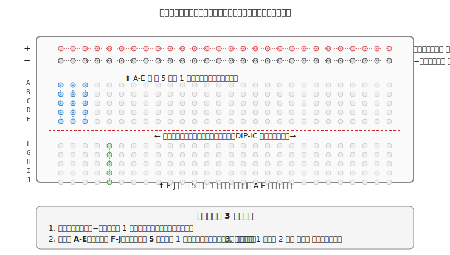
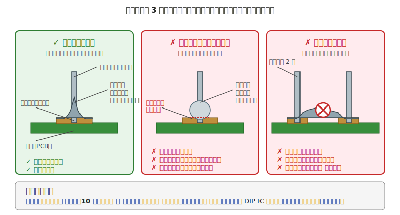

# 第 6 章　電気の組立フェーズ

[第 5 章](05-design-phase.md) で BOM（部品表）が確定したら、次は **実物を組み上げる** 段階です。本章では、設計で決めたルール — **電源の分け方・GND の繋ぎ方・電圧の合わせ方・部品の向き** — を、**組立のときに間違えないための作業のコツ** を扱います。

**この章ではまだ電源は入れません。** 電源投入は [第 7 章 テスト前チェック](07-pre-test-check.md) を終えたあと、[第 8 章 テスト中チェック](08-test-check.md) で初めて行います。組立は「紙の上の設計を、実物に起こす」工程で、**動作確認はまだ先** です。

!!! warning "この章で壊しやすいもの"
    - マイコンボード（ブレッドボードのピン差し間違い、**はんだの盛りすぎで隣のピンと繋がる「はんだブリッジ」**）
    - **ランド**（基板の銅のパッド部分。はんだごての温度が高すぎると基板から剥がれる）
    - 部品（熱のかけすぎ、逆向きに差し込む、足を繰り返し曲げて折る）
    - 指（はんだごての先端は 300〜400℃。一瞬触れただけで火傷）

---

## 1. 組立フェーズの位置づけ

| フェーズ | やること | 本章との関係 |
|---|---|---|
| 設計（第 5 章）| BOM を確定 | **本章の前提**。BOM なしでは組めない |
| **組立（本章）** | **物理的に配線・はんだ付け** | **通電はしない** |
| テスト前（第 7 章）| 電源投入の前に導通・極性等を確認 | 組立の検証工程 |
| テスト中（第 8 章）| 電源投入し動作確認 | ここで初めて通電 |
| デバッグ（第 9 章）| 不具合の切り分け | 組立に戻ることもある |

本章の目的は、**「設計で決めたルールを、組立のときに踏み外さない」** ことです。具体的には:

- **電源の分け方**（第 4 章 §5 で説明した「V 分離／GND 共通」）を、配線の上できちんと実現する
- **GND** は 1 点にすべて集めて放射状に配る（後述の §6.2「スター接続」）
- **極性のある部品**（LED、電解コンデンサ、ダイオード、IC）を正しい向きで差す
- はんだ付けでは **冷はんだ**（後述 §3.5：はんだが部品やランドに馴染まず玉になる失敗）と **はんだブリッジ**（隣のランドとはんだが繋がる失敗）を作らない

---

## 2. ブレッドボード配線の原則

### 2.1 ブレッドボードの内部構造を理解する

「どの穴とどの穴が電気的に繋がっているか」を誤解していると、配線しても回路として成立しません。必ず最初にこれを確認してください。

### 2.2 配線の 4 原則

1. **電源はまずレールに引く**  
   マイコンの 5V ピンと GND ピンから、ブレッドボードの **＋レールと −レールに最初にジャンパを 1 本ずつ引く**。部品の VCC と GND はレールから直接取ります。**電源線を部品のあいだを縫うように長く引き回さない** — 長い電源線はノイズを拾いやすく、トラブル時に「どこを通って繋がっているか」を追いかけるのが大変になります。

2. **ジャンパは短く、きつく差す**  
   信号線は **隣接する数列のあいだで収める**。長く引き回すとノイズを拾う／見た目が乱れる。ジャンパは根元まで差し、ぐらつかないことを確認します（差しが浅いと接触不良の原因）。

3. **部品の足は真っ直ぐに**  
   LED や抵抗の足をブレッドボードに差すとき、**90 度の急な曲げを避ける**。繰り返しの抜き差しで金属疲労を起こし、折損します。やわらかいカーブで曲げます。

4. **組む順番：電源 → バイパスコンデンサ → メイン IC → 周辺**  
   電源レールから順に組み、各 IC の VCC と GND の間には **0.1μF のセラミックコンデンサ** を忘れずに入れる。これを「**バイパスコンデンサ**（電源に乗ったノイズを IC に届かせないための小さなコンデンサ）」と呼びます。型番表記で「104」と書かれているコンデンサ（= 0.1μF、10 × 10^4 pF の略記）のことです。IC を先に置いてから電源を引くと、バイパスコンデンサを入れ忘れやすい。

### 2.3 ブレッドボードで陥りがちな勘違い

!!! warning "中央ギャップを越えて繋がっていると思い込む"
    A-E の列と F-J の列は **電気的に分離** しています。これは、足が 2 列に並んでいる細長い IC（**DIP パッケージ** ＝ Dual In-line Package、ムカデのような形の IC）を、中央ギャップをまたがせて差し込むための設計です。
    「同じ列番号だから繋がっているだろう」で進めると、IC の両側が繋がっていないまま配線が完了し、動かない原因になります。

!!! warning "左右の電源レールを繋ぎ忘れる"
    多くのブレッドボードは **左右の＋レール同士、−レール同士が内部で繋がっていない** 構成です（見た目で 1 本のラインに見えても、中央で切れているタイプがある）。
    マイコンの GND をレール片側にしか繋いでいないと、反対側の部品が GND なしで動作することになります。
    **最初に左右レールを自前ジャンパで橋渡し** しておくのが安全です。

---

## 3. はんだ付けの基本

ブレッドボードで試作が固まったら、ユニバーサル基板などに **はんだ付け** で移植します。ここは練習量が効く領域で、初見で完璧にはできないため、**捨てても惜しくない基板で練習してから本番に入る** のが正道です。

### 3.1 道具のセットアップ

- **こて台**：必須。火傷防止と、こて先の清掃用スポンジ or 真鍮たわしを備えたもの
- **はんだごて**：温度制御付き（白光 FX600 など）。30〜70W 程度
- **はんだ**：鉛フリー φ0.6〜0.8 mm、または鉛入り φ0.6 mm（以下「はんだ」と記す）
- **フラックス**（ヤニ入りはんだを使っていればほぼ不要。あると仕上がりが良くなる）
- **はんだ吸取線**：失敗時のリカバリ用
- **保護メガネ**：はんだの飛沫・フラックスの飛散対策

### 3.2 こて先の手入れ（こて先に薄くはんだを塗っておく）

こて先は使っているうちに表面が黒くなります（これを「酸化」と呼びます）。黒くなると熱が部品に伝わりにくくなり、はんだが乗らなくなります。**使用前と、作業中に数回** は、こて先を「整える」必要があります。手順はこうです:

1. こて先を **濡らしたスポンジ** か **真鍮たわし** で軽く拭く（酸化した表面をこすり落とす）
2. はんだを少量こて先に供給して、**こて先全体に薄くはんだを塗る**。この作業は英語で "tinning（ティニング）" と呼びます — 「こて先を銀色にピカピカの状態に戻す」儀式だと思ってください
3. 余分なはんだはスポンジで払う

### 3.3 温度設定の目安

| はんだの種類 | 推奨温度 | 備考 |
|---|---|---|
| 鉛フリー | 340〜360℃ | 一般的には 350℃ |
| 鉛入り（Sn-Pb）| 310〜330℃ | 融点が低いので温度も低め |

!!! warning "温度を上げすぎない"
    400℃ 以上にすると、**基板のランド（銅のパッド）が基板から剥がれて取れてしまう** ことがあります。一度剥がれると基板は使えなくなるため、「温度を上げれば解決する」と思わないこと。温度が合っているのにはんだが乗らない場合、原因は **こて先が酸化して黒くなっている**（§3.2 の手入れ不足）か、**ランドの表面が汚れている**（使い古した基板や保管中に酸化したもの）かのいずれかです。

### 3.4 はんだ付けの 4 ステップ手順

1. **こてを「ランド」（基板の銅のパッド）と部品の足の両方に、同時に触れるように当てる**（2〜3 秒キープ）
2. **こて先とは反対側から、はんだ線を接点に供給する**（はんだ線の先を、こて先の上ではなく **ランドと部品の足が接している場所** に当てる）
3. はんだが溶け出して広がったら、**はんだ線を先に離す**
4. 1 秒ほどそのまま待ってから、**こてを離す**（この間こては動かさない）

!!! tip "はんだ線をこて先で溶かさない"
    初心者がやりがちな失敗が、「はんだをこての先端で溶かして、それをランドに落とす」という動きです。これは冷はんだ（はんだが馴染まず固まる失敗）になる最短コースです。
    正しくは、**はんだは部品とランドの熱で溶かす**。こては「ランドと足を温める道具」であって「はんだ線を溶かす道具」ではない、と覚えてください。

### 3.5 良いはんだ／悪いはんだの見分け方

| パターン | 見た目 | 原因 | 対処 |
|---|---|---|---|
| **良い** | 富士山型、光沢あり、境がなだらか | 温度・はんだ量・時間が揃っている | そのまま |
| **イモはんだ（冷はんだ）** | 玉状、表面が曇り、凸の段差 | 温度不足、時間短すぎ、こてを振った | 温めて再度はんだを少量足す |
| **はんだブリッジ** | 隣のランドまで繋がっている | はんだ量が多すぎる、こて先が太い | はんだ吸取線で吸い取る |
| **はんだ量過多** | 大きな球状、足が隠れる | 時間が長すぎる、量が多い | 吸取線で削る |

**ルーペ（10 倍）** で 1 箇所ずつ確認する習慣を付けると、目視段階でブリッジの 8 割は発見できます。残りはテスタの導通モードで拾います（第 7 章テスト前チェックで毎回実施）。

---

## 4. 配線の色分けルール

色分けは **組立フェーズ最大の投資リターン** です。数秒のルール遵守で、後日のデバッグ（第 9 章）が何十分も楽になります。

### 4.1 本書の推奨色分け

| 色 | 用途 |
|---|---|
| **赤** | VCC（5V、または主電源の正側）|
| **黒** | GND（0V） |
| **オレンジ** | 3.3V（5V と混在する場合の区別用） |
| **黄** | ロジック信号（デジタル I/O）|
| **緑** | I2C / SPI / UART などの通信線 |
| **青** | アナログ信号 |
| **白** | 予備・未分類 |

この割当は慣習であり、絶対ではありません。**重要なのは「自分のプロジェクト内で一貫させる」** こと。プロジェクトの最初に自分の色分けを決めて、BOM ノートの先頭に貼っておきます。

!!! tip "赤と黒だけは絶対に守る"
    他の色は好みで良いですが、**赤＝＋、黒＝−** は世界共通の規範に近いので従ってください。
    将来 AI エージェントに写真を見せてデバッグを相談する場面でも、赤黒が守られていれば読み取りが格段に速くなります。

### 4.2 ジャンパワイヤの色を混ぜない

100 円ショップの「虹色ジャンパセット」は魅力的ですが、**配線がすぐスパゲティ化** します。各色を十分な本数（10〜20 本）ずつ揃えて、色を用途で固定するのが長期的には時間の節約になります。

---

## 5. ラベリングと配線管理

### 5.1 配線の長さ：サービスループ

- **短すぎ**：配線がピンと張って、コネクタが引っ張られて抜ける・配線が切れる
- **長すぎ**：絡まる、ノイズを拾う、見た目が汚い
- **ちょうどいい**：**サービスループ**（= 作業するときに少しだけ余裕があって、動作中にも垂れ下がらない長さ。点検のときに少し引き出せる程度）

**具体的な長さの目安**：小型ロボット（手のひらサイズ）なら、コネクタから **3〜5 cm の余裕**、中型なら 5〜10 cm。「コネクタを 1 回外して作業できる長さ」を目安にしつつ、可動部を避けて配線する経路の **最短+2〜3 cm** を選ぶと、余分なたわみも抑えられます。

### 5.2 ラベリング

はんだ付けが終わった配線は、**両端にラベル** を貼ります。

- **マスキングテープ + 油性ペン**（簡易、いつでも剥がせる）
- **熱収縮チューブ + 印字**（永続的、きれい）
- **ラベルプリンタ**（ダイモ等。プロ仕様だが初期投資）

ラベルの内容は例えば「**M1+**（モータ 1 のプラス側）」「**BAT+**（電池のプラス）」のような、**配線先と極性が分かる短い文字列**。数字だけ（「1」「2」）にすると後で意味が分からなくなります。

### 5.3 配線図（Wiring Sheet）を書いておく

組立完了時に、**どの配線がどこに繋がっているか** を 1 枚の表に書き出しておきます。これは第 9 章デバッグ章で再三参照される「正解」のリファレンスになります。

### 5.4 熱収縮チューブと絶縁

- **はんだ付けの接合部**：むき出しのままだと隣接部に触れてショートするため、熱収縮チューブか絶縁テープで覆う
- **熱収縮チューブ**：挿入 → 位置合わせ → ヒートガンで加熱
- **絶縁テープ（ビニール）**：簡易だが夏場に粘着が溶けるため仮止め向け

### 5.5 ケーブルタイは優しく

ケーブルタイで束ねるときは、**手で動かして少し余裕がある程度** に留めます。強く締めすぎると:

- 被覆（外側のビニール）がつぶれて、中の銅線が切れる
- タイで締めた場所だけが繰り返し曲がって、そこから切れる
- コネクタ側が引っ張られて、コネクタが抜ける・壊れる

---

## 6. 組立中に「設計のルール」を崩さない

ここが本章のポイントです。第 5 章で決めた設計のルール — 電源の分け方、GND の繋ぎ方、部品の向き — を、**組立の作業中に踏み外さない** ためのチェックを並べます。

### 6.1 電源分離は「見てすぐ分かる形」で配線する

配線が完成したあとに「どれがロジック用の赤線で、どれがモータ用の赤線か」がパッと見で分からないと、トラブル時に追いかけるのが大変です。**色か太さで物理的に見分けがつく** ようにしておきます。

- **マイコン用の VCC（5V）ラインとモータ用の V+ ラインを、別の色か別の太さで区別する**
    - 例：マイコン用は **普通の赤ジャンパ**、モータ用は **太い赤ジャンパ**（太さは「AWG」という規格で表記され、番号が小さいほど太い。マイコン配線用は AWG 24 程度、モータ配線は AWG 20 程度が目安）
    - 例：マイコン用は赤、モータ用は黄＋赤のストライプ、など色で区別する
- ブレッドボードでは **左側の＋レールをロジック 5V、右側の＋レールをモータ用** というように、**位置で分けて使う**
- ユニバーサル基板にはんだ付けする場合は、**ロジックの電源ラインとモータの電源ラインを物理的に離して配線する**（間に 5mm 以上の隙間を空ける）

### 6.2 GND は「1 点に集めて放射状に広げる」（スター接続）

GND の配線には 2 つの流派があります。

- **スター接続**：すべての部品の GND 線を、マイコンの GND ピンという **1 点に集める**。星のように 1 点から放射状に広がる配線の形になるので「スター」と呼びます（本書の推奨）
- **数珠つなぎ（デイジーチェーン）**：部品 A の GND → 部品 B の GND → 部品 C の GND、と **1 本の線で順番に繋いでいく** 方式（非推奨）

数珠つなぎでも「電気的に繋がっている」という意味では動きますが、大電流（モータなど）が流れた瞬間に配線の抵抗で電圧降下が発生し、**部品ごとに「0V」の位置がズレてしまう** ため、マイコンが誤動作しやすくなります。

- **モータドライバの GND、センサの GND、電池の GND を、すべてマイコンの GND ピンに集めて接続** する
- ブレッドボードの −レールを GND として使う場合でも、**マイコンの GND から −レールへの線を 1 本に限定** して、そこから各部品に配る（つまり −レール自体が 1 点から派生した枝になる）

### 6.3 極性部品の向きは「組みながら」確認

組立完了後に極性を間違いに気付くと、分解し直しになります。**以下を差し込む前に** 向きを確認する癖を付けてください。

- **LED**：長い足がアノード（＋）
- **電解コンデンサ**：印字帯の側が負極（−）、**短い足側が負極**
- **ダイオード**：帯の印刷側がカソード（＋ → 負荷の向き）
- **IC**：切り欠き or 丸印があるピンが 1 番ピン
- **モジュール類**：シルク印刷の VCC / GND 表記と配線色を合わせる

第 7 章のテスト前チェック (E) で再度確認しますが、**組立時に見つけるのが最速のリカバリ** です。

---

## 7. 組立フェーズの失敗パターン集

!!! warning "冷はんだ（見た目は付いているが電気的に繋がっていない）"
    最頻出のトラブル原因。**組立直後は動くが、熱・振動・時間でそのうち接触不良** になる厄介な症状です。
    ルーペ目視とテスタ導通で組立時点で潰しておくのが最善。

!!! warning "ブレッドボードの差し間違い（1 列ずれる）"
    IC を差すときに 1 列ずれていて、それぞれのピンが本来とは違う列（＝違う配線系統）に入ってしまうミス。本書の中でも特に頻出する失敗です。
    **差した直後にルーペで 1 ピンずつ確認** するのが手早く、毎回必ずやると事故率が下がります。

!!! warning "色を混同（面倒がって全部同じ色で済ませる）"
    「とりあえず動かしたいから赤ジャンパだけで組む」 → 後でデバッグするときに VCC/GND/信号 が区別できず詰む。
    **組立段階で色を守る** ことがデバッグフェーズの効率を決めます。

!!! warning "先にラベリングせず「後でやろう」と決め込む"
    ラベルなし配線は **1 週間後に見ると意味不明** になります。組立当日の記憶があるうちにラベリング or 配線シートを残してください。

!!! warning "通電しないつもりだが、USB が挿さっている"
    パソコンに接続してスケッチ書き込み中のボードに、ブレッドボードを繋いで配線を変更 → 配線変更中にショートしてボード破壊。
    **通電していないつもりでも、USB ケーブルが挿さっていれば 5V が配られている** のが Arduino 等の挙動です。配線変更前に **USB を抜く** か、**電源スイッチ付きハブを OFF** にしてください。

!!! warning "抵抗のカラーコード読み間違い"
    茶黒茶（100 Ω）と茶黒赤（1 kΩ）は **茶と赤の 1 文字違いで 10 倍違う**。特に古い抵抗は色あせて茶と赤が見分けづらい。**実装前にテスタの抵抗レンジで実測** するのが最も確実。10 個並んでいても、途中 1 本だけ違う値が紛れていたりする（袋詰め時の混入）。

!!! warning "抵抗の足を曲げずに差し込む"
    ブレッドボードやユニバーサル基板にそのまま差そうとして、足を **90° に急激に曲げて** 折損。抵抗・LED・コンデンサなどのリード部品は、**専用のフォーマー** か **指で緩やかに曲げる**（曲げ半径は足の太さの 2〜3 倍）。折れた部品は予備から交換。

!!! warning "ジャンパ線が知らないうちに抜けかけている"
    ブレッドボードに挿したジャンパ線が、動かしている最中に **半抜け** の状態になる。半抜けだと接触不良で「動いたり動かなかったり」。**すべてのジャンパを親指で押し込んで深く差す** を組立後に 1 周やる。

!!! warning "ジャンパのメス側がずれて隣のピンに触れる"
    デュポンメスコネクタがピンから抜けて **隣のピン** に触れてショート。対策は **熱収縮チューブ** でコネクタ根元を補強、または **ピンソケットを個別プラグ形状** のものに変更。

!!! warning "GND を繋ぎ忘れる"
    マイコン単体は動く（USB 給電されている）、モータ単体も動く（電池で駆動）、しかし両者を結ぶロジック信号が **GND が共通でない** ために狂う。通電前に必ず [第 7 章 §6 (D)](07-pre-test-check.md) の GND 共通チェック。

!!! warning "電源ラインとロジックラインの色混在"
    赤ジャンパで信号線を、黒ジャンパで PWM 出力を配線 → 後日デバッグ時に「VCC だと思っていた赤線が実は信号線でテスタを当てた瞬間に誤動作」の事故。**赤＝VCC、黒＝GND** だけは厳守（§4 参照）。

!!! warning "USB ケーブルが充電専用"
    100 円ショップや同梱品の USB ケーブルに多い。**通信線が省かれている** のでマイコンに書き込めない／シリアル出力が出ない。「マイコンは生きているが PC から見えない」という症状は、まず **別の USB ケーブル** で試す。

!!! warning "プローブを A 端子に差したままテスタで電圧測定"
    [第 2 章 §5](../getting-started/02-safety-basics.md) で扱った通り、**テスタ内部ヒューズが飛ぶ**。電流測定が終わったら必ず V 端子に戻す習慣。

!!! warning "はんだ付け後、フラックスで隣接ピンが導通する"
    ヤニ入りはんだのフラックス残渣が、IC の隣接ピン間で **わずかに導通** する（抵抗数 kΩ〜数十 kΩ）。デジタル回路は影響しないことが多いが、**高インピーダンス入力（ADC、OP アンプ入力）で誤差が出る**。フラックス洗浄剤で拭き取る。

!!! warning "ブレッドボードの内部接点が劣化"
    数年使った安物ブレッドボードは、内部のバネ接点が広がって **差し込んでもカチッと入らない** 状態に。新しいボードに乗せ替えると直る現象が多い。「特定の列だけ動かない」は内部劣化を疑う。

!!! warning "配線は正しいが、シリアルモニタのボーレート不一致"
    スケッチで `Serial.begin(9600)` なのに、Arduino IDE のシリアルモニタを 115200 で開いて「文字化けする／出ない」。**左下のボーレート設定** を確認。

!!! warning "書き込み中に USB ケーブルを抜いた・ボードに触った"
    書き込み最中に物理的に接続が切れると、**ブートローダ領域が壊れてボードが復旧困難** になる（ブリック）。書き込み中は **一切触らない・ケーブルを動かさない**。

!!! warning "『たぶん動く』で通電してから、予備が全部なくて詰む"
    組立後のテストで 1 つ部品を焼いた → 予備なし → パーツ発注で 1 週間停止。[第 5 章 §5.2](05-design-phase.md) の **予備数の考え方** を読み返す（LED・抵抗は多め、高価部品は最低限）。

---

## 8. 次章への橋渡し

組立が完了しても **まだ電源は入れません**。次の [第 7 章「電気のテスト前チェック」](07-pre-test-check.md) で、**通電前に導通・極性・電圧一致を一通り確認** します。この段階での検証が、ショート破壊や焼損事故を防ぐ最後の砦です。

第 7 章を飛ばして第 8 章（テスト中チェック）にジャンプしたい誘惑に駆られますが、**通電前チェックで見つかる事故は通電後の発覚より被害が桁違いに小さい** ことを思い出してください。組立が終わったら、必ずテスタを握って第 7 章に進みます。
