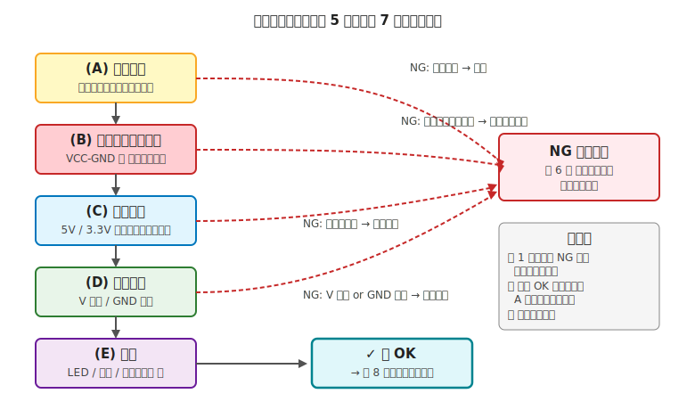
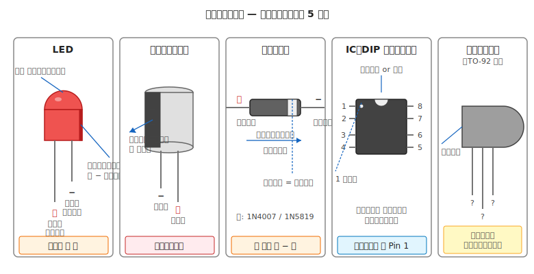

# 第 7 章　電気のテスト前チェック

[第 6 章](06-assembly-phase.md) で組立が完了しました。ここは **組み上がったものに電源を入れる直前** のチェックフェーズです。本章のチェックを全項目パスするまで、**絶対に電源を入れないでください**。

本章は [第 2 章 §6 動作確認チェックリスト](../getting-started/02-safety-basics.md) の電源投入前セクションを、**ワークフロー章としての決定版** に展開した章です。以降のハンズオン章（Part IV 電気系トピック）はすべて、テスト前段階で **本章を参照** する運用になります。

!!! danger "この章のチェックをスキップしないこと"
    - 焼損事故の多くは、本章のいずれかの項目（配線ミス・ショート・電源分離不備・極性逆）を **通電前に確認していれば防げた** ものです
    - 「面倒だから」「今回は大丈夫そうだから」でスキップしたものが、数千円〜数万円の部品を煙にすることがあります
    - **1 項目でも NG なら電源を入れない**。これは訓練の問題ではなく、ルールとして守ってください

---

## 1. テスト前チェックの位置づけ



本章は **5 段階チェック（A〜E）** から成ります。順番に実施し、いずれかで NG が出たら、第 6 章組立フェーズに戻って修正してから再実施します。

| 段階 | チェック内容 | 主な検出ターゲット |
|---|---|---|
| **(A) 目視確認** | 配線シートとの突き合わせ、部品の向き | 配線ミス、部品の向き誤り |
| **(B) ショートチェック** | VCC - GND 間の短絡 | はんだブリッジ、被覆剥け、ジャンパ差し間違い |
| **(C) 電圧一致** | 各 IC の VCC が正しいレールに繋がっている | 5V / 3.3V 混同 |
| **(D) 電源分離** | V 分離 / GND 共通 | 電源系統の誤配線 |
| **(E) 極性** | LED、電解 C、ダイオード、IC、トランジスタ | 逆挿入 |

**所要時間の目安**：慣れれば 10〜15 分。初回はルーペを片手に 30 分〜1 時間。**組立に数時間かけたあとのこの数十分が、焼損事故の発生率を数十分の 1 に下げます**。

---

## 2. 事前準備

### 2.1 テスタの初期設定

!!! warning "プローブは V / COM に差してあるか？"
    前の作業で A 端子に差したままになっていないかを確認してください。
    A 端子のまま電圧測定や導通測定をすると、**テスタ内部の低抵抗シャントが電源を短絡してヒューズが飛ぶ**（第 2 章 §5.2）。

- [ ] 赤プローブが **V 端子**、黒プローブが **COM 端子** に差してある
- [ ] テスタ本体を **導通モード（ブザー付き）** に設定
- [ ] プローブ先端を触れ合わせてブザーが鳴ることを確認
- [ ] 電池残量 OK（液晶が薄くなっていない）

### 2.2 配線シート（Wiring Sheet）を手元に置く

[第 6 章 §5.3](06-assembly-phase.md) で作った配線シート（または配線写真）を広げます。これが「正解のリファレンス」になります。

### 2.3 電源が **完全に断** されていることを確認

- [ ] **USB ケーブルが抜けている**（PC 側・ボード側の両方を抜く）
- [ ] 電池が電池ボックスから外れている、または **電源スイッチで OFF**
- [ ] AC アダプタのプラグが抜けている（コンセント側ではなく、**ボード側** を抜く）
- [ ] 大容量コンデンサが残留電荷を持っていないか（第 1 章 §6.3 参照。数百 μF 以上は注意）

!!! info "なぜ完全断が必要か"
    本章のチェックは **電源が入っていない状態でしか成立しない** ものが多いです。
    特に導通モード（§4, §5, §6 で使用）は、電源電圧がテスタに流れ込むとテスタ側を壊す可能性があります。
    導通モードのテスタは **内部から微小電流を流して抵抗を測る** 原理なので、外から電圧がかかっていてはダメです。

---

## 3. (A) 目視による配線確認

### 3.1 手順

配線シート（または設計図）を左手、実機を右手に持ち、**1 つずつ指差しながら** 次を確認します。

- [ ] 配線シートに書かれた **すべての接続** が、物理的に存在する
- [ ] 配線シートに **書かれていない接続** が、物理的に存在しない（余計な配線がないか）
- [ ] ブレッドボードの場合、**部品がどの列に差さっているか** を 1 つずつ確認
    - 特に DIP IC の列ずれ（1 列ずれて全ピンがずれている、あるあるのミス）
    - 足が曲がって隣の列にも触れていないか
- [ ] ジャンパワイヤの **両端が正しい穴** に差さっている
    - 被覆が剥けて裸導体が露出していないか
    - 差しが浅くてぐらついていないか
- [ ] 極性部品（LED・電解・ダイオード・IC）の向きが正しい（§7 で再度詳細確認）
- [ ] 部品がシルク印刷（VCC / GND / RX / TX 等）通りに配線されているか

### 3.2 目視が拾えるもの／拾えないもの

**拾える**：配線ミス（繋ぎ忘れ、繋ぎすぎ、列ずれ）、明らかな部品の逆挿入、ジャンパ被覆の破損、大きなはんだブリッジ

**拾えない**：冷はんだ（外見は繋がっているが電気的に繋がっていない）、微細な隣接ピンブリッジ、見えない場所でのショート — これらは (B) のショートチェックで拾います。

!!! tip "目視にルーペを使う"
    肉眼だと見落とすレベルのブリッジや被覆剥けが、**10 倍のルーペ** だと容易に見つかります。ルーペは 500〜1,500 円程度で、コストパフォーマンスが非常に良い工具です。

### 3.3 NG が見つかったら

修正は [第 6 章 組立フェーズ](06-assembly-phase.md) に戻って行います。修正後は **(A) からやり直し**（他の場所が影響を受けていないか再確認するため）。

---

## 4. (B) VCC - GND 間ショートチェック

電源を入れると最も被害が大きいのが VCC と GND のショート。はんだブリッジ・ジャンパ差し間違い・被覆剥けのいずれでも起きます。

### 4.1 基本手順

テスタを **導通モード** のままで、次の組み合わせを 1 つずつ当てます。**すべてでブザーが鳴らない** のが正解です。

- [ ] マイコンの **VCC ピン ⇔ GND ピン**
- [ ] ブレッドボードの **+ レール ⇔ - レール**（左右の両方）
- [ ] 各 IC の **VCC ピン ⇔ GND ピン**（データシートでピン番号を確認）
- [ ] **5V レール ⇔ 3.3V レール**（混在する場合。これも鳴ってはいけない）
- [ ] モータ電源の **V+ ⇔ GND**（別系統の場合）

### 4.2 ブザーが鳴ってしまったら

**絶対に電源を入れない**。ショート経路が存在します。次の手順で特定します。

1. 鳴っている配線系統を把握する（例：マイコン VCC と GND 間が鳴る）
2. **ジャンパを 1 本ずつ抜く**、または **部品を 1 つずつ外す**
3. 鳴らなくなった時に外したものが **疑わしい箇所** — その部品や配線の周辺を目視＋ルーペで確認
4. 見つかったら修正、再度 (A) からやり直し

!!! tip "消去法が効くのは分離可能な配線から"
    ブレッドボード上はジャンパを抜きやすいですが、はんだ付け済みの基板は **一度流れたら戻れない** ので、目視＋ルーペ確認の比重が高くなります。
    はんだ付け時にルーペで毎接合点を確認しておくのが、ここで詰まない最善策です。

### 4.3 部品側のショート

配線にミスが見当たらないのにブザーが鳴る場合、**部品自体がショート不良** の可能性があります。

- タンタルコンデンサは **経年や過電圧でショートモード故障** することが有名
- MOSFET は **ESD（静電気）でゲート破壊** されるとドレイン-ソース間がショート
- 配線は切り離して部品単体で導通測定 → ショートを確認

---

## 5. (C) ロジック電圧の一致チェック

各部品が **正しい電圧のレールに繋がっているか** を、導通モードで確認します。

### 5.1 手順

BOM（第 5 章で作ったもの）を開き、各部品の動作電圧を確認しながら:

- [ ] **5V 動作の部品**（5V 電源のセンサ、ロジック IC など）の VCC ピンが、**ボードの 5V ピンと導通**
- [ ] **3.3V 動作の部品**の VCC ピンが、**ボードの 3.3V ピンと導通**
- [ ] **3.3V 部品の VCC が 5V ラインと導通していない**（逆も同様。5V 部品が 3.3V ラインに繋がっていない）
- [ ] **モータドライバのロジック電源（V_CC）** が、マイコンと同じロジック電圧レール（5V なら 5V、3.3V なら 3.3V）に繋がっている
- [ ] **モータドライバのモータ電源（V_M）** が、モータ用電源レール（電池 7.4V 等）に繋がっている（ロジックと同じレールになっていない）

### 5.2 I2C / SPI / UART のロジック電圧整合

通信バス上で **送り手と受け手のロジック電圧が違う** 場合、**レベル変換 IC** を経由している必要があります（第 3 章 §5 の V_OH / V_IH 不等式）。

- [ ] 5V → 3.3V への信号線に **レベル変換 IC** が入っている（例：TXS0108E、FXMA108 など）
- [ ] I2C の **プルアップ抵抗** が、受け手側のロジック電圧（5V なら 5V レール、3.3V なら 3.3V レール）にプルアップされている

!!! warning "レベル変換を忘れた時の典型症状"
    レベル変換なしで 5V マイコン → 3.3V センサに接続すると、通電直後にセンサが壊れます。煙が出ないこともあるが、**センサが応答しない／値がおかしい** という症状で後から発覚します。
    テスト前チェック段階で **配線経路にレベル変換 IC が挿入されているか** を目視と導通で確認してください。

---

## 6. (D) 電源分離チェック

ロジック電源とモータ電源を別系統にしている場合、**物理的に分離しているか** を確認します。第 4 章 §5 で扱った「V 分離 / GND 共通」の実装検証です。

### 6.1 V 分離の確認

テスタの導通モードで:

- 赤プローブを **マイコン側の VCC ピン**、黒プローブを **モータ電源の V+ 端子** に当てる
- [ ] **ブザーが鳴らない**（V 分離 OK）

**鳴ってしまったら**：2 つの電源が物理的に繋がっています。典型的な原因:

- ジャンパを間違えてマイコン VCC とモータ V+ を接続
- モータドライバの V_M と V_CC を同じレールに繋いでしまった
- ブレッドボードの左右レールが内部で繋がっていることを忘れて混在させた

→ 第 6 章の組立フェーズに戻って修正。

### 6.2 GND 共通の確認

- 赤プローブを **マイコン側の GND ピン**、黒プローブを **モータ電源の GND 端子** に当てる
- [ ] **ブザーが鳴る**（GND 共通 OK）

**鳴らないと致命的** ：GND 共通がないと、モータドライバのロジック入力が意味のない電位を指してしまい、通電直後に誤動作・IC 破壊します。

→ 第 6 章に戻り、GND 配線（スター接続）を確認。

### 6.3 チェック結果の 4 象限

| V 間 | GND 間 | 判定 | 対処 |
|---|---|---|---|
| 鳴らない | 鳴る | **OK** | 次の (E) へ進む |
| 鳴らない | 鳴らない | NG：GND 分離 | 組立に戻り GND 配線を追加 |
| 鳴る | 鳴る | NG：V 共通 | 組立に戻り V を分離 |
| 鳴る | 鳴らない | 致命的 NG | 配線全体の再確認が必要 |

---

## 7. (E) 極性部品の向き

通電前の最後の関門。極性のある部品の向きを、**1 つずつ実機で** 確認します。



### 7.1 部品別チェックポイント

**LED**

- [ ] 長い足（アノード）が **+ 側（電流が流れ込む側）** に差さっている
- [ ] LED 本体の **平らな面**（カソード側）が - 側（GND 側）を向いている

**電解コンデンサ**

- [ ] **白帯 or 「−」印字のある側** が GND 側に差さっている
- [ ] 短い足が - 側
- [ ] **絶対に逆挿入しない**（電解液が沸騰して破裂、顔に飛ぶ危険あり）

**ダイオード**

- [ ] 本体の **帯の印刷側**（カソード）が + → 負荷の方向を向いている
- [ ] 電流が流したい方向に、**帯が下流** になっているか確認
- [ ] ショットキー、整流、フライホイール用途それぞれで向きが違うので、回路図を照合

**IC（DIP パッケージ）**

- [ ] 切り欠きまたは丸印のある側が **1 番ピン**
- [ ] データシートの **Pin Configuration** と物理配置を 1 ピンずつ照合
- [ ] 同一パッケージでもピン配置が違う IC があるため、**型番をラベルで確認**

**トランジスタ / MOSFET**

- [ ] **データシートで E/C/B（または S/G/D）のピン配置を確認**（パッケージは同じ TO-92 でもメーカーで違う）
- [ ] 平らな面の向きが、データシートの図と一致する
- [ ] ピン順は **目視では分からない**（トランジスタのパッケージには極性マークがないため、データシート必須）

### 7.2 NG が見つかったら

電源投入前の段階で見つかればラッキーです。

- 極性部品を引き抜いて、正しい向きで差し直す
- 電解コンデンサの場合、**一度逆挿入で通電した個体は交換推奨**（内部で劣化している可能性）
- はんだ付け済みの部品は、はんだ吸取線で外してから差し直し

---

## 8. 全項目の記録様式（作業ログ）

組立の大きさに合わせて、次の表をノートまたは作業ログに書き写して使ってください。

```
╔══════════════════════════════════════════════════════════════╗
║  プロジェクト: ___________     日付: 2026/__/__               ║
║  作業者: _______________     配線シート Rev: _______         ║
╠══════════════════════════════════════════════════════════════╣
║ (A) 目視確認                                                 ║
║  □ 配線シートとの照合完了                                     ║
║  □ 部品の列ずれなし                                           ║
║  □ ジャンパ被覆 OK                                            ║
║                                                              ║
║ (B) ショートチェック (導通モード、全て鳴らないこと)           ║
║  □ MCU VCC ⇔ GND         結果: 鳴らない / 鳴った              ║
║  □ 左右 +/- レール        結果: 鳴らない / 鳴った              ║
║  □ 5V ⇔ 3.3V レール       結果: 鳴らない / 鳴った              ║
║  □ モータ V+ ⇔ モータ GND 結果: 鳴らない / 鳴った              ║
║                                                              ║
║ (C) 電圧一致チェック (導通モード、期待どおり繋がっていること) ║
║  □ 各 IC の VCC 正しいレールと導通                            ║
║  □ 違うレールとは非導通                                       ║
║  □ レベル変換 IC 挿入確認                                    ║
║                                                              ║
║ (D) 電源分離                                                 ║
║  □ MCU VCC ⇔ モータ V+   期待: 鳴らない  結果: _____         ║
║  □ MCU GND ⇔ モータ GND  期待: 鳴る     結果: _____         ║
║                                                              ║
║ (E) 極性                                                    ║
║  □ LED 長足 = +                                              ║
║  □ 電解 C 白帯 = GND                                          ║
║  □ ダイオード帯 = - 側                                       ║
║  □ IC 切り欠き = Pin 1                                       ║
║  □ トランジスタ (データシート照合済み)                        ║
║                                                              ║
║ 結論: □ 全項目 OK → 第 8 章テスト中チェックへ                 ║
║       □ NG あり → 第 6 章組立に戻る（NG 箇所: ________）     ║
╚══════════════════════════════════════════════════════════════╝
```

このフォーマットは **作業ログ（第 1 章 §6.4 の「作業ログを残す」）** と直結します。数週間後に「このロボット、なぜ動かないんだっけ？」となったとき、ログを見れば組立時点で何をチェックしたかが分かります。

---

## 9. 見落としがちな馬鹿馬鹿しい失敗

上のチェックリストを全部通したのに動かない、という時は、次の **「言われると当たり前だが、確認を忘れがちな項目」** を順に見てください。初心者だけでなく経験者も踏む落とし穴です。

!!! warning "電源スイッチが OFF のまま"
    電池ボックスやハブに **スイッチがある** のに、**OFF のまま「動かない」と悩む**。スイッチの位置を目視確認。

!!! warning "USB ケーブルが PC 側で抜けかかっている"
    ボード側はしっかり挿さっているが、**PC 側が緩く浮いている**。USB が断続的に切れて書き込みが不安定に。両側とも奥まで差し込む。

!!! warning "プラグの極性は合っているが、電圧が違う"
    センタープラスで挿さるが、**9 V ボードに 12 V アダプタを挿した**。定格超過でボード死亡。**アダプタの電圧表記を読んでから挿す**。

!!! warning "電池を入れ忘れている or 逆向き"
    電池ボックスのふたを開けて、**中に電池が入っていないことに気付く**。または **1 本だけ逆向き** で実質的に電圧が足りない。通電前に電池の向きを目視確認。

!!! warning "ケーブルの差し込みが浅い（半挿し）"
    Dupont ジャンパや JST コネクタが、**差さっているように見えて 1〜2 mm 浮いている**。揺らすと抜ける状態で組立完了扱い → 稼働中に抜ける。通電前にすべてのコネクタを押し込む。

!!! warning "モータの片方だけ配線忘れ"
    「両方繋いだつもりが、実は右モータの片方の線が半田付けされていない」。通電するとなぜか片方しか回らない。左右のモータ単体動作を順にテスト。

!!! warning "電源アダプタがコンセントに挿さっていない"
    AC アダプタをロボット側に挿した時点で満足して、**コンセントに挿し忘れている**。あるあるすぎて気付かない。

!!! warning "ブレッドボードの中央ギャップを超えて繋いだつもり"
    A-E 列と F-J 列は別ネット（[第 6 章 §2.1](06-assembly-phase.md)）なのに、**同じ列番号だから繋がっていると思い込んで** 組立。通電前に導通モードで 1 列ずつ確認するのが無駄ではない。

!!! warning "抵抗の値を mega と k を取り違え"
    1 kΩ のつもりで 1 MΩ を挿している → 電流が 1/1000 に。LED は光らない、センサのプルアップは効かない。テスタの抵抗レンジで実測確認。

---

## 10. 全項目の判定

- **全項目 OK** → [第 8 章 電気のテスト中チェック](08-test-check.md) に進む（ここで初めて電源投入）
- **1 項目でも NG** → [第 6 章 電気の組立フェーズ](06-assembly-phase.md) に戻って修正し、本章を最初から実施

!!! danger "NG のまま電源を入れない"
    「1 箇所だけなら大丈夫だろう」「原因は分かっているからそのまま入れよう」— 焼損事故のほとんどがこの判断から始まります。
    **NG は NG として、修正してからしか次に進まない** という原則を、本書を通じて崩さないでください。

---

## 11. 次章への橋渡し

テスト前チェックが全項目 OK になったら、いよいよ **電源投入** です。[第 8 章「電気のテスト中チェック」](08-test-check.md) では、投入直後の 10 秒・30 秒・1 分の観察ポイント、VCC の実測、温度確認、マイコンの書き込み・シリアル出力確認、ブラウンアウト検出を扱います。

テスト前（本章）が「**入れたら壊れる事故を防ぐ**」ためのチェックなら、テスト中は「**入れた後に壊れそうな兆候を捉える**」ためのチェック。両方揃って初めて、組み上がった回路を安全に運用できます。
