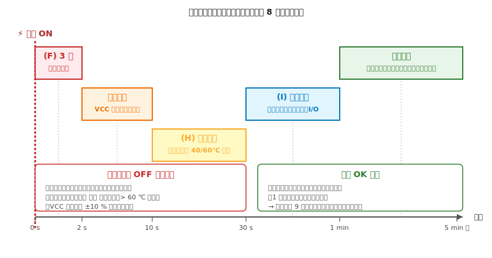

# 第 8 章　電気のテスト中チェック

[第 7 章](07-pre-test-check.md) のテスト前チェックを全項目パスしたら、**ここで初めて電源を入れます**。本章は **電源投入後の観察と計測** を時系列で整理した章です。

テスト前（第 7 章）は「**入れたら壊れる事故を防ぐ**」ためのチェックでした。テスト中（本章）は「**入れた後に壊れそうな兆候を捕まえる**」ためのチェックです。両方揃って初めて、回路を安全に運用できます。

!!! warning "この章で見逃すと致命的なもの"
    - **煙・焦げ臭・パチッという音**（投入後 2 秒以内に気づくべき）
    - **VCC が公称値から ±10% 以上外れる**（電源容量不足・配線抵抗・ショートの兆候）
    - **60℃ を超える発熱**（手をかざして熱風を感じるレベル）
    - **ブラウンアウトループ**（マイコンが起動を繰り返す）
    - **シリアル出力が出ない**（GND 未接続・書き込み失敗・ブラウンアウトの疑い）

---

## 1. テスト中チェックの位置づけ

本章は「電源を入れてから、回路が安定動作している」と判断できるまでの時間に行う観察の集合です。**時系列で 5 段階** に分けます。

| 時間帯 | 段階 | 主にチェックする対象 |
|---|---|---|
| 0〜2 秒 | **(F) 3 感チェック** | 視覚（煙・火花）／嗅覚（焦げ臭）／聴覚（破裂音）|
| 2〜10 秒 | **安定観察** | VCC の維持、急激な発熱 |
| 10〜30 秒 | **(H) 温度確認** | 部品温度が 40〜60℃ の範囲内か |
| 30 秒〜1 分 | **(I) 機能確認** | 書き込み、シリアル出力、入出力の反応 |
| 1 分以降 | **長期観察** | モータ駆動・センサ稼働中の挙動、温度の再確認 |

各段階で **異常を感じたら即座に電源を切り**、第 7 章のチェックに戻ります。「このまま 1 分見続ければ安定するはず」という判断は、ほぼ必ず被害を拡大させます。

---

## 2. 事前準備（電源を入れる直前にやること）

### 2.1 電源スイッチが手の届く位置にあるか

**異常を感じてから電源を切るまでの時間が、被害の大きさを決めます**。工作机の上で:

- [ ] 電源スイッチ（電池ボックスのスイッチ、スイッチ付き USB ハブ、AC アダプタのコード元プラグ）が **利き手で 1 秒以内に届く** 位置にある
- [ ] ケーブルが机の向こう側に回り込んでいて、切るためにまず机を回り込まないといけない、という状態ではない

### 2.2 テスタをスタンバイさせる

- [ ] テスタを **DCV モード**、赤プローブを **V 端子**（A 端子のままだとヒューズが飛ぶ、第 2 章 §5.2）
- [ ] プローブを **VCC-GND 間** に当てられる状態にしておく。投入直後に実測するため

### 2.3 シリアルモニタ／書き込み環境を開く

- [ ] Arduino IDE または MicroPython のツール（Thonny 等）を起動し、シリアルモニタを開いておく
- [ ] 事前にスケッチ／プログラムを書き込んである（または投入後すぐ書き込める状態）

### 2.4 部品に手を伸ばせる姿勢

温度確認には **手のひらを部品に 2〜3 cm 近づける** 動作が必要です。無理な姿勢だと判定を省略しがちになるので、座る位置を整えておきます。

---

## 3. (F) 投入直後の 3 感チェック（0〜2 秒）

電源スイッチを入れた **直後の 2 秒間** が、最重要の観察ウィンドウです。ここで何かが起きたら、**ほぼ確実に配線ミス** です。

### 3.1 視覚

- [ ] **煙** が出ていない（レギュレータ・IC・抵抗・電解コンデンサのどこからも）
- [ ] **火花** が出ていない
- [ ] 想定外の LED が光っていない（期待していない回路に電流が流れている兆候）

### 3.2 嗅覚

- [ ] **焦げ臭** がしない（樹脂が焼ける臭い、電解液が沸騰する酸っぱい臭い）
- [ ] **甘い臭い** がしない（トランジスタの樹脂が溶け始めるとわずかに甘い臭いがすることがある）

### 3.3 聴覚

- [ ] **パチッ** という音がしない（コンデンサの破裂、ヒューズの溶断）
- [ ] **ジー／ピー** という持続音がしない（不安定な発振、スイッチングの異常）

!!! danger "いずれかが起きたら即座に電源 OFF"
    煙・焦げ臭・破裂音のいずれかを感じた時点で、**思考停止で電源スイッチを切る** ことに慣れてください。
    「もう少し待てば収まるかも」は焼損の最短コース。電源を切ってから、冷めた部品を冷静に調べます。

---

## 4. 安定観察（2〜10 秒）

最初の 2 秒で異常がなければ、次は 10 秒まで **電圧と発熱** を確認します。

### 4.1 VCC の実測

テスタを DCV モードで VCC-GND 間に当て、**公称値 ±5%** に収まっていることを確認します。

- [ ] **5V 動作のボード**：4.75〜5.25 V
- [ ] **3.3V 動作のボード**：3.15〜3.45 V
- [ ] 実測値が公称より **10% 以上低い** 場合、電源容量不足・配線抵抗・ショートの疑い → 電源 OFF、第 9 章デバッグへ

### 4.2 急激な発熱をかざしで拾う

手のひらを **部品から 2〜3 cm 上** にかざして、**熱風を感じる部品がないか** を巡回確認します。この段階では数秒なので、どの部品もまだ温度が低いはずです。急激に暖まっている部品は何かがおかしいサインです。

- [ ] レギュレータ（三端子 or LDO）から熱風を感じない
- [ ] モータドライバ IC から熱風を感じない
- [ ] 抵抗・IC が冷たいままである

---

## 5. (H) 温度確認（10〜30 秒）

通常動作中に発熱する部品は、10〜30 秒経過で **平衡温度に近づきます**。ここで温度が高すぎる場合、「時間経過で安定する」ことは期待できません。

### 5.1 温度の目安（手の感覚による）

| 温度 | 感覚 | 判定 |
|---|---|---|
| 室温〜35℃ | ほんのり温かい | OK |
| 40℃ 前後 | 触っていられる温かさ | **OK**（IC の多くはここで安定）|
| 50℃ 前後 | 「あったか」と感じる | 注意 — 仕様を確認（レギュレータなら正常範囲のこともある）|
| 60℃ 超 | **瞬間的に「熱い」と感じる** | **NG** — 電源 OFF |
| 70℃ 超 | 触り続けられない | **即電源 OFF**、火傷注意 |

判定は **手を 2〜3 cm 上にかざし、じんわり伝わる熱** で行います。直接触って判定してはいけません（瞬間的に火傷する可能性）。

### 5.2 熱くなる部品と原因のカタログ

発熱を見つけたら、電源 OFF 後に原因を絞り込みます。

| 部品 | 発熱の典型原因 |
|---|---|
| **レギュレータ** | 入出力電圧差が大きすぎる（9V → 5V は 4V 分が熱になる）／負荷電流が定格ギリギリ／放熱不足 |
| **モータドライバ IC** | 負荷電流が連続定格を超えている／ブリッジ上下のショート／発振 |
| **DC モータ** | ストール状態が続いている／ギア噛み合わせが悪い／ベアリング不良 |
| **抵抗** | 電流が P = I²R で許容電力を超過（例：1/4W 抵抗で 1W 消費）|
| **マイコンボード** | VCC-GND 間ショート（数百 mA〜1A が流れている）|

---

## 6. (I) 機能確認（30 秒〜1 分）

回路が熱的に安定したら、**想定した動作をしているか** を確認します。

### 6.1 マイコンへの書き込み

- [ ] Arduino IDE の「書き込み完了」または `mpremote` の「OK」が表示される
- [ ] **書き込みエラーが出る** 場合：ブラウンアウト、GND 未接続、USB ケーブル不良、ドライバ未インストール、ボードが認識されていない等の疑い

### 6.2 シリアルモニタの出力

- [ ] `setup()` に仕込んだメッセージ（例：`Serial.println("BOOT");`）が **1 回だけ** 表示される
- [ ] `loop()` の定期出力（例：`millis()`）が **途切れず** 流れる
- [ ] **`BOOT` が繰り返し表示** → ブラウンアウトループの疑い（§7）
- [ ] **何も表示されない** → GND 未接続、ボーレート不一致、シリアル線未接続のいずれか

### 6.3 入出力の反応

- [ ] ボタンを押すと期待の反応（LED 点灯等）が起きる
- [ ] センサが想定範囲の値を返す
- [ ] モータ（もし搭載している場合）が指令どおり動く

**期待どおりの反応が返らない** 場合は、焼損ではなくロジックまたは配線の間違いです → 電源を切ってから第 9 章デバッグへ。

---

## 7. ブラウンアウトの検出

[第 4 章 §7](../getting-started/04-power.md) で扱ったブラウンアウト（電源電圧が瞬間的に下がってマイコンがリセットする現象）は、**動作中に起きる** ので本章の検出範囲です。特にモータや大電流負荷を動かした瞬間に発生します。

### 7.1 症状（復習）

- シリアルモニタで **起動メッセージが繰り返し** 表示される
- 内蔵 LED（Arduino Uno なら D13）が **不規則に点滅** する
- モータが「動いては止まる」を細かく繰り返す
- PC で **USB デバイスの接続／切断が繰り返される**

### 7.2 検出方法

- **方法 1：シリアルモニタでブート回数を数える**（第 4 章 §7 と同じ）
- **方法 2：DMM の MIN HOLD 機能でモータ駆動中の最低電圧を記録**（DMM が MIN HOLD 対応の場合）
- **方法 3**（本章独自）：**内蔵 LED の挙動を目視** — Arduino Uno の場合、起動時に D13 が 3 回点滅するため、モータ駆動中にこれが繰り返されていたらブラウンアウトの可能性

### 7.3 発覚したら

電源を切り、第 4 章 §7 の切り分け手順（USB ケーブル交換 → モータ電源分離 → 電源容量増強）に従って対処します。

---

## 8. 長期観察（1 分以降）

最初の 1 分で異常がなければ、次は **想定負荷をかけた状態での長期動作** を観察します。

### 8.1 モータ・大電流負荷を動かす

- [ ] モータを **最大出力** で駆動しても、マイコンがリセットしない（§7）
- [ ] モータを **長時間（30 秒以上）** 連続駆動しても、モータ／ドライバの温度が危険域に入らない
- [ ] 複数のモータ・サーボが同時に動いても電源が落ちない

### 8.2 熱的な飽和

部品温度は **数分かけて平衡** に達するため、短時間のテストで OK だった温度が長期運転で上昇することがあります。

- [ ] **投入後 5 分** で各部品の温度を再確認
- [ ] **投入後 15 分** も余裕があれば再確認（特にレギュレータとモータドライバ）

---

## 9. 異常を感じたときの即時アクション

### 9.1 電源を切る手順（速さ優先）

1. **最も手近な電源スイッチを切る**（考えるより先に手を動かす）
    - 電池ボックスのスイッチ／スイッチ付き USB ハブ／電源タップの個別スイッチ
2. スイッチがなければ **電源ケーブルを抜く**
    - USB ケーブルなら **ボード側** から抜く（PC 側より近い）
    - AC アダプタなら **プラグ側**（ボードに差さっている側）から抜く
3. 電池が直接繋がっている場合は **電池を外す**

**配線を引き抜いて電源を切らない**。通電したまま配線を外すと、外す瞬間にショートが発生する可能性があります。必ず電源側から切ります。

### 9.2 切り分け前に「何が起きたか」を記録

電源を切った後、**冷静に戻る前に** 次を記録します（記憶はすぐ曖昧になります）。

- [ ] 発生した症状（煙が出た部品、音の種類、感じた匂い）
- [ ] 電源投入からの経過時間（2 秒以内 or 10 秒以降 など）
- [ ] テスタで最後に読んだ電圧値
- [ ] シリアルモニタの最終表示
- [ ] できれば **写真を撮る**（焦げ痕、部品の位置）

### 9.3 冷却を待ってから調査

- [ ] 部品が触れる温度になるまで **5〜10 分** 待つ
- [ ] 大容量電解コンデンサがある場合、**残留電荷** の放電も待つ（数十 V の残留が数秒〜数十秒続く、第 1 章 §6.3）

### 9.4 第 9 章デバッグへ

記録と冷却が済んだら、[第 9 章「電気のデバッグ」](09-debugging.md) の症状別カタログを開きます。本章の観察記録がデバッグの出発点になります。

---

## 10. 全項目の判定

- **全段 OK**（投入から 1 分以降まで安定、機能確認も通った）→ 組立完了として運用に入れる
- **部分 OK、細かい不具合あり**（機能確認で一部動かない、期待と違う）→ [第 9 章 電気のデバッグ](09-debugging.md) で切り分け
- **重大 NG**（煙・破裂・大発熱のいずれか）→ 電源 OFF 後、冷却を待って **第 7 章のテスト前チェック全項目** からやり直し。焼けた部品は交換

!!! tip "正常動作の定義を書いておく"
    「動く」ことの定義が曖昧だと、**動いているのか動いていないのか判定できない** 状況に陥ります。
    第 5 章の BOM と同じノートに、**「LED が 1 秒周期で点滅する」「ボタンを押すと LED が 3 秒消灯する」** のような **正常動作の定義** を書いておき、ここと照合してチェックすると判定が明確になります。

---

## 11. 次章への橋渡し

テスト中チェックまでで、**電気的に健全な動作** と **想定どおりの機能** がそろったら組立はひとまず完成です。

ただし実作業では、**「機能確認で動かない」** 場合のほうが多く、その原因切り分けに時間を使います。次の [第 9 章「電気のデバッグ」](09-debugging.md) は、**症状別の切り分け方法論** をまとめた章です。「LED が光らない」「マイコンに書き込めない」「モータが暴走する」といった頻出症状について、**GND 確認・電圧実測・シリアル print・分離テスト** の 4 つの武器でどう切り込むかを扱います。

Part III「電気のワークフロー」はこの次章（第 9 章）で閉じ、続く Part IV（電気系トピック）では LED・スイッチ・モータ等の **部品別の詳細** に戻ります。Part IV では本章の「テスト中チェック」を毎回参照する運用になります。
