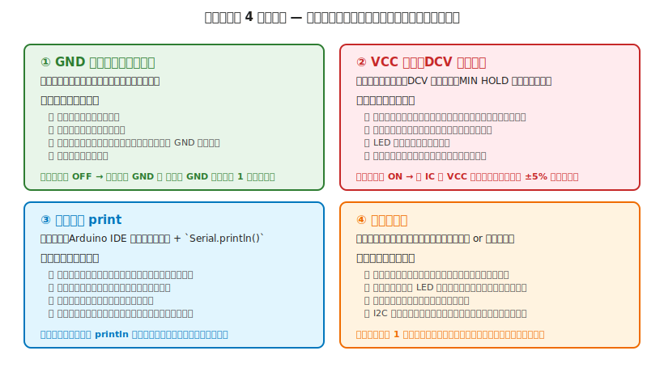

# 第 9 章　電気のデバッグ

Part III「電気のワークフロー」の最終章。**「組み上げて電源を入れたけれど、期待どおりに動かない」** ときに、原因を体系的に追いかける方法をまとめます。

デバッグは電子工作の中でもっとも時間を取られる工程で、**どう攻めるかの方針** を持っているかどうかで所要時間が何倍も変わります。本章では、AI エージェントに頼る前に **自分で切り分けられる範囲を最大化** するための 4 つの武器と、症状別の対処カタログを扱います。

!!! warning "デバッグ中に新たな事故を起こさないために"
    - **通電したまま配線を変更しない** — 外す瞬間にショートして別の部品を壊す。さらに **ロボット特有のリスク** として、手や工具が誤ってコントロール入力（GPIO、スイッチ、センサ）に触れると **マイコンがそれを指令と解釈してモータが突然回り出し、指を挟む／アームで顔を叩く／車両が机から落ちる** などの人体事故を起こします
    - **熱を持った部品に直接触らない** — 冷めるまで待ってから確認
    - **疲れているときは続けない** — 判断が鈍ると「ちょっとだけ」で致命的な配線ミスをしがち（第 1 章 §6.4）
    - **「もしかしたら動くかも」で繰り返し電源を入れない** — 原因を仮説化しないまま ON/OFF を繰り返すと、既に弱っている部品がとどめを刺される

---

## 1. デバッグの位置づけ

本章は Part III の締めくくり。第 8 章テスト中チェックで **期待どおりに動かない** ことが判明した時、または後日トラブルが出た時に戻ってくる章です。

### 本章が扱う範囲と扱わない範囲

**扱う（電気側）**：電圧不足、配線ミス、ロジックの順序問題、部品の破損・劣化、ノイズ、接触不良

**扱わない（本章では）**：機械側のトラブル（異音、干渉、スリップ等）→ [第 25 章 機械のデバッグ](../workflow-mechanical/25-debugging.md)

電気と機械のトラブルが混在することもあります。まず **モータ単体を手で回して** 機械側の問題を切り離してから電気を追うのが鉄則です。

---

## 2. デバッグの大前提

### 2.1 基本サイクル：電源 OFF → 観察 → 仮説 → 測定 → 修正 → 再テスト

1. **電源を切る**（いつでも最初にこれ）
2. **観察**：目に見える異常（焦げ、膨らみ、色の変化）と、第 8 章で記録した症状
3. **仮説**：「この症状ならここが原因のはず」という候補を 2〜3 個立てる
4. **測定**：仮説を検証する最小限のテスト（テスタ、シリアル print、分離）
5. **修正**：1 箇所だけ直す（複数同時に直すと何が効いたか分からない）
6. **再テスト**：第 7 章テスト前チェック → 第 8 章テスト中チェック

!!! tip "1 回に 1 箇所だけ直す"
    プログラミングと同じです。複数の仮説を同時に検証すると、うまく行ったとき / ダメだったときに **何が効いたのか分からなくなる**。辛抱強く 1 箇所ずつ変えます。

### 2.2 仮説を立てるコツ：**変えた直後を疑う**

- **新しく追加した部品** の疑いがいちばん濃い
- **ハンダ付けし直した箇所** も濃い
- **何も変えていないのに動かなくなった** 場合は、熱・振動・経年が候補（接触不良、冷はんだ、ケーブル断線）

---

## 3. デバッグの 4 つの武器



各武器の詳細は §4 以降で扱います。使い分けの目安:

| 武器 | 当てるべき場面 |
|---|---|
| ① **GND 確認** | 書き込みエラー、シリアル出力なし、センサがデタラメ |
| ② **VCC 実測** | 発熱、ブラウンアウト、LED が暗い、モータが弱い |
| ③ **シリアル print** | 実行順序が想定と違う、条件分岐が通らない、値がおかしい |
| ④ **分離テスト** | 複数部品を積んだら動かない、どれが原因か分からない |

これらは **独立ではなく併用** します。例えば「書き込みエラー」は ① GND 確認 → ② VCC 実測 → ④ USB ケーブル分離テスト、と連携して攻めます。

---

## 4. 必ず最初にやる 3 確認

症状がどうであれ、最初にこの 3 つを確認すると、トラブルの半分以上はここで原因が見つかります。

### 4.1 GND は繋がっているか

電源を切って、**テスタの導通モード** で:

- [ ] マイコンの GND ピン ⇔ 各 IC の GND ピン：**ブザーが鳴る**
- [ ] マイコンの GND ピン ⇔ モータ電源 GND（電源分離時）：**ブザーが鳴る**
- [ ] マイコンの GND ピン ⇔ ブレッドボード − レール：**ブザーが鳴る**

GND が繋がっていないと、**マイコンから見ると部品の入力電位が何 V なのか分からない** 状態になり、あらゆる動作が狂います。「スケッチは正しいのに挙動がおかしい」のほとんどは GND 未接続です。

### 4.2 VCC は来ているか

電源を入れて、**テスタの DCV モード** で:

- [ ] マイコンの VCC ピン：公称値 ±5% に収まっている（5V なら 4.75〜5.25V）
- [ ] 各 IC の VCC ピン：同じく公称値 ±5%
- [ ] モータ電源の V+：データシート指定範囲

測って **0V** なら配線が途切れている、**公称より大きく下回る** なら電源容量不足かショート経路があって電圧が食われている。

### 4.3 マイコンに書き込みは通るか

書き込み自体が通らない場合、後続のデバッグ（シリアル print 等）が使えないので、**まずここを確認** します。

- [ ] Arduino IDE で **書き込み完了** メッセージが出る
- [ ] 書き込み中にエラーが出る場合、典型原因は次の 5 つ:
    1. USB ケーブルが不良（充電専用ケーブル、断線）
    2. **GND 未接続**（§4.1）
    3. VCC 不足（§4.2）
    4. ボードが認識されていない（OS 側のドライバ未インストール or ポート指定違い）
    5. ブートローダ破損（稀。他のボードで試して切り分け）

書き込みが通る状態にしてから、以降のデバッグを進めます。

---

## 5. ② VCC 実測での切り分け

VCC 不足が疑われるときの追い方。**「電源レールから末端に向かって」** 順に測ります。

### 5.1 測定順序

1. **電源元**（電池ボックスの出力 or AC アダプタのプラグ）で電圧を測定
2. マイコンの **電源入力ピン**（5V ピン、VIN ピン）
3. マイコン **内部レギュレータ出力**（3.3V ピン、ある場合）
4. 各 IC の **VCC ピン** を 1 つずつ
5. **信号線**（プルアップ電圧、PWM 出力の HIGH 電圧 等）

### 5.2 どこで電圧が落ちているかで原因がわかる

| 電圧が落ちる場所 | 原因 |
|---|---|
| 電源元の時点で低い | 電池消耗、AC アダプタ不良、電源ショート |
| マイコンの VCC ピンで低い | 電源ケーブル不良、入力ジャンパの抵抗過大 |
| ある IC の VCC ピンで低い | その IC 手前の配線不良、パスコン不良、その IC がショート |
| 信号線の HIGH 電圧が低い | GPIO の電流定格オーバー、受け手側の入力インピーダンスが低すぎる |

---

## 6. ③ シリアル print デバッグ

スケッチが「**書き込みは通るが、動作が期待と違う**」というロジック側の不具合に最も効く武器。

### 6.1 最小の仕込み

```cpp
void setup() {
  Serial.begin(9600);
  Serial.println("=== BOOT ===");     // 起動印
}

void loop() {
  static unsigned long last = 0;
  if (millis() - last > 1000) {
    Serial.print("tick ");
    Serial.println(millis());          // 1 秒ごとに millis
    last = millis();
  }
}
```

この骨格に **怪しい箇所の println を追加** して、実行の順序と値を可視化します。

### 6.2 効果的な使いどころ

- **「ここまでは通ったはず」を確認**：関数の先頭・終わりに `Serial.println("A enter")` `Serial.println("A exit")` を入れる
- **変数の実値を見る**：センサ読み値、計算結果、時刻 etc.
- **条件分岐の通過可否**：`if (x > 10) { Serial.println("branch taken"); ... }`
- **割り込みハンドラの発火回数**：カウンタ変数を立てて、loop() で定期出力

### 6.3 println デバッグの落とし穴

!!! warning "シリアルは遅い"
    `Serial.println()` は 1 行あたり数 ms の処理時間を使います。タイミングがシビアなループ（PWM、通信プロトコル）では、println を入れること自体が挙動を変えてしまうことがあります。
    この場合は **フラグを立てて後で出力** するか、**I/O ピン（LED）でマーク** する代替策を使います。

---

## 7. ④ 分離テスト — 切り分けの定石

「何かが悪い」が特定できない時、**部品やブロックを順に外して／追加して** 挙動の変化を見る方法。

### 7.1 外していく方式（減算法）

全部組んだ状態から、**外しても動いているべき部品** を 1 つずつ外します。

```
[マイコン + センサ A + センサ B + モータ + LED] 全部動かず
→ LED を外す → まだ動かず
→ センサ B を外す → 動いた！ → 原因はセンサ B
```

- モータは **指令を停止** すれば「外した」と等価
- I2C デバイスは **SDA / SCL をバスから外す** だけで OK

### 7.2 追加していく方式（加算法）

何もない状態から、**1 つずつ追加** して止まるポイントを見つけます。

```
[マイコン単独] 正常 → [+ LED] 正常 → [+ センサ A] 正常
→ [+ センサ B] 止まった！ → 原因はセンサ B
```

どちらの方式も有効。**どちらがやりやすいか** は状況（はんだ付け済みか、ブレッドボードか）で決めてください。

### 7.3 分離テストで絞ったあと

原因となる部品が特定できたら、そこに対して武器 ①②③（GND / VCC / シリアル）を当てて **さらに絞る**。分離テストは「問題の所在を粗く絞る」道具で、**根本原因までは教えてくれない** ことを覚えておきます。

---

## 8. 症状別対処カタログ

現場で詰まりやすい症状を、頻度順に並べます。

### 8.1 LED が光らない

| 候補原因 | 確認手順 |
|---|---|
| 電流制限抵抗の抜け／値が大きすぎる | 抵抗の両端電圧を測定（§5）。抵抗値 × 電流が 2V 前後なら OK |
| LED の極性逆 | 電源を切り、LED を裏返して再確認（第 7 章 §7） |
| GPIO からの出力が HIGH になっていない | `digitalWrite(pin, HIGH)` 実行後、そのピンの電圧を DCV で測定 |
| GPIO の電流容量オーバー（LED が焼けた） | LED だけ交換して再テスト。繰り返し焼けるなら抵抗値の再計算 |

### 8.2 マイコンに書き込めない

| 候補原因 | 確認手順 |
|---|---|
| USB ケーブル不良（充電専用） | **他のケーブルで試す**（切り分けがいちばん速い） |
| GND 未接続 | §4.1 |
| ブートローダに行かない | Arduino Uno R3 は通常、**自動リセット**で書き込める。自動リセットが効かない古いボードや Pro Mini などでは、書き込み開始直前に **手動でリセットボタンを押す** 操作が必要（ボード固有の手順はそれぞれのデータシート／公式ドキュメント参照）|
| ポート指定違い | Arduino IDE の「ツール → シリアルポート」を確認 |
| ドライバ未インストール | OS の「デバイスマネージャ」でエラーマークを確認 |
| 他のスケッチがシリアルを占有している | シリアルモニタを閉じてから書き込み |

### 8.3 書き込めても動作しない

| 候補原因 | 確認手順 |
|---|---|
| スケッチが想定どおりの状態で起動していない | シリアル print で `setup()` の通過を確認（§6）|
| 無限ループで止まっている | `loop()` の先頭で `Serial.println(millis())` を入れてタイミング確認 |
| 割り込みが入りすぎて loop() が走らない | 割り込みハンドラに `Serial.println` は入れない（ただしデバッグ時のカウント増加で発火回数は見られる）|
| ブラウンアウトで setup() を繰り返す | シリアルモニタで `BOOT` の繰り返しを確認（第 4 章 §7）|

### 8.4 モータが回らない

まず **モータ単体で回るか** を確認（モータを回路から外し、直接電池に繋いで回るか）。**モータ自体の故障** をまず切り分けます。

| 候補原因 | 確認手順 |
|---|---|
| モータ電源が届いていない | モータドライバの V_M ピンを測定（§5）|
| モータドライバのロジック入力が LOW のまま | `digitalWrite(IN1, HIGH)` したあと IN1 ピンを測定（§6）|
| ドライバの ENABLE ピンが未接続 or LOW | データシートで ENABLE の仕様を再確認 |
| PWM 周波数が想定外 | オシロなしの場合：PWM Duty を 100%（= digitalWrite HIGH）にして回るか確認 |
| ドライバの過熱保護が働いている | 指かざしで温度確認（第 8 章 §5）、電源容量と放熱を見直す |

### 8.5 モータが暴走する

| 候補原因 | 確認手順 |
|---|---|
| ロジック入力が不定（GND 未接続、浮きピン） | §4.1 GND 確認 + プルアップ／プルダウンの有無確認 |
| 割り込みハンドラ内で指令を書き換えている | シリアル print で指令値の変化を記録 |
| ノイズで GPIO が誤動作している | モータ電源にデカップリング（0.1μF）を追加、ロジック配線を短く |
| ブラウンアウトループ | 第 4 章 §7 の切り分け |

### 8.6 センサ値がおかしい（ばらつく、ゼロ、飽和）

| 候補原因 | 確認手順 |
|---|---|
| GND 共通ができていない | §4.1 |
| I2C のプルアップ抵抗がない | I2C アドレススキャンで何も検出されないなら要プルアップ（典型値 4.7kΩ）|
| 5V / 3.3V 混在でレベル変換が抜けている | 第 7 章 §5 を再確認 |
| アナログ入力のリファレンス電圧が不安定 | VCC で測定して安定しているか（§5）|
| センサの VCC が電源容量不足 | センサ単体の VCC 実測 |

### 8.7 PC がマイコンを認識しない・COM ポートが出ない

| 候補原因 | 確認手順 |
|---|---|
| **USB ケーブルが充電専用** | 別のケーブルで試す（データ通信対応かをケーブル表記で確認）|
| **USB シリアルドライバ未インストール** | Windows：デバイスマネージャで「!」マーク確認 → CH340 / CP2102 のドライバ入手 |
| **USB ハブの電力不足** | **PC 本体の USB ポートに直挿し** で試す |
| **ポート名が変わった** | 書き込み時に Arduino IDE の「ツール → ポート」を再選択 |
| **OS の USB が不安定（スリープ復帰後など）** | PC を再起動 |
| **他のアプリがポートを占有** | Arduino IDE・PuTTY・Tera Term などを一度全部閉じる |

### 8.8 「何もしていないのに」動作が変わった

| 候補原因 | 確認手順 |
|---|---|
| **半抜けジャンパ** | すべてのジャンパを親指で押し込む |
| **冷はんだ**（熱・振動で接触不良）| はんだ付け箇所をルーペ点検、怪しい箇所は再加熱 |
| **電池残量低下** | 無負荷時とモータ駆動時の両方で VCC 実測 |
| **温度による特性変化** | 室温・直射日光・放熱状態を確認 |
| **ブレッドボード接点の劣化** | 別ブレッドボードに移植して試す |
| **USB ケーブルの接触不良** | 別ケーブルで確認 |

### 8.9 シリアルモニタの表示がおかしい（文字化け、出ない、大量に出る）

| 候補原因 | 確認手順 |
|---|---|
| **ボーレート不一致** | Arduino IDE 左下のボーレートを `Serial.begin()` の値と一致させる |
| **print の改行忘れ** | `Serial.println()` を使う、`Serial.print()` なら最後に `"\n"` |
| **loop() に println を直書き** | delay なしで毎ループ print すると大量出力 → 値の変化時だけ print に変更 |
| **他のポートを開いている** | COM ポート番号の再確認 |

---

## 9. AI エージェントへのバグ相談

武器 ①〜④ と症状別カタログでも絞れない場合、AI エージェントに相談します。**出す情報が質の高い絞り込みには必須** です。

### 9.1 AI に渡すべき情報

1. **症状** — 何が期待どおりで、何が期待と違うか。「動かない」ではなく「LED が光らず、シリアルに BOOT だけ出て loop に入らない」のように具体的に
2. **環境** — マイコン、電源、OS、Arduino IDE バージョン、使ったライブラリ
3. **回路** — 配線シート or 配線写真、使った部品の型番
4. **スケッチ（または該当箇所）** — 完全なコードか、ミニマル再現コード
5. **これまでに試したこと** — §4 の 3 確認の結果、①〜④ の武器で絞り込んだ範囲
6. **テスタで測った実測値** — VCC、各ピンの電圧、導通の有無

### 9.2 プロンプト例

```
Arduino Uno R3 + DRV8835 モータドライバ + FA-130 モータで、以下の症状が出ています。

症状：PWM で速度を上げるとマイコンがリセットされる（シリアルで BOOT 繰り返し）。
Duty 30% 以下なら安定動作、40% 以上で発症。

環境：Arduino IDE 2.x、Windows 11、電源は単 3 × 4 本（6V）を DRV8835 の V_M、
マイコンは USB 給電。GND は共通接続済み（導通モード確認済み）。

実測値：
- V_M（モータ動作中）：6.0V → 4.8V まで低下
- マイコン VCC（モータ動作中）：5.0V → 4.5V まで低下
- ブラウンアウト検出しきい値（ATmega328P デフォルト）：4.3V
- 電池電圧（無負荷）：6.1V、モータ最大負荷時：4.9V

試したこと：
1. モータを直接電池に接続 → 問題なく回転（機械側は OK）
2. USB ケーブルを交換 → 改善なし
3. モータドライバ VCC のデカップリングに 100μF を追加 → 改善なし

質問：
- 原因は電池の内部抵抗によるモータ電源の電圧降下と推測していますが、正しいですか？
- 対処として「電池を単 3 × 6 本（9V）に増やして DCDC で 5V を作る」と
  「アルカリをニッケル水素 or リポに替える」のどちらが有効でしょうか？
```

### 9.3 AI 回答の取り扱い

AI からの回答は、第 5 章 §4 の **レビューチェックリスト** に戻って検証してから試します。**鵜呑みにして電源を入れるのは、第 5 章の方針に反する** ことを思い出してください。

---

## 10. Part III のまとめと次章への橋渡し

Part III「電気のワークフロー」は本章で終わりです。ここまでで読者は、

- **第 5 章** で設計 → **第 6 章** で組立 → **第 7 章** で通電前チェック → **第 8 章** で通電後チェック → **第 9 章** でデバッグ

という **電気側の 5 フェーズ** をひと通り経験しました。これらはプロジェクトごとに何度でも巡回する工程です。

次からは **Part IV「電気系トピック」**（第 10〜17 章）に入ります。LED、スイッチ、モータ、センサなど、**部品カテゴリごとの詳細** を扱う章群です。各章は §8 の章テンプレ（動機 → NG 例 → データシート根拠 → 正しい設計 → チェックリスト）で書かれており、本章 §8 の症状別カタログの **「正しい使い方」の詳細版** になります。

Part IV を読み進めながら、実際のプロジェクトでは **Part II〜III のワークフロー** を毎回繰り返す、という使い分けになります。次は [第 10 章「LED を正しく光らせる」](../topics/10-led.md) から。
