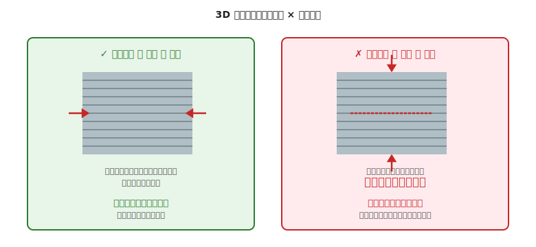

# 第 22 章　製作フェーズ

電気側の [第 6 章「電気の組立フェーズ」](../workflow-electrical/06-assembly-phase.md) と対応する、機械側の **実物を作る** 段階を扱います。設計フェーズで出した CAD データや寸法図を、**物理的な部品** に変換する工程です。

本章では家庭でできる手加工、家庭用 3D プリンタでの出力、レーザーカット外注の使い分けを中心に扱います。

!!! warning "この章で壊しやすいもの・怪我しやすいもの"
    - **手・指**（ドリル作業での巻き込み、やすりでの擦り傷、カッターでの切創）
    - **目**（ニッパで切った足が飛ぶ、ドリル切屑、3D プリントサポート材の破片）
    - **アクリル板**（無理な手加工でクラック、ドリル熱で溶融して焦げる）
    - **3D プリント部品**（積層方向誤り、定着不良で反る、熱膨張で寸法ズレ）
    - **ドリル刃**（材料に引っかかって折損、高速回転中の飛散）

!!! info "初回はこの製作方針が安全"
    - 平板部品はレーザーカット外注、複雑形状だけ 3D プリントにする
    - 回転工具での手加工は「下穴あけ・バリ取り」までに留める
    - 出力前にスライサープレビュー（または 1:1 紙モック）で干渉を先に潰す

---

## 1. 製作フェーズの位置づけ

設計で作った CAD データと、機械系 BOM。これらから **実物の部品** を得る工程です。ここで作る部品を、次の組立前チェック（第 23 章）で検品し、組立（第 24 章）に渡します。

| 加工方法 | 向いている形状 | 主な選択肢 |
|---|---|---|
| **3D プリント（FDM）** | 複雑形状、ブラケット、マウント | 家庭用プリンタ（所有 or 外注）|
| **レーザーカット** | 平板の切り抜き（底板、側板、歯車）| 外注業者（elecrow、ポンパレ、工房）|
| **手加工（ドリル・やすり）** | 既製品の穴あけ、調整 | 自宅工具 |
| **切削（CNC）** | 高精度な金属部品 | 外注、もしくは本格工房 |

本書の作例範囲では、**3D プリント + レーザーカット + 軽度の手加工** の 3 本柱でカバーできます。

---

## 2. 3D プリント（FDM）の基本

家庭用の FDM（Fused Deposition Modeling、熱溶融積層）3D プリンタでの出力を想定します。Bambu Lab / Creality / Prusa などが定番です。

### 2.1 積層方向と荷重方向の向き

FDM 3D プリントは、**樹脂を層状に積み上げて** 物体を作ります。このため、**層と層の境目は層内部より弱い** という特性があります。

- **層と平行な荷重**（層内の引張・圧縮・曲げ）→ **強い**（通常の樹脂強度）
- **層と直交する荷重**（層を引き剥がす方向）→ **弱い**（層同士の接着力のみに依存）

### 2.2 積層方向を決めるコツ

CAD の部品を「どう置いて」プリントするかで、強度の出方が変わります。

- **主な荷重が水平方向** → 部品を **寝かせて** プリントし、層を水平に積む
- **主な荷重が垂直方向** → 部品を **立てて** プリントし、層を縦方向にする（ただし落下・衝撃に弱くなる）
- **モータマウントのような複合荷重** → 複数の力がかかるため優先順位が要る。判定ルール：
    1. **常時かかる荷重を最優先**（例：モータの自重 + 車輪の自重、これらは常に下向き）
    2. **突発的な荷重より定常荷重**（走行時の横揺れは一時的、重力は常時）
    3. **モーメントが効く軸を考慮**（モータ軸の先端が下に垂れる方向の曲げ荷重が大きければ、この方向を層平行にする）
    迷ったら「このマウントが壊れるとしたら、どこからクラックが入るか？」を想像し、そのクラック方向と層方向を直交させない（層が剥離しない）ようにする

### 2.3 スライス設定の目安

家庭用プリンタでの定番設定（PLA を想定）:

| 設定項目 | 目安 | 備考 |
|---|---|---|
| ノズル温度 | 200〜215℃ | フィラメントによる |
| ベッド温度 | 50〜60℃ | 定着性と反り防止のバランス |
| 層高 | 0.2 mm | 精度と速度のバランス |
| 壁の厚さ | 3 周（約 1.2 mm）| 構造物なら 4〜5 周 |
| 充填率 | 20〜30% | 構造物なら 40〜60% |
| 充填パターン | Gyroid または Grid | 強度バランス良し |

### 2.4 サポート材とオーバーハング

- **角度 45° 以下のオーバーハング** → サポートなしで出力可能
- **角度 45° 超** → サポート材が必要（サポート除去痕が残る）
- **ブリッジ（2 点間の水平渡し）** → 20〜30 mm まではサポートなしで出せる

設計段階で **サポートなしで出せる向き** を考えておくと、仕上がりが綺麗で手間も減ります。具体的な見分け方：

1. **スライサー**（Bambu Studio、OrcaSlicer、Cura 等のソフト）に STL を読み込み、**プレビュー画面で「サポートを有効」にしてから「サポートが生成される箇所」を確認** する
2. サポートが大量に出る場合、CAD で **部品の向きを 90°／180° 回転させて STL を再出力**、同じスライサーで再確認
3. サポートなしで出せる向きが見つからない場合、**設計を変更する**（45° 以下の斜面に置き換える、オーバーハング部を別部品として分割する、等）

この「スライサーで試行→CAD で修正→再スライス」のサイクルを 2〜3 回回すと、サポート量が最小の向きが見つかります。

---

## 3. レーザーカット外注の基本

アクリル板やアルミ薄板（1〜2 mm）を切り抜く定番の方法。家庭でできる切断と違って **高精度で美しい** 仕上がりが得られます。

### 3.1 発注までの流れ

1. **CAD で DXF 形式に出力** — Fusion 360、Inkscape、AutoCAD 等から
2. **業者の要求するフォーマットに変換** — 線幅、色、ファイル名の命名規則など
3. **見積もり依頼** — 多くの業者が Web アップロードで即時見積もり
4. **発注・納品** — 3〜7 日程度で届く

### 3.2 発注時のチェックリスト

- [ ] **単位が mm になっている**（inch のまま送ると寸法が狂う）
- [ ] **内穴と外形の線が重なっていない** — 重複があると 2 度切られて部品が割れる
- [ ] **切断線だけが「切る」色**、マーキングは別色
- [ ] **材料と厚みが正しい**（例：アクリル透明 3 mm）
- [ ] **発注前に PDF プレビュー** で確認（業者のプレビューがあれば必ず使う）

### 3.3 国内業者の例

- **Elecrow**（中国、価格安、納期長め 7〜14 日）
- **工房 Emerge+**（国内、納期 3〜5 日、定番）
- **レーザー加工ドットコム**（国内、見積もり即時）

業者によって「切断線の色指定」「ファイル形式」が異なるので、**各業者のガイド** を最初に読みます。ガイドに典型的に含まれる項目:

- 対応ファイル形式（DXF、AI、SVG 等）と推奨バージョン
- 切断線の色コード（赤＝切断、青＝刻印、のような色分けルール）
- 線幅の指定（0.01 mm 等、ヘアライン指定が多い）
- 対応材料と厚み（アクリル 2/3/5/10 mm、ベニヤ 3/4 mm 等）
- 最小加工寸法（5 × 5 mm 以下の細かい部品は切り離されない等）
- 原点・向きの指定
- 納期と送料の計算ルール

---

## 4. 手加工の基本

自宅の電動ドリルとやすりで対応できる加工:

### 4.1 穴あけ

- **ポンチで位置決め** — 中心点に打刻を入れないとドリルが滑る
- **小径から順に拡大** — 最終径が φ 5 mm なら、まず φ 2 mm で下穴、次に φ 3、最後に φ 5
- **材料をクランプで固定** — 手で押さえて穴あけするのは怪我の元
- **回転速度** — アクリルは低速（400〜800 rpm）、アルミは中速（1000〜1500 rpm）

### 4.2 やすりがけ

- **荒やすり → 細目やすり → 紙やすり** の順
- **一方向に動かす** — 往復すると目が滑る
- **バリ取り** — 切断面の角はすべて 0.5 mm 程度面取りしておく（手を切らない、組立時の擦れ防止）

### 4.3 安全姿勢

!!! danger "ドリル作業時の禁止事項"
    - **軍手をしない**（回転部に巻き込まれる。素手または作業用手袋を使う）
    - **長袖の袖口はボタン留めか捲る**
    - **長髪は結ぶ**
    - **必ず保護メガネ** を着用

!!! warning "アクリル加工の特有リスク"
    - **ドリル熱でアクリルが溶けて刃にこびりつく** — 低速で少しずつ
    - **引っかかって部材が割れる／跳ねる** — クランプで 2 箇所以上固定
    - **クラック（ひび）が伸びる** — 穴の近くに応力が集中、丁寧に拡大

---

## 5. 製作中の検品

加工した部品は、組立前（第 23 章）に最終検品しますが、**加工直後にも簡易確認** しておくと手戻りが減ります。

### 5.1 3D プリント直後

- [ ] 層の剥離がないか（特に底面とサポート接触部）
- [ ] 反りがないか（底面が平らか、定規を当てて確認）
- [ ] ねじ穴・通し穴の径をノギスで測定
- [ ] 表面に穴（過度なインフィル不足）がないか

### 5.2 レーザーカット品受領時

- [ ] 指定した枚数が揃っているか
- [ ] 焦げや溶融痕が製品面でないか
- [ ] 主要寸法をノギスで確認
- [ ] 角が鋭利すぎないか（鋭利なら 0.5 mm 面取り）

### 5.3 手加工後

- [ ] 穴位置が図面通り（中心からの距離をノギスで測定）
- [ ] 穴が垂直に開いている（斜めだとねじが通らない）
- [ ] バリが残っていない

---

## 6. 製作フェーズの失敗パターン

!!! warning "3D プリント積層方向ミス"
    最頻出の失敗。設計時点で積層方向を考えていないと、強度が必要な方向に弱い部品ができる。
    **モータマウントのように振動と荷重がかかる部品は特に要注意**。

!!! warning "レーザーカット発注時の重複線"
    同じ線を複数回描いてしまい、業者のレーザーが同じ場所を 2 回切断。部品が落ちる・焦げる。
    **CAD 上で重複線を削除するチェック** を発注前に入れる。

!!! warning "手加工での位置ずれ"
    ポンチなしでドリルが滑って、穴の位置が数 mm ずれる。
    **必ずポンチ** で打刻してから穴あけ開始する。

!!! warning "材料の取り違え"
    「アクリル 3 mm」と「アクリル 5 mm」を混同して発注。板厚が違うとねじ穴の深さや外寸が全て合わなくなる。
    **発注書類とは別に、実物を受け取ったときに厚みをノギスで測って確認** する。

!!! warning "怪我"
    安全装備を省略してドリル・やすり作業をする。軍手を履いて回転工具を使う。
    **「今日は少しだけだから」が一番危ない**（第 1 章 §6 参照）。

!!! warning "3D プリントが失敗したまま放置して帰宅"
    長時間プリントで、**途中で定着が外れたり糸引きで大量のゴミが出たり** してもユーザは気付かない。そのまま数時間放置すると **ノズルが固着**、最悪の場合は **可燃物への延焼** リスク。長時間プリントは **カメラで遠隔監視** する、または **初期数層だけ立ち会う** のが安全。

!!! warning "STL のサイズ単位がインチだった"
    海外サイトで拾った STL を読み込んだら、**25.4 倍の大きさ** になってプリントできない（逆に 1/25.4 で極小）。スライサーで読み込んだ後は **寸法をノギスで想定と照合** してからプリント開始。

!!! warning "1 層目が定着せず、糸の塊（スパゲティ状態）に"
    ベッド温度不足、レベル調整不足、プリント開始時のノズル高さ狂いが原因。**最初の 3〜5 層を目視で見届ける** ことで早期に停止できる。スパゲティになったまま続行すると、樹脂がノズルに絡まって **分解修理** が必要に。

!!! warning "サポート材を剥がすときに本体も欠けた"
    サポートと本体の接点が強すぎて、サポート除去時に本体の一部まで持っていかれる。**サポート密度を下げる**（10〜20% 程度）、**サポート接触面を 0.1 mm 空ける**（Z gap 設定）ことで改善。

!!! warning "DXF に重複した線がある"
    CAD ソフトの「ミラー」「配列」操作で、同じ線が 2 本重なったまま DXF 出力。レーザーカット業者が **同じ場所を 2 回切断して部品が落ちる・焦げる**。DXF 出力前に「線の重複を削除」機能を実行する。

!!! warning "レーザーカットの線幅・色指定ミス"
    業者の指定（例：切断は赤・線幅 0.01 mm、刻印は青）と違う色・線幅で出力 → **切断されるはずの線が刻印になった**、または逆。発注前に業者のプレビュー画面で確認する。

!!! warning "板の厚みを取り違えて発注"
    設計時に 3 mm 想定で進めていたが、発注書に 5 mm と書いて加工依頼 → **他の部品の組み合わせが狂う**。発注前に「板厚・材料・色」を **読み直して確認**。

!!! warning "ドリルの位置決めでポンチを忘れた"
    鋼材やアクリルに **いきなりドリル** を当てると、**刃先が滑って 5〜10 mm ずれて穴が開く**。位置決めパンチ、またはセンタードリルで **浅い窪みを先に作る**。

!!! warning "穴あけで貫通後に刃が持ち上がって二次的なキズ"
    ドリルが材料を貫通した瞬間、押す力が急に抜けて **下の作業台・部品を掘る**。貫通直前で力を抜く・当て木を敷く。

!!! warning "手加工の切断面を素手で触って切創"
    アクリル・アルミの切断面は **カミソリのように鋭利**。軽く触れただけで皮が切れる。切断後は必ず **ヤスリ or カッターで C 0.5 mm 程度の面取り**。

!!! warning "3D プリント部品を机に置いたまま放熱不足で変形"
    出力直後の部品を、まだ熱いうちに **ぐにゃっと曲がるような姿勢で置く** と、その形のまま冷えて歪む。**平らな面に置いて完全に冷えるまで触らない**。

---

## 7. 次章への橋渡し

部品が揃ったら、組立に入る前に **検品** の工程があります。

次の [第 23 章「組立前チェック」](23-pre-assembly-check.md) では、加工した部品と購入した部品をすべて広げて、**BOM との突き合わせ・寸法確認・嵌合確認** を行います。電気側の [第 7 章「電気のテスト前チェック」](../workflow-electrical/07-pre-test-check.md) に対応する章で、組立段階で詰まらないための検証工程です。
